# Developer Guide

This document describes the architecture and software implementation of the application, _Ha(ppy)Bit_. 
The document will be great for you if you are a developer who wish to gain insight into 
the design considerations and implementation of features, and possibly expand on the application.

* [Acknowledgements](#acknowledgements)
* [1. Introduction](#1-introduction)
  * [1.1. Overview of Ha(ppy)Bit](#11-overview-of-happybit)
  * [1.2. Terminology](#12-terminology)
  * [1.3. Icons and Format](#13-icons-and-format)
* [2. Setting Up](#2-setting-up)
  * [2.1. Application Requirements](#21-application-requirements)
  * [2.2. Project Set Up](#22-project-set-up)
* [3. Design](#3-design)
  * [3.1. Overall Architecture](#31-overall-architecture)
  * [3.2. UI Component](#32-ui-component)
  * [3.3. Parser Component](#33-parser-component)
  * [3.4. Command Component](#34-command-component)
  * [3.5. Goal Component](#35-goal-component)
  * [3.6. Storage Component](#36-storage-component)
* [4. Implementation](#4-implementation)
  * [4.1. Adding a Goal](#41-adding-a-goal)
    * [4.1.1. Implementation](#411-implementation)
    * [4.1.2. Design Considerations](#412-design-considerations)
  * [4.2. Adding a Habit](#42-adding-a-habit)
    * [4.2.1. Implementation](#421-implementation)
    * [4.2.2. Design Considerations](#422-design-considerations)
  * [4.3. Listing all Goals](#43-listing-all-goals)
    * [4.3.1. Implementation](#431-implementation)
    * [4.3.2. Design Considerations](#432-design-considerations)
  * [4.4. Listing all Habits](#44-listing-all-habits)
  * [4.5. Completing a Habit](#45-completing-a-habit)
  * [4.6. Updating a Goal](#46-updating-a-goal)
  * [4.7. Updating a Habit](#47-updating-a-habit)
  * [4.8. Deleting a Goal](#48-deleting-a-goal)
  * [4.9. Deleting a Habit](#49-deleting-a-habit)
  * [4.10. Getting Help](#410-getting-help)
  * [4.11. Storage of Information](#411-storage-of-information)
* [Appendix A: Product Scope](#appendix-a-product-scope)
  * [Target user profile](#target-user-profile)
  * [Value proposition](#value-proposition)
* [Appendix B: User Stories](#appendix-b-user-stories)
* [Appendix C: Non-Functional Requirements](#appendix-c-non-functional-requirements)
* [Appendix D: Glossary](#appendix-d-glossary)
* [Appendix E: Instructions for Manual Testing](#appendix-e-instructions-for-manual-testing)

---------------------------------------------------------------------------------------------------------

## Acknowledgements

This application reused some parts of the code from:
* Developer's name: Daren Tan (find his profile [here](AboutUs.md))
* Code source: CS2113T Individual Project
* Link to code: <https://github.com/DJ-Tan/ip.git>

This application referenced some parts of the code from:
* Developer team: find the team [here](https://se-education.org/addressbook-level3/AboutUs.html)
* Code source: AB-3
* Link to code: <https://github.com/se-edu/addressbook-level3.git>

This application adapted the Developer Guide and User Guide from:
* Developer team: find the team [here](https://se-education.org/addressbook-level3/AboutUs.html)
* Link to Developer Guide: <https://se-education.org/addressbook-level3/DeveloperGuide.html>
* Link to User Guide: <https://se-education.org/addressbook-level3/UserGuide.html#quick-start>

---------------------------------------------------------------------------------------------------------

## 1. Introduction

### 1.1. Overview of Ha(ppy)Bit

Ha(ppy)Bit is a desktop application aimed to empower students to achieve their goals—whether personal, academical, or 
health—amidst the hectic and stressful university life, through cultivating good habits. The application operates on a 
Command Line Interface (CLI) while still comprising features typically found in a Graphical User Interface (GUI). 
Students who type fast will find that Ha(ppy)Bit performs habit tracking more efficiently than your conventional GUI 
applications.

### 1.2. Terminology

Name     | Description                                                   | Example
-----    | ------------------------------------------------------------- | ---------------------
Goal     | A long term achievement you wish to accomplish.               |`Lose 5kg by Dec`
Habit    | Small, actionable tasks to be done to achieve goal.           |`Run 5km`
Interval | The time period (in days) which you want the habit to recur.  |`Run 5km every 7 days`

A goal can have one or more habits.\
A habit can have one or more intervals.

### 1.3. Icons and Format

> 📃 **Note**: important information you should take note off (especially if you encounter input errors)

> ⚠️ **Warning**: avoid doing the things mentioned here at all costs (unless you're feeling lucky)

> 💡 **Pro-Tip!** additional information that may make your tracking journey easier

## 2. Setting Up
The following section covers basic setup instructions to get you up and running on the HappyBit development environment.

### 2.1. Application Requirements

1. Ensure that you have installed Java SE Development Kit (JDK) `11` on your computer. If you do not have it installed, 
   you may download it from [here](https://docs.aws.amazon.com/corretto/latest/corretto-11-ug/downloads-list.html).
2. We recommend using [IntelliJ IDEA](https://www.jetbrains.com/idea/download/).
3. Fork this [repository](https://github.com/AY2122S1-CS2113T-F14-1/tp), and clone the fork to your computer.

### 2.2. Project Set-Up

> ⚠️ **Warning**: Follow the steps in the following guide exactly. Any deviations may result in the code failing to 
                     run as intended.

1. Start IntelliJ IDEA.
2. If you are currently on a project, close the project.
3. Navigate to `Plugins` and ensure that the Gradle plugin is enabled (Gradle is installed by default).
4. Open the project that was forked to your computer.
5. Set-up JDK 
   * Navigate to `File` > `Project Structure...` > `Project` 
   * Under `Project SDK`, add the JDK installed in Section 2.1.1
   * Under `Project Language Level`, choose `11 - Local variable syntax for lambda parameters`
6. Navigate to `Project` > `tp` > `src` > `main` > `happybit` > `HappyBit`
7. Locate the `main` method and click the green triangle on the left of it
8. If the code builds and runs with no issues, you are good.

## 3. Design

### 3.1. Overall Architecture

The architecture diagram below describes the high-level design of the application.

The 5 main components of the architecture diagram are:
1. `Ui` : User interface of the application
2. `Parser` : Parses user inputs (checks if input is valid and logic is correct)
3. `Command` : Executes the user commands
4. `Goal` : Contains the data of all goals, habits and intervals, as well as the logic to update them
5. `Storage` : Facilitates transfer of data between the application and external storage files

The sequence diagram below shows how the components interact with each other for the scenario where the user issues the
command `remove g/1` to remove the goal at index 1.

### 3.2. UI Component

The UI component is responsible for all user interfaces of the application. However, the component is further divided
into 2 sub-components: `UiManager.java` for static interface displays, and `PrintManager.java` for dynamic interface
displays (display messages in response to user input). The diagrams below illustrates the high level representation of
each sub-component.

### 3.2.1 UiManager

**API:** `UiManager.java`

1. `UiStartup` will be called upon starting the application (we refer to this as the start state).
2. `UiMain` will be called upon entering the main state of the application (the main state is entered when you select
    the option `[5] Start Application` in the start state).
3. `UiMain` calls `Goal` to display a static view of all habits to be done for the day.
4. `UiMain` calls `Storage` to display alerts for status of storage imports and exports.

### 3.2.2 PrintManager

**API:** `PrintManager.java`

1. `PrintManager` is called upon by user commands to display text or error messages.
2. `PrintManager` may call `PrintTable` to print a list of items in a tabular format, for example when a user inputs
the `help` command to view a summary of formats of relevant commands in a tabular form.
3. `PrintManager` depends on `Goal` and `Habit` to print goal-related and habit-related information respectively.

### 3.3. Parser Component

The Parser component is responsible for parsing and checking the logic of the user input. The diagram below illustrates
the high level representation of the component.

**API:** `Parser.java`

1. A user input is given to `ParserManager` that determines which subclass of `Parser` is required
2. Inputs starting with `help`, `return`, and `exit` are handled by `ParserManager`
3. Other inputs are handled by `Parser`, which has a total of 7 subclasses
4. `AddParser` handles the parsing of inputs starting with `set` and `add`
5. `DeleteParser` handles the parsing of inputs starting with `remove` and `delete`
6. `DoneParser` handles the parsing of inputs starting with `done`
7. `ListGoalParser` handles the parsing of inputs starting with `list`
8. `ListHabitParser` handles the parsing of inputs starting with `view`
9. `UpdateParser` handles the parsing of inputs starting with `update` and `change`
10. `SetParser` Handles the parsing of inputs starting with `goal`

The sequence diagram below illustrates the flow of logic when a generic user input is entered into the application.

### 3.4. Command Component

The Command component is responsible for executing the application logic based on the parsed user input. The diagram
below illustrates the high level representation of the component.

**API:** `Command.java`

1. `Command` obtains the breakdown of required parameters from Parser - this means that no logic is performed here.
2. Add, update, done and delete commands updates the GoalList.
3. Commands that update the GoalList, as well as `ExitCommand` and `ReturnCommand`, updates the Storage.
4. The following describes the features of each command:
   * `AddGoalCommand` - Adds a new Goal to the GoalList.
   * `AddHabitCommand` - Adds a new Habit to a specified Goal set by the user.
   * `UpdateGoalCommand` - Updates one or more attributes (Name, End Date, Type) for a Goal.
   * `UpdateHabitCommand` - Updates one or more attributes (Name, Interval) for a Habit.
   * `DoneHabitCommand` - Marks a Habit from a specified Goal as completed.
   * `ListGoalCommand` - Lists out all the Goals set by the user.
   * `ListHabitCommand` - Lists out all the Habits set under a Goal.
   * `DeleteGoalCommand` - Deletes a Goal from the GoalList.
   * `DeleteHabitCommand` - Deletes a Habit from a specified Goal set by the user.
   * `SetCommand` - Indexes into a Goal so that commands can be called without stating a Goal's index (not implemented).
   * `HelpCommand` - Prints out table of all available commands.
   * `ReturnCommand` - Returns the user to start state of the application (Refer to Section 3.2. for _start state_).
   * `ExitCommand` - Saves all changes and exits the application.

### 3.5. Goal Component

The Goal component is responsible for maintaining and updating all goals set by the user. This includes running logic to
ensure that there are no violations when modifying information related to a goal. The diagram below illustrates the high
level representation of the component.

**API:** `Goal.java`

1. 0 or more `Goal` are associated with a `GoalList`.
2. A `Goal` must have exactly 1 `GoalType`. If not specified, the `GoalType` will be DEFAULT.
3. 0 or more `Habit` are associated with a `Goal`.
4. `Habit` may call `HabitDateManager` to handle date related logic.
5. 1 or more `Interval` are associated with a `Habit`.

### 3.6. Storage Component

The Storage component allows data to be read from and saved to a storage file. The diagram below illustrates the high
level representation of the component and the interactions between the other components.

**API:** `Storage.java`

1. `Storage` calls `Export` when saving data from the `GoalList` to an external storage file.
2. `Storage` calls `Import` when reading data from the external storage file to the `GoalList`.
3. `Import` calls `ImportParser` to decode the data extracted from the external storage file.
4. `ImportParser` calls `Goal`, `Habit`, and `Interval` in that order to load data into the `GoalList`.

## 4. Implementation

This section describes some noteworthy details on how the main features are implemented.

### 4.1. Adding a Goal 

This section describes the implementation of how the user can add a goal to their tracking list.

#### 4.1.1. Implementation

Adding a goal is amongst the first feature that the user will interact with as they begin goal tracking. The add goal 
feature is implemented using the `AddParser` and `AddGoalCommand` class. It allows the user to create a new goal on
their personal account which will be stored in the `GoalList` class. 

1. The `AddParser#parseAddGoalCommand(commandInstruction)` method is called, which in turns calls the 
   `AddParser#getGoal(commandInstruction)` method.
2. The `AddParser#getGoal(commandInstruction)` method will internally check for name, goal type, start date, and end
   date parameters. The name parameter has been limited to a maximum of 50 characters. The start date has to come after
   the end date, in addition to both dates needing to come after the date when the goal was created.
3. An `AddGoalCommand(goal)` object is created from the `AddParser#parseAddGoalCommand(commandInstruction)` method.

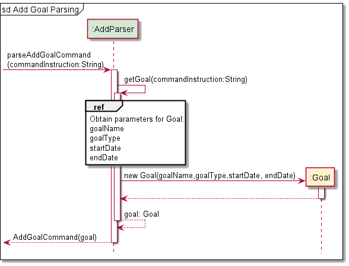

4. The `AddGoalCommand#runCommand(goalList, printManager, storage)` method is called, which in turns calls the 
   `GoalList#addGoal(goal, printManager)` method.
5. The `GoalList#addGoal(goal, printManager)` method checks for duplicated goal names before adding a goal to the list.
6. The `PrintManager#printAddedGoal(description)` method prints an acknowledgement message that the goal has been added.

#### 4.1.2. Design Considerations

**Aspect:** Limiting number of characters for goal name
* **Alternative 1:** No limit imposed, but cut-off after a fixed number of characters and replace with ellipsis when
                 printing the list.
  * Pros: Table will be of a fixed size and reduced chance of error if the character limit is exceeded. 
  * Cons: Important information regarding the name may be unintentionally cut-off.
* **Alternative 2 (current choice):** A 50-character limit is imposed.
  * Pros: Entire name will be visible when printing the list, also no chance of exceeding character limit.
  * Cons: Table may be misaligned if the user's monitor is too small, name has to conform within the limit.

### 4.2. Adding a Habit

This section describes the implementation of how the user can add a habit to one of their tracked goals.

#### 4.2.1. Implementation

1. The `AddParser#parseAddHabitCommand()` method is called, which starts the process of extracting parameters from the
   user input.
2. The `AddParser#splitInput(commandInstruction)` method splits the user input into a string array of parameters, while
   the `AddParser#getIndex(paramters, "g/")` method finds the goal index from this string array and checks that the
   index is a positive integer.
3. The `AddParser#getHabit(commandInstruction)` method creates a `Habit` object from the parameters of the user input. 
   Within this method, there is a 50-character limit imposed on the name, as well as an integer check for the interval.
4. An `AddHabitCommand(habit, goalIndex)` object is created from the `AddParser#parseAddHabitCommand()` method.

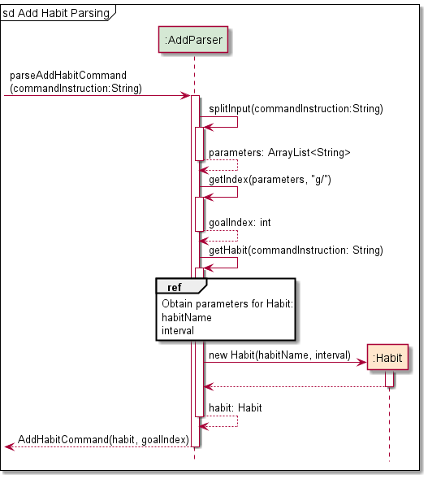

5. The `AddHabitCommand#runCommand(goalList, printManager, storage)` method is called, which in turns calls the
   `GoalList#addHabitToGoal(habit, goalIndex, printManager)` method.
6. Within this newly called method, the `GoalList#getGoal(goalIndex)` method is called to ensure that the habit to be
   added is associated with a goal. Following which, methods of `GoalList` will verify that the habit to be added does 
   not already exist within that goal, as well as having an interval that is smaller or equal to the number of days
   between the start and end dates of the goal.
7. The `GoalList#updateHabitEndDate(goal, habit)` method is called to set the end date of habit similar to that of the
   associated goal. This was not performed during habit creation since the check for goal existence was not performed
   within `AddParser`. This method returns a new `Habit` object with its end date filled in.
8. The `Habit#populateIntervalsDuringHabitCreation()` method is finally called to generate intervals for the new `Habit`
   object, given that the start date, end date, and interval are known at this point.
9. The `Habit` object is added to the list of habits associated with the goal (of step 6) through the 
   `Goal#addHabit(newHabit)` method.
10. The `PrintManager#printAddedHabit(newHabitName, goalDescription)` method prints an acknowledgement message that the 
    habit has been successfully added to the goal.

#### 4.2.2. Design Considerations

**Aspect:** Calling constructor of `Habit` object with end date
* **Alternative 1:** Create `Habit` object in `AddParser` with end date.
    * Pros: `Habit` constructor can generate all intervals upon habit creation, lesser logic required in `GoalList`.
    * Cons: A `GoalList` object has to present in `AddParser` to check for a goal's existence (non-trivial).
* **Alternative 2 (current choice):** Create `Habit` object in `AddParser` without end date and updating in `GoalList`.
    * Pros: No additional logic required to get the `GoalList` object in `AddParser`.
    * Cons: Additional logic required in `GoalList` to update end date and populate intervals.

### 4.3. Listing all Goals

This section describes the implementation of how the user can display a list of all tracked goals.

#### 4.3.1. Implementation

1. Since the command for listing goals does not require any parameters, using `ParserManager` to detect the command word
   `list` is sufficient to execute the command.
2. The `ListGoalsCommand#runCommand(goalList, printManager, storage)` method is called, which in turns calls the
   `GoalList#listGoals(printManager)` method.
3. If the `GoalList` object is empty, the `GoalList#listGoals(printManager)` method returns an exception indicating that
   there are no goals to be printed. 
4. Otherwise, the method calls the `PrintManager#printGoalList(goalList, goalList.size()` method, which iterates through
   all `Goal` objects and prints their respective description line by line in a table.

#### 4.3.2. Design Considerations

**Aspect:** Information to be included for the list of goals
* **Alternative 1:** Include minimal information, but add a command that prints in depth statistics of the goal.
    * Pros: The command to list goals acts as a quick view for the user without the clutter of irrelevant information. 
    * Cons: Total number of commands required will be increased, resulting in increased application complexity.
* **Alternative 2 (current choice):** Include all information, inclusive of statistics.
    * Pros: The command acts as an overview of everything the user may need to know about each goal.
    * Cons: Too much upfront information, which may lead to a lot of user scrolling if the list is very long.

### 4.4. Listing all Habits

This section describes the implementation of how the user can display a list of all tracked goals.

#### 4.4.1. Implementation

1. The `ListHabitParser#parseListHabitCommand(commandInstruction)` method is called, which starts the process of 
   extracting parameters from the user input.
2. The `ListHabitParser#splitInput(commandInstruction)` method splits the user input into an ArrayList of parameters, 
   while the `ListHabitParser#getIndex(parameters, "g/")` method finds the goal index from the parameters ArrayList and 
   checks that the index is a positive integer, returning the goalIndex of the specified goal in the goalList.
3. An `ListHabitsCommand(goalIndex)` object is created and returned from the 
   `ListHabitParser#parseListHabitCommand(commandInstruction)` method.

4. The `ListHabitsCommand#runCommand(goalList, printManager, storage)` method is called, which in turns calls the
   `GoalList#listHabitsFromGoal(goalIndex, printManager)` method.
5. Within this newly called method, the `GoalList#getGoal(goalIndex)` method is called to retrieve the `Goal` object
   from the `goalList`. 
6. The `goal.getHabitList()` method is called to retrieve all the habits associated with that `Goal` object.
7. The `goal.getListLength()` method is called to find the number of habits associated with that `Goal` object.
8. If the habitList is empty, a `HaBitCommandException` is raised to indicate the error that there are no habits
   associated with that goal.
9. Otherwise, the `PrintManager#printHabitList(goalName, habitList, numOfHabits)` method prints all habits associated
   with that goal in a tabular form.

#### 4.4.2. Design Considerations

// TODO

### 4.5. Completing a Habit

#### 4.5.1. Implementation

1. The `DoneParser#parseDoneHabitCommand(commandInstruction)` method is called, which starts the process of
   extracting parameters from the user input.
2. The `DoneParser#splitInput(commandInstruction)` method splits the user input into an ArrayList of parameters,
   while the `ListHabitParser#getIndex(parameters, "g/")` and `ListHabitParser#getIndex(parameters, "h/")`methods find 
   the goal index and habit index from the parameters ArrayList respectively. These methods check that the index is a 
   positive integer and return the index, throwing a `HaBitParserException` otherwise.
3. An `DoneHabitCommand(goalIndex, habitIndex)` object is created and returned from the
   `DoneParser#parseDoneHabitCommand(commandInstruction)` method.

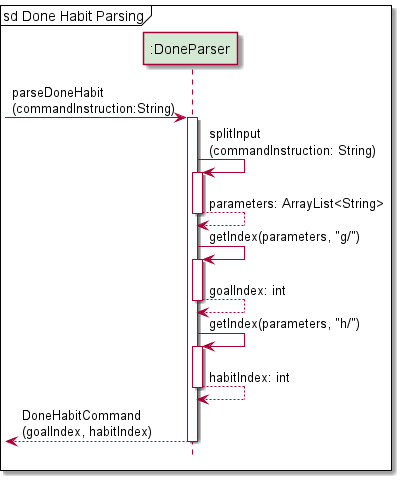

4. The `DoneHabitCommand#runCommand(goalList, printManager, storage)` method is called, which in turns calls the
   `GoalList#doneHabitFromGoal(goalIndex, habitIndex, printManager)` method.
5. Within this newly called method, the `GoalList#getGoal(goalIndex)` method is called to retrieve the `Goal` object
   from the `goalList`.
6. The `goal.getHabitList()` method is called to retrieve all the habits associated with that `Goal` object.
7. The `GoalList#getHabit(habitList, habitIndex)` method is called to retrieve the habit at specified `habitIndex`.
8. The `goal.doneHabit(habitIndex)` method is called to mark the specified habit as completed.
9. The `habit.getDoneHabitDates` method is called to get information on the start and end dates of the interval marked 
   as done, as well as the next interval's start date. This is information is required for printing a confirmation
   message to the user.
10. Finally, the `PrintManager#printDoneHabit(goalDescription, habitDescription, strDates)` method is called to
    print a confirmation message on the successful completion of a habit.

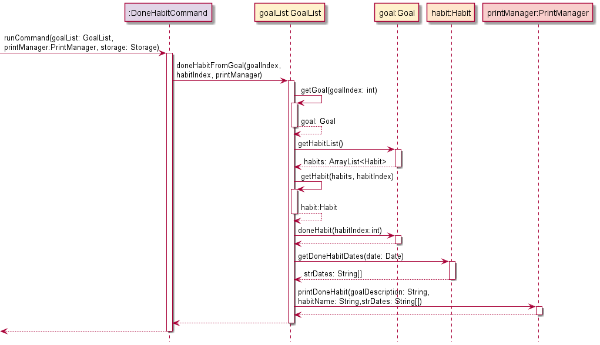

#### 4.5.2. Design Considerations

// TODO

### 4.6. Updating a Goal

A `UpdateGoalCommand` object is returned from the `UpdateParser` if the user input is successfully parsed as shown below.
If the update command is not provided with a goal index, or without any update flags it will throw an exception.

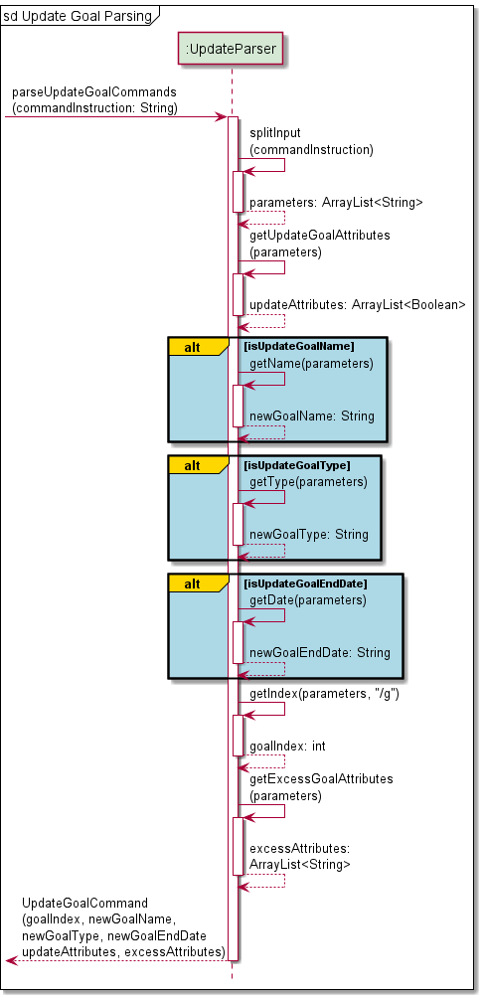

The `runCommand` method is then executed for the `UpdateGoalCommand` object as seen.

### 4.7. Updating a Habit

A `UpdateHabitCommand` object is returned from the `UpdateParser` if the user input is successfully parsed as shown below.
If the update command is not provided with a goal index and a habit index, or without any update flags it will throw an exception.

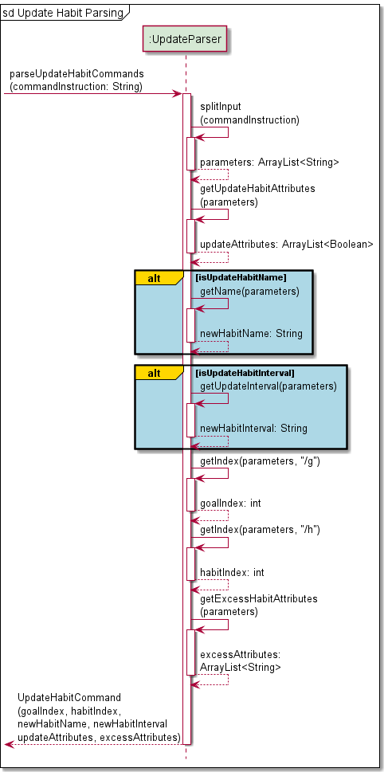

The `runCommand` method is then executed for the `UpdateHabitCommand` object as seen.

### 4.8. Deleting a Goal
This command allows you to delete goals from _Ha(ppy)Bit_. This allows them to rid the app of goals 
you decide not to pursue any further or may deem to be irrelevant.

A `DeleteGoalCommand` object is returned from the `DeleteParser` if the user input is successfully parsed as shown below.
If the delete command is not provided with a goal index, it will throw an exception.

When the `runCommand` method is executed for the `DeleteGoalCommand` object, the following steps as indicated by the
sequence diagram below is carried out:

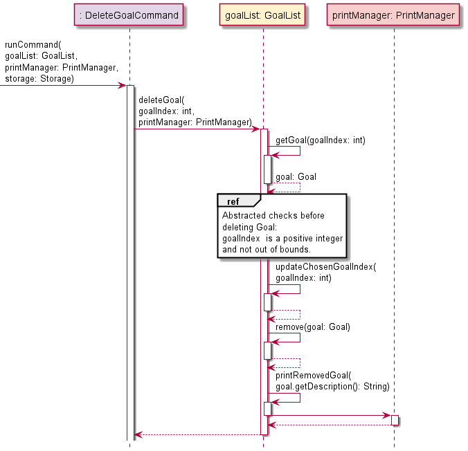

### 4.9. Deleting a Habit

When the `runCommand` method is executed for the `DeleteHabitCommand` object, the following steps as indicated by the
sequence diagram below is carried out:

### 4.10. Getting Help

When the `runCommand` method is executed for the `HelpCommand` object, it instantiates a `PrintManager` object and
calls the `printCommandList` method which prints out a pre-set message informing the user of all the inputs they
can type to execute a certain command.

### 4.11. Storage of Information

The sequence diagram shows how the program imports data from storage file.

The program uses `Storage` class to import data from the storage file.
* `Storage` interacts with `Import` to access the data stored in storage file.
* `Import` will depend on `ImportParser` to decipher the data stored, and return
  a `Goal`, `Habit` or `Interval` object back to `Import` correspondingly.
* `Import` will then populate `GoalList` accordingly
  before returning `GoalList` back to `Storage` and back to user.

The sequence diagram shows how the program exports data to storage file.

`Storage` class can also export data to storage file with `Export` class.
It takes in a `GoalList` object and converts the data into string to be stored in storage file.

---------------------------------------------------------------------------------------------------------

## Appendix A: Product Scope

### Target user profile:
* wants to have a work-life balance but is often consumed by work/school
* have goals and aspirations but falls short of them; lacklustre commitment or game plan for action
* doesn't want to rely on smartphone (They're doing everything these days, sheesh!)
* prefers desktop app, 
* familiar and comfortable with CLI apps, or willing to learn to use

### Value proposition

Users with _Ha(ppy)Bit_ will find themselves cultivating good habits and breaking bad habits despite hectic 
workload or commitments. 

## Appendix B: User Stories

|Version| As a ... | I want to ... | So that I can ...|
|--------|----------|---------------|------------------|
|v1.0|new user|see usage instructions|refer to them when I forget how to use the application| 
|v1.0|user|set a new goal I wish to accomplish|start working towards completing the goal|
|v1.0|user|add habits i wish to carry out in the process of accomplishing my goal|break down the journey of achieving my goal into smaller manageable steps
|v1.0|user|remove a goal from my list of goals|remove goals that I no longer wish to work towards|
|v1.0|user|delete a habit added under a goal|remove a habit that I no longer wish to carry out|
|v1.0|user|mark a habit as done|indicate that I have completed that habit|
|v1.0|user|list out all the goals I have|remind myself of the goals I am working towards|
|v1.0|user|view all the habits I have set for each goal|check which habits I have yet to complete|
|v1.0|user|have import and export functionality in the program|access goals and habits previously set from a local data storage
|v2.0|user|have recurring habits at a regular interval|habitually carry out the habits I set for myself|
|v2.0|user|be able to view my progress for any goal|motivate myself in the process|
|v2.0|user|view all my habits due for the day upon entering the program|remember to carry out these habits by the end of the day|

## Appendix C: Non-Functional Requirements

|Non-Functional Requirements | Requirement Type |
| :---------- | :---: |
|App should be operable on Windows, macOS, and Ubuntu running Java `11` or above.|Technical|
|App can be learned anyone who is familiar with computer within minutes of use.|Quality|
|App should be a helpful, encouraging, and a joy to use.|Quality|
| {feel free to add something here}|Performance|

## Appendix D: Glossary

* **Goal**: A long term achievement you wish to accomplish
* **Habit**: Checkpoints; actionable tasks to be done to achieve goal

## Appendix E: Instructions for Manual Testing

The instructions below are for the manual testing of the program.

### Launching and Exiting the Program

1. Launch
   * Download the jar file [here](UserGuide.md#1-quick-start) and copy the file into an empty folder.
   * Open your terminal and type in the command `java -jar happybit.jar` to start up the program.
   * You should see the start-up page with the start-up menu as shown below.
  

2. Navigation
   * Select what you are interested in from the start-up menu by typing in the corresponding option number.
   * You can find out more about the various options at our [User Guide](UserGuide.md#12-main-interface).
   * There will be an error message shown if you select an invalid option.
   * Test: `-1` to see the error message.

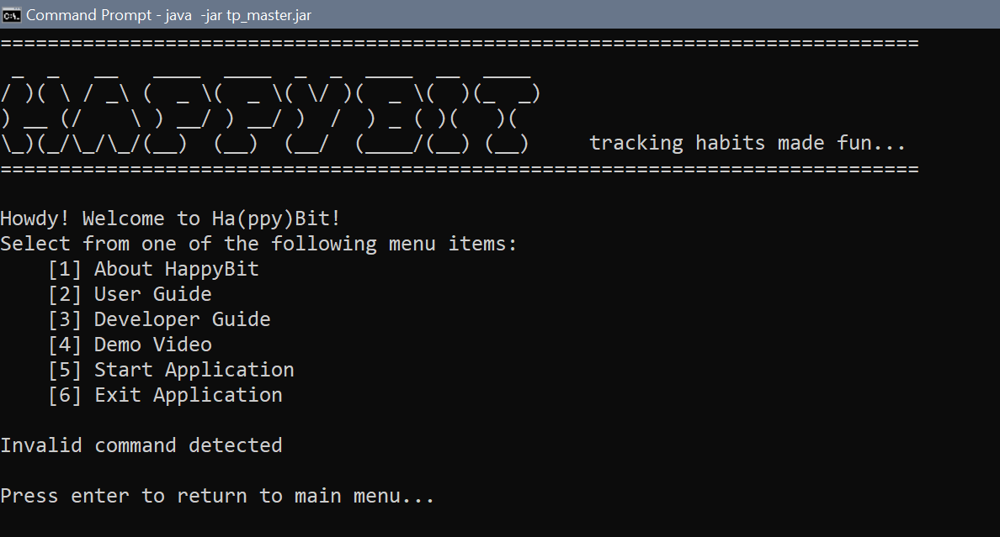

3. Exit
   * To exit the program, select option `6`. 
   * You should see the exit message before the program terminates as shown below.
  

### Starting the Application

1. Launch the program and select option `5` to start using the application.
2. Upon starting the application, you should see the command screen as shown below.

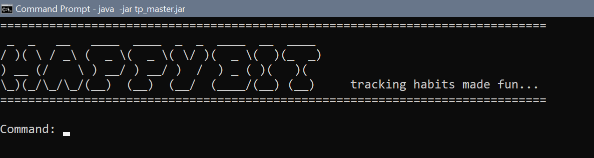

3. Command screen takes in your input at `Command: `. Press 'enter' after typing in your command.
4. For example, to set a goal: `set n/Wake up at 8am everyday t/sl s/08112021 e/15112021`
   * The name of goal: `Wake up at 8am everyday`
   * The goal is classified as a sleeping goal: `sl`
   * Start the goal at: `08112021` (08 Nov 2021)
   * End the goal at: `15112021` (15 Nov 2021)
5. After you have entered the command to add a goal, you should see that the goal was successfully added.

6. Press enter again to return to command screen.

### Deleting Goals or Habits

After adding in a substantial number of goals and habits, you can test out the deletion commands as shown below.

1. To see all the goals you have added, use command `list`. You should take note of the index of the goal that you
  want to delete. We will be using the list shown below as an example.

2. To delete a goal, use the command `remove`.
   * Test: `remove g/6` to remove goal at index `6`.

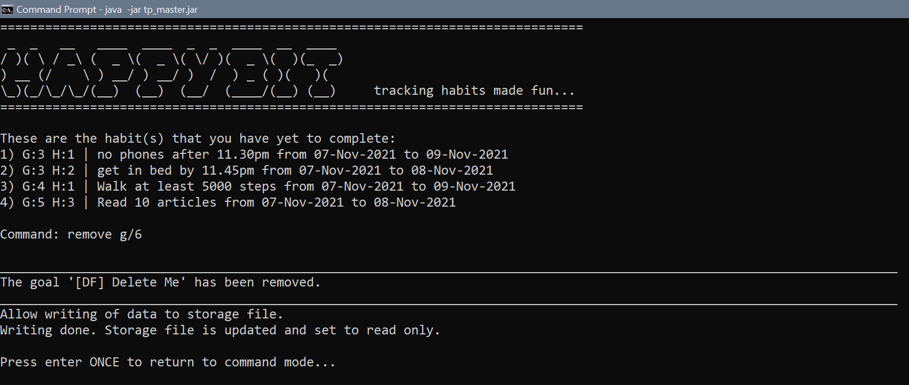

   * Use the command `list` to see the new index of the goals.
   

3. Next, use `view` to see the index of the habit under a goal that you want to delete.
   * Test: `view g/6` to view the habits under goal `6`.

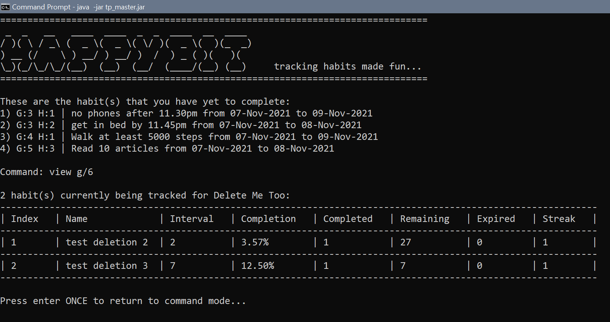

5. To delete a habit, use the command `delete`.
   * Test: `delete g/6 h/1` to delete habit `1` under goal `6`.

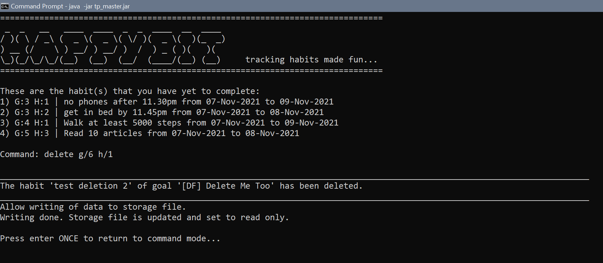

6. After any deletion, the index of the goals or habits will change. Therefore, make sure to use commands
  `list` and/or `view` to check for the new index of the goals and habits.
   * Test: `remove g/7` to remove a goal at index `7` that does not exist. Error will be thrown.

### Storage of Data

To check if the program can save and load your data:

1. Exit the application using command `exit`.
2. Launch the program and enter the application again.
3. Type `list` to check that all your previous data are present.
4. If your data are all present, it means that the program successfully saved and loaded your data
  from the storage file.

> ⚠ The subsequent steps might cause you to lose your data.

To check if the program can create a storage file if it doesn't exist:

1. Go to the folder containing the jar file. You should see a folder `data` that contains a `.txt` file
  which contains your data. Delete the folder `data` or move it somewhere else.

2. Launch the program and enter the application.
3. Type `list` to see that no goals exists since the storage file was deleted. A new empty storage file
  will be created by the program.

To check if the data file is read-only and if it is possible to corrupt data file:

1. The storage file is set to read-only. To test this, go to `data` folder and open the `.txt` file.
2. Randomly edit the text file to corrupt it.
3. Try to save the changes and there should be an error message preventing you to do so.

To check that in the event the data file is corrupted, all the data will be wiped off:

1. If the data file is for some reason corrupted, note that you will lose **all** your data.
2. Once you enter the application, and it detects that the file is corrupted, it will clear the file.

3. Without adding any data in the application, exit the program and check back to the corrupted file.
  It should be empty.
