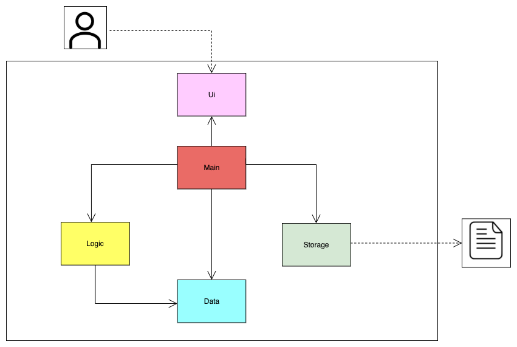
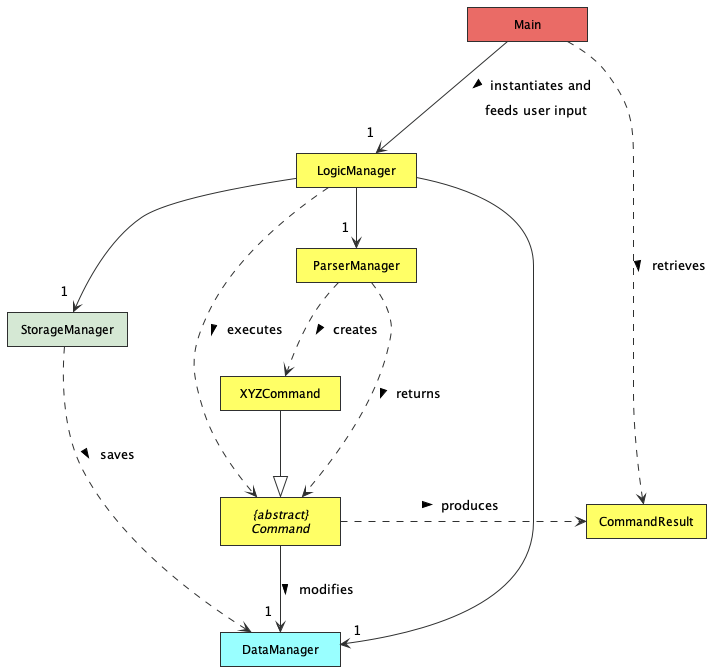
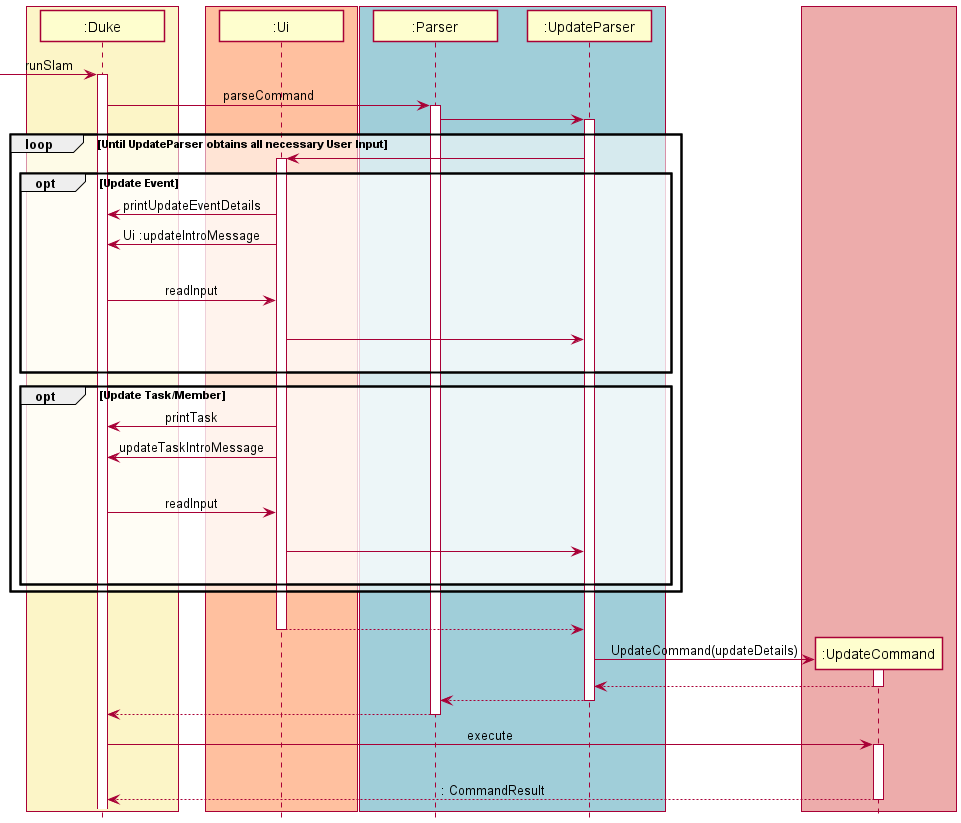

# Developer Guide

## Introduction

SLAM is a **command line interface application** for student group leaders in NUS to **manage their group 
events, tasks and members**, without the need for much programming knowledge. This application allows student leaders to plan and manage the organisation 
of various events by allowing users to add custom events to their schedule. Users can add tasks to complete 
under each event and keep track of the progress of such tasks and events. 
These tasks also have group members assigned to them from a user-generated roster of members. 
The simple interaction between the **User** and the **command line interface application** makes SLAM an extremely user friendly
and usable event planner for student leaders.

### Purpose of Developer Guide
To give an overview on the application, namely overall architecture, implementation design rational, and specificities
in the algorithms used within SLAM. To get a good grasp of how the application works, it is recommended to look at the Overall Architecture
section of this guide.

## Acknowledgements

{list here sources of all reused/adapted ideas, code, documentation, and third-party libraries -- include links to the original source as well}

## Design

This section describes some noteworthy details on how certain features are designed and implemented within SLAM.

### Architecture
Below displays how the overall flow and implementation of the application is executed.

The architecture of the entire application revolves around a few different components.
* `Ui` : This component is responsible for the information displayed to the user from the command line interface.
* `Parser` : This component parses the different data keyed in from the user and prepares the relevant data required to execute the commands.
* `Commands` : These components executes the different commands parsed by the parser from the inputs of the User.
* `Items` : Represents the different types of items (events, tasks and members) that can be assigned and implemented within the application.
* `Storage` : Manages the writing and reading of data to and from the disk.

The interaction of all the different components within the application can be depicted as such.

### Ui component

**API**: `Ui.java`

Below is a brief class diagram of the UI component

The UI component,
* executes the different user commands using the `Logic` component.
* looks out for changes in the `Command` and `Parser` classes so that the UI can be updated to display to the user the latest data of the application.
* Manages the access to the `Scanner` object that reads user input.
* is the bridge between the user and the `Logic` component.
* contains all the methods for printing to the User.

### Logic component

**API**: `Parser.java` 

Below is a partial class diagram that shows na overview of the `Logic` component.

How the `Logic` component works:
1. When `Logic` is called upon to execute a command it uses the abstract `Parser` class to parse the UserCommand.
2. The `Parser` then calls the specified abstract `Parser` class to be called. For example, `DeleteParser` will be command when a `delete` command is keyed in by the user.
3. `DeleteParser` will then parse the necessary information from the Users input.
4. This results in  `Command` object (more precisely, an object of one of its subclasses e.g. `DeleteCommand`) being returned.
5. `Duke` then calls `execute()` within the `Command` object which then executes the specified command.
6. Upon the completion of `execute()` an object of type `CommandResult` is returned to `Duke` and the feedback is displayed to the User

### Storage component

**API**: `Storage.java`

#### Save Functionality

How the `save` functionality works:
1. When the `save` method is called, `StorageFile` constructs a new `File` object using the configured `DEFAULT_FILE_PATH`.
2. The presence of the `File` object on the local system is checked. The `data` directory and `slamData.txt` file wil be created if they are absent.
3. The `Member` objects in the provided `memberRoster` will be encoded into a list of `String` objects via the `encodeMemebersList` method.
4. The `Event` objects in the provided `eventCatalog` along with their respective lists of `Task` objects will be encoded into a list of `String` objects via `encodeEventsList`.
5. The `writeToFile` method will be called to write the encoded lists of `String` data into the `.txt` save file locally for future uses of the program.

#### Load Functionality

How the `load` functionality works:
1. When the `loadSaveFile` method is called, `StorageFile` constructs a new `File` object using the configured `DEFAULT_FILE_PATH`.
2. The returned `File` object will then be parsed into an `ArrayList<String>` of `encodedLines` through the `getStringsFromFile` method.
3. If the detected line contains data regarding a `Member` or `Event` object, the `StorageFile` instance will decode and construct the `Member` and `Event` objects, adding them to the global `MemberRoster` and `EventCatalog` respectively.
4. If the detected line contains data regarding a `Task` object:
   1. The `decodedTask` object will be decoded from the respective line and returned via `decodeTaskFromString`.
   2. The `decodedTask` will be added to the `Event` object's list of tasks within the global `eventCatalog`.
   3. `Member` objects in the global `memberRoster` that this `decodedTask` contains will also have their list of tasks updated to contain this `decodedTask`.

>💡 When decoding an invalid line (possibly from unwanted edits to `slamData.txt` by the user), `loadSaveFile` will throw an appropriate exception and provide feedback regarding the invalid line to the user.

## Implementation

This section aims to explain the specfic application functionalities and the interactions between the classes and their methods

>💡 The lifeline of the objects should terminate at the destroy marker (`X`), however due to a limitation of the PlantUML software, the lifeline extends beyond the destroy marker.

### Commands

The commands represent the different tasking that the application can complete and the different user specific functionalities within the application

Here is a brief overview of the different Commands
* List
* Next
* Update
* Delete
* Select
* Find
* Add
* Help
* DoneUndo
* Bye

#### List Functionality

How List works:
1. When the `parser` class parses `list` as the command from the user, a new `Command` object, `ListCommand` is created.
2. The `ListCommand` constructor will parse through the user command to remove the empty space by calling `checkForEmptyCells`
3. Then it would initialize the `listType` value depending on the `userCommand`
4. This processed information would be passed back to `parser` then on to `Duke`.
5. `Duke` then calls the `execute` method in `ListCommand` which will then return an object of type `CommandResult` and would print out the list corresponding to the `listType` in chronological order
6. list can display 4 types of list depending on the `listType` 
7. `list` : to list the Overall Schedule 
8. `list -m` : to list all the members in the Overall Members List
9. `list {Event_Num} -t` : to display all the tasks in a unique Event
10. `list {Event_Num} t/{Task_Num}` : to display all the members involved in a specific task

#### Next Functionality

How Next works:
1. When the `Parser` class parses `next` as the command from the user, a new `Command` object, `NextCommand` is created.
2. Within the constructor `NextCommand` process the inputs from the user
3. `Duke` then calls `execute` within the `NextCommand` where in it will display the most upcoming event or task depending on the user input
4. `task` will display next upcoming task and `event` will display next upcoming event

#### Update Functionality

How Updating works:
1. When the `Parser` class parses `update` as the command from the user, a new `Command` object, `UpdateCommand` is created.
2. The `UpdateCommand` constructor processes the entire input from the user by calling `prepareUpdates`.
3. It will the display to the user the selected `Event`
4. `Duke` then calls the `execute`  method in `UpdateCommand`
5. `UpdateCommand` will interact with `Duke` and the Users Inputs to finish the updates the User requires within a loop
6. Once all the updates are completed, and we exit the loop, `UpdateCommand` will return a `postUpdateMessage()` along with `CommandResult` object to show the User the result of the Updates

#### Delete Functionality
How deleting works:

1. When the `Parser` class parses `delete` as the command from the user, a new `Command` object, `DeleteCommand` is created.
2. The `DeleteCommand` constructor processes the entire input from the user by calling `prepareInputs`.
3. `DeleteCommand` has 3 uses: deleting an `Event`, a `Task`, or to delete all `Event`s through the command `delete all`.
4. The constructor processes the usage for `DeleteCommand` and executes the actual deletion through `execute` which returns a `CommandResult` object with the associated deletion message from the `Ui` class.
5. `delete all` will not immediately invoke the `clear()` method on the global `eventCatalog` ArrayList and will instead prompt a confirmation from the user before deleting all `Event`s.

#### Select Functionality

How selecting an `Event` or an event's nested `Task` works:
1. When the `Parser` class parses `select` as the command from the user, a new `Command` object, `SelectCommand` is created.
2. If the command contains a valid flag (`-e` or `-t`), `SelectCommand` processes the input from the user by calling `prepareInputs`.
3. If the user selects an `Event`, `SelectCommand` updates the index of this `Event` in `Parser`.
4. `SelectCommand` then passes the processed inputs back to `Parser`, which passes it back to `Duke`.
5. `Duke` then calls the `execute` method in `SelectCommand` which will return an object of type `CommandResult`, and the respective output will be printed.

## Product scope
### Target user profile

{Describe the target user profile}

### Value proposition

{Describe the value proposition: what problem does it solve?}

## User Stories

|Version| As a ... | I want to ... | So that I can ...|
|--------|----------|---------------|------------------|
|v1.0|new user|see usage instructions|refer to them when I forget how to use the application|
|v2.0|user|find a to-do item by name|locate a to-do without having to go through the entire list|

## Non-Functional Requirements

{Give non-functional requirements}

## Glossary

* *glossary item* - Definition

## Instructions for manual testing

{Give instructions on how to do a manual product testing e.g., how to load sample data to be used for testing}
