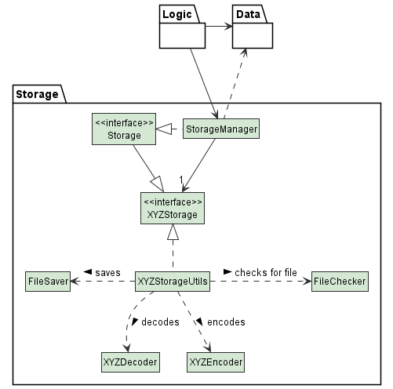
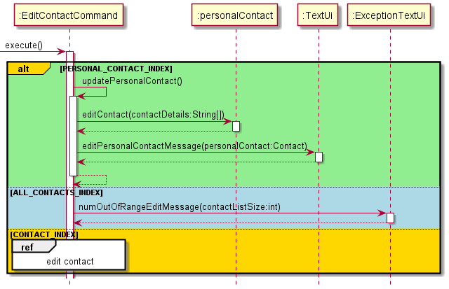

# Developer Guide

### Table of Content
- [Acknowledgements](#acknowledgements)
- [Design](#design)
  - [System Architecture](#sys-arch)
  - [TextUi](#text-ui)
  - [MainParser](#main-parser)
  - [Command](#command)
  - [ContactList](#contact-list)
  - [Storage](#storage)
- [Implementation](#implementation)
- [Product Scope](#scope)
  - [Target user profile](#target)
  - [Value proposition](#value)
- [User Stories](#stories)
- [Non-Function Requirements](#nf-req)
- [Glossary](#glossary)
- [Instructions for manual testing](#manual-test)

## Acknowledgements

- Inspiration for App Idea and OOP Structure: AddressBook (Level 2)  
  https://github.com/se-edu/addressbook-level2
- Inspiration for User Guide and Developer Guide: AddressBook (Level 2)  
  https://se-education.org/addressbook-level3/DeveloperGuide.html  
  https://se-education.org/addressbook-level3/UserGuide.html
- Converting text for ConTech:  
  https://patorjk.com/software/taag/#p=display&f=Graffiti&t=Type%20Something%20
- GitHub Markdown Emoji Syntax for User Guide:  
  https://github.com/ikatyang/emoji-cheat-sheet/blob/master/README.md
- PlantUML Tutorial:  
  https://se-education.org/guides/tutorials/plantUml.html

{list here sources of all reused/adapted ideas, code, documentation, and third-party libraries -- include links to the original source as well}

## Design

### System Architecture

The above **System Architecture** diagram shows the high-level design of ConTech.

On launch, the `Main` class initialises the app components in the correct sequence and links them up
with each other, in the correct sequence.

ConTech comprises five main components, namely:
- `TextUi`: Command Line User Interface of ConTech.
- `MainParser`: Parser to parser user inputs from `TextUi` for `Command`.
- `Command`: Command to be executed upon input parsing.
- `ContactList`: Data structure to store `Contact`s while running ConTech.
- `Storage`: Reads from and writes to [`LocalStorage`](#local-storage).

The five main components interact with each other, as shown in the sequence diagram below.
{ NEED SEQUENCE DIAGRAM }

### TextUi
### MainParser
### Command
### ContactList
### Storage
**API** :`Storage.java`

The `Storage` component is responsible for saving both contacts data and personal contact data locally inside the file 
paths, `data/contacts.txt` and `data/me.txt`. `Storage` is also responsible for loading these data back into their 
corresponding `ContactList` and `Contact` objects. It is thus dependent on the classes, `ContactList` and 
`Contact`.

## Implementation

{Describe the design and implementation of the product. Use UML diagrams and short code snippets where applicable.}

{NOT DONE}

### Editing a contact: `edit`
This feature is processed using `EditContactParser` under `MainParser`. In order to edit a contact in the contact list, 
a user must enter a command in the form `edit [CONTACT INDEX] [DETAILS WITH FLAGS]` where the details with flags are 
specified in the form `-flag detail` with up to 6 details i.e. `-g github-username -tw twitter_handle`. The user input
will be parsed by `EditContactParser` methods `getIndexToStore` and `parseContactDetails` to obtain a String array with
the details to be edited. An `EditContactCommand` with the specified parameters will then be created and executed in 
`Duke`. The sequence diagram below shows how the whole process is carried out.

### Deleting a contact: `rm`
This feature is processed using the `DeleteContactCommand`. Whenever the user wants to remove a contact from the contact
list using the `rm` command, `DeleteContactCommand` is created in the `MainParser` and executed in`Duke`. The sequence 
diagram below shows how the `execute()` function of `DeleteContactCommand` works. 

### Searching a contact: `edit`
This feature is processed using `SearchContactParser` under `MainParser`. In order to edit a contact in the contact list,
a user must enter a command in the form `search [FLAG] [SEARCH QUERY]`. If no flag is specified, the search will be done
on contact names buy default. From the user input, the search query and the search flag are obtained from the 
`parseSearchQuery` and the `getDetailFlag` methods respectively. A `SearchContactCommand` with the specified parameters
will be created and executed in `Duke`. The sequence diagram below shows how the whole process is carried out.

## Product scope
### Target user profile
- Has a need to store a significant amount of computing-related contacts
- Prefers and is familiar with Command Line Interface (CLI) applications
- Has many contacts that use common computing platforms, such as: Github, Linkedin, Twitter, Telegram, and Email
- Can type fast and prefers typing to mouse interactions

### Value proposition

As computing professionals are often on their computer, ConTech allows them to have a platform to 
manage their computing-related contacts locally and efficiently, without the need to use 
additional devices or platforms.

## User Stories

{NOT DONE}

|Version| As a ... | I want to ... | So that I can ...|
|--------|----------|---------------|------------------|
|v1.0|new user|see usage instructions|refer to them when I forget how to use the application|
|v2.0|user|find a to-do item by name|locate a to-do without having to go through the entire list|

## Non-Functional Requirements

- Should work on any [*mainstream Operating Systems*](#os) as long as Java `11` or higher has been installed on it
{Give non-functional requirements}

## Glossary

* **Mainstream Operating Systems** - Windows, macOS, *NIX
* **LocalStorage** - Refers to user's hard disk storage

## Instructions for manual testing

{Give instructions on how to do a manual product testing e.g., how to load sample data to be used for testing}
