# Developer Guide

This document describes the architecture and software implementation of the application, _Ha(ppy)Bit_. 
The document will be great for you if you are a developer who wish to gain insight into 
the design considerations and implementation of features, and possibly expand on the application.

* [Acknowledgements](#acknowledgements)
* [1. Introduction](#1-introduction)
  * [1.1. Overview of Ha(ppy)Bit](#11-overview-of-happybit)
  * [1.2. Terminology](#12-terminology)
  * [1.3. Icons and Format](#13-icons-and-format)
* [2. Setting Up](#2-setting-up)
  * [2.1. Application Requirements](#21-application-requirements)
  * [2.2. Project Set Up](#22-project-set-up)
* [3. Design](#3-design)
  * [3.1. Overall Architecture](#31-overall-architecture)
  * [3.2. UI Component](#32-ui-component)
  * [3.3. Parser Component](#33-parser-component)
  * [3.4. Command Component](#34-command-component)
  * [3.5. Goal Component](#35-goal-component)
  * [3.6. Storage Component](#36-storage-component)
* [4. Implementation](#4-implementation)
  * [4.1. Adding a Goal](#41-adding-a-goal)
    * [4.1.1. Implementation](#411-implementation)
    * [4.1.2. Design Considerations](#412-design-considerations)
  * [4.2. Adding a Habit](#42-adding-a-habit)
    * [4.2.1. Implementation](#421-implementation)
    * [4.2.2. Design Considerations](#422-design-considerations)
  * [4.3. Listing all Goals](#43-listing-all-goals)
    * [4.3.1. Implementation](#431-implementation)
    * [4.3.2. Design Considerations](#432-design-considerations)
  * [4.4. Listing all Habits](#44-listing-all-habits)
    * [4.4.1. Implementation](#441-implementation)
    * [4.4.2. Design Considerations](#442-design-considerations)
  * [4.5. Completing a Habit](#45-completing-a-habit)
    * [4.5.1. Implementation](#451-implementation)
    * [4.5.2. Design Considerations](#452-design-considerations)
  * [4.6. Updating a Goal](#46-updating-a-goal)
    * [4.6.1. Implementation](#461-implementation)
    * [4.6.2. Design Considerations](#462-design-considerations)
  * [4.7. Updating a Habit](#47-updating-a-habit)
    * [4.7.1. Implementation](#471-implementation)
    * [4.7.2. Design Considerations](#472-design-considerations)
  * [4.8. Deleting a Goal](#48-deleting-a-goal)
    * [4.8.1. Implementation](#481-implementation)
    * [4.8.2. Design Considerations](#482-design-considerations)
  * [4.9. Deleting a Habit](#49-deleting-a-habit)
    * [4.9.1. Implementation](#491-implementation)
    * [4.9.2. Design Considerations](#492-design-considerations)
  * [4.10. Getting Help](#410-getting-help)
    * [4.10.1. Implementation](#4101-implementation)
    * [4.10.2. Design Considerations](#4102-design-considerations)
  * [4.11. Storage of Information](#411-storage-of-information)
    * [4.11.1. Implementation](#4111-implementation)
    * [4.11.2. Design Considerations](#4112-design-considerations)
* [Appendix A: Product Scope](#appendix-a-product-scope)
  * [Target user profile](#target-user-profile)
  * [Value proposition](#value-proposition)
* [Appendix B: User Stories](#appendix-b-user-stories)
* [Appendix C: Non-Functional Requirements](#appendix-c-non-functional-requirements)
* [Appendix D: Glossary](#appendix-d-glossary)
* [Appendix E: Instructions for Manual Testing](#appendix-e-instructions-for-manual-testing)

---------------------------------------------------------------------------------------------------------

## Acknowledgements

This application reused some parts of the code from:
* Developer's name: Daren Tan (find his profile [here](AboutUs.md))
* Code source: CS2113T Individual Project
* Link to code: <https://github.com/DJ-Tan/ip.git>

This application referenced some parts of the code from:
* Developer team: find the team [here](https://se-education.org/addressbook-level3/AboutUs.html)
* Code source: AB-3
* Link to code: <https://github.com/se-edu/addressbook-level3.git>

This application adapted the Developer Guide and User Guide from:
* Developer team: find the team [here](https://se-education.org/addressbook-level3/AboutUs.html)
* Link to Developer Guide: <https://se-education.org/addressbook-level3/DeveloperGuide.html>
* Link to User Guide: <https://se-education.org/addressbook-level3/UserGuide.html#quick-start>

---------------------------------------------------------------------------------------------------------

## 1. Introduction

### 1.1. Overview of Ha(ppy)Bit

Ha(ppy)Bit is a desktop application aimed to empower students to achieve their goals—whether personal, academical, or 
health—amidst the hectic and stressful university life, through cultivating good habits. The application operates on a 
Command Line Interface (CLI) while still comprising features typically found in a Graphical User Interface (GUI). 
Students who type fast will find that Ha(ppy)Bit performs habit tracking more efficiently than your conventional GUI 
applications.

### 1.2. Terminology

Name     | Description                                                   | Example
-----    | ------------------------------------------------------------- | ---------------------
Goal     | A long term achievement you wish to accomplish.               |`Lose 5kg by Dec`
Habit    | Small, actionable tasks to be done to achieve goal.           |`Run 5km`
Interval | The time period (in days) which you want the habit to recur.  |`Run 5km every 7 days`

A goal can have one or more habits.\
A habit can have one or more intervals.

### 1.3. Icons and Format

> 📃 **Note**: important information you should take note off (especially if you encounter input errors)

> ⚠️ **Warning**: avoid doing the things mentioned here at all costs (unless you're feeling lucky)

> 💡 **Pro-Tip!** additional information that may make your tracking journey easier

## 2. Setting Up
The following section covers basic setup instructions to get you up and running on the HappyBit development environment.

### 2.1. Application Requirements

1. Ensure that you have installed Java SE Development Kit (JDK) `11` on your computer. If you do not have it installed, 
   you may download it from [here](https://docs.aws.amazon.com/corretto/latest/corretto-11-ug/downloads-list.html).
2. We recommend using [IntelliJ IDEA](https://www.jetbrains.com/idea/download/).
3. Fork our [repository](https://github.com/AY2122S1-CS2113T-F14-1/tp), and clone the fork to your computer.

### 2.2. Project Set-Up

> ⚠️ **Warning**: Follow the steps in the following guide exactly. Any deviations may result in the code failing to 
                     run as intended.

1. Start IntelliJ IDEA.
2. If you are currently on a project, close the project.
3. Navigate to `Plugins` and ensure that the Gradle plugin is enabled (Gradle is installed by default).
4. Open the project that was forked to your computer.
5. Set-up JDK 
   * Navigate to `File` > `Project Structure...` > `Project` 
   * Under `Project SDK`, add the JDK installed in Section 2.1.1
   * Under `Project Language Level`, choose `11 - Local variable syntax for lambda parameters`
6. Navigate to `Project` > `tp` > `src` > `main` > `happybit` > `HappyBit`
7. Locate the `main` method and click the green triangle on the left of it
8. If the code builds and runs with no issues, you are good.

## 3. Design

### 3.1. Overall Architecture

The architecture diagram below describes the high-level design of the application.

The 5 main components of the architecture diagram are:
1. `Ui` : User interface of the application
2. `Parser` : Parses user inputs (checks if input is valid and logic is correct)
3. `Command` : Executes the user commands
4. `Goal` : Contains the data of all goals, habits and intervals, as well as the logic to update them
5. `Storage` : Facilitates transfer of data between the application and external storage files

The sequence diagram below shows how the components interact with each other for the scenario where you issue the
command `remove g/1` to remove the goal at index 1.

We will now explain the 5 individual components, beginning with the UI Component.

### 3.2. UI Component

Firstly, the UI component is responsible for all user interfaces of the application. However, the component is further divided
into 2 sub-components: `UiManager.java` for static interface displays, and `PrintManager.java` for dynamic interface
displays (display messages in response to user input). The diagrams below illustrates the high level representation of
each sub-component.

#### 3.2.1 UiManager

**API:** `UiManager.java`

1. `UiStartup` will be called upon starting the application (we refer to this as the start state).
2. `UiMain` will be called upon entering the main state of the application (the main state is entered when you select
    the option `[5] Start Application` in the start state).
3. `UiMain` calls `Goal` to display a static view of all your habits to be done for the day.
4. `UiMain` calls `Storage` to display alerts for status of storage imports and exports.

#### 3.2.2 PrintManager

**API:** `PrintManager.java`

1. `PrintManager` is called upon by user commands to display text or error messages.
2. `PrintManager` may call `PrintTable` to print a list of items in a tabular format, for example when you input
    the `help` command to view a summary of formats of relevant commands in a tabular form.
3. `PrintManager` depends on `Goal` and `Habit` to print goal-related and habit-related information respectively.

### 3.3. Parser Component

Our second component is the Parser component, responsible for parsing and checking the logic of the user input. 
The diagram below illustrates the high level representation of the component.

**API:** `Parser.java`

1. A user input is given to `ParserManager` that determines which subclass of `Parser` is required
2. Inputs starting with `help`, `return`, and `exit` are handled by `ParserManager`
3. Other inputs are handled by `Parser`, which has a total of 7 subclasses:
   1. `AddParser` handles the parsing of inputs starting with `set` and `add`
   2. `DeleteParser` handles the parsing of inputs starting with `remove` and `delete`
   3. `DoneParser` handles the parsing of inputs starting with `done`
   4. `ListGoalParser` handles the parsing of inputs starting with `list`
   5. `ListHabitParser` handles the parsing of inputs starting with `view`
   6. `UpdateParser` handles the parsing of inputs starting with `update` and `change`
   7. `SetParser` Handles the parsing of inputs starting with `goal`

The sequence diagram below illustrates the flow of logic when a generic user input is entered into the application.

### 3.4. Command Component

The Command component is responsible for executing the application logic based on the parsed user input. The diagram
below illustrates the high level representation of the component.

**API:** `Command.java`

1. `Command` obtains the breakdown of required parameters from Parser - this means that no logic is performed here.
2. Add, update, done and delete commands updates the GoalList.
3. Commands that update the GoalList, as well as `ExitCommand` and `ReturnCommand`, updates the Storage.
4. The following describes the features of each command:
   * `AddGoalCommand` - Adds a new Goal to the GoalList.
   * `AddHabitCommand` - Adds a new Habit to a specified Goal set by the user.
   * `UpdateGoalCommand` - Updates one or more attributes (Name, End Date, Type) for a Goal.
   * `UpdateHabitCommand` - Updates one or more attributes (Name, Interval) for a Habit.
   * `DoneHabitCommand` - Marks a Habit from a specified Goal as completed.
   * `ListGoalCommand` - Lists out all the Goals set by the user.
   * `ListHabitCommand` - Lists out all the Habits set under a Goal.
   * `DeleteGoalCommand` - Deletes a Goal from the GoalList.
   * `DeleteHabitCommand` - Deletes a Habit from a specified Goal set by the user.
   * `SetCommand` - Indexes into a Goal so that commands can be called without stating a Goal's index (not implemented).
   * `HelpCommand` - Prints out table of all available commands.
   * `ReturnCommand` - Returns the user to start state of the application (Refer to Section 3.2. for _start state_).
   * `ExitCommand` - Saves all changes and exits the application.

### 3.5. Goal Component

The Goal component is responsible for maintaining and updating all goals set by the user. This includes running logic to
ensure that there are no violations when modifying information related to a goal. The diagram below illustrates the high
level representation of the component.

**API:** `Goal.java`

1. 0 or more `Goal` are associated with a `GoalList`.
2. A `Goal` must have exactly 1 `GoalType`. If not specified, the `GoalType` will be DEFAULT.
3. 0 or more `Habit` are associated with a `Goal`.
4. `Habit` may call `HabitDateManager` to handle date related logic.
5. 1 or more `Interval` are associated with a `Habit`.

### 3.6. Storage Component

The Storage component allows data to be read from and saved to a storage file. The diagram below illustrates the high
level representation of the component and the interactions between the other components.

**API:** `Storage.java`

1. `Storage` calls `Export` when saving data from the `GoalList` to an external storage file.
2. `Storage` calls `Import` when reading data from the external storage file to the `GoalList`.
3. `Import` calls `ImportParser` to decode the data extracted from the external storage file.
4. `ImportParser` calls `Goal`, `Habit`, and `Interval` in that order to load data into the `GoalList`.

## 4. Implementation

This section describes some noteworthy details on how the main features are implemented.

### 4.1. Adding a Goal 

This section describes the implementation of how the user can add a goal to their tracking list.

#### 4.1.1. Implementation

Adding a goal is amongst the first feature that the user will interact with as they begin goal tracking. The add goal 
feature is implemented using the `AddParser` and `AddGoalCommand` class. It allows the user to create a new goal on
their personal account which will be stored in the `GoalList` class. 

1. The `AddParser#parseAddGoalCommand(commandInstruction)` method is called, which in turns calls the 
   `AddParser#getGoal(commandInstruction)` method.
2. The `AddParser#getGoal(commandInstruction)` method will internally check for name, goal type, start date, and end
   date parameters. The name parameter has been limited to a maximum of 50 characters. The start date has to come after
   the end date, in addition to both dates needing to come after the date when the goal was created.
3. An `AddGoalCommand(goal)` object is created from the `AddParser#parseAddGoalCommand(commandInstruction)` method.

4. The `AddGoalCommand#runCommand(goalList, printManager, storage)` method is called, which in turns calls the 
   `GoalList#addGoal(goal, printManager)` method.
5. The `GoalList#addGoal(goal, printManager)` method checks for duplicated goal names before adding a goal to the list.
6. The `PrintManager#printAddedGoal(description)` method prints an acknowledgement message that the goal has been added.

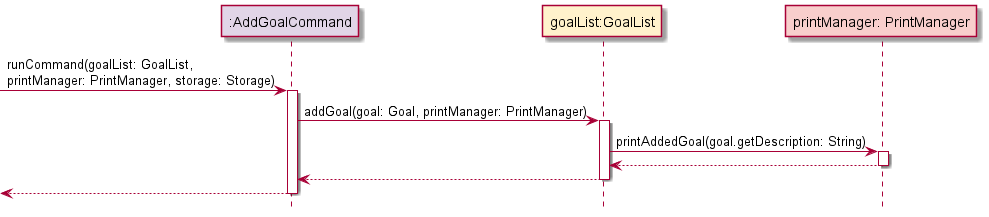

#### 4.1.2. Design Considerations

**Aspect:** Limiting number of characters for goal name
* **Alternative 1:** No limit imposed, but cut-off after a fixed number of characters and replace with ellipsis when
                     printing the list.
  * Pros: Table will be of a fixed size and reduced chance of error if the character limit is exceeded. 
  * Cons: Important information regarding the name may be unintentionally cut-off.
* **Alternative 2 (current choice):** A 50-character limit is imposed.
  * Pros: Entire name will be visible when printing the list, also no chance of exceeding character limit.
  * Cons: Table may be misaligned if the user's monitor is too small, name has to conform within the limit.

### 4.2. Adding a Habit

This section describes the implementation of how the user can add a habit to one of their tracked goals.

#### 4.2.1. Implementation

1. The `AddParser#parseAddHabitCommand()` method is called, which starts the process of extracting parameters from the
   user input.
2. The `AddParser#splitInput(commandInstruction)` method splits the user input into a string array of parameters, while
   the `AddParser#getIndex(paramters, "g/")` method finds the goal index from this string array and checks that the
   index is a positive integer.
3. The `AddParser#getHabit(commandInstruction)` method creates a `Habit` object from the parameters of the user input. 
   Within this method, there is a 50-character limit imposed on the name, as well as an integer check for the interval.
4. An `AddHabitCommand(habit, goalIndex)` object is created from the `AddParser#parseAddHabitCommand()` method.

5. The `AddHabitCommand#runCommand(goalList, printManager, storage)` method is called, which in turns calls the
   `GoalList#addHabitToGoal(habit, goalIndex, printManager)` method.
6. Within this newly called method, the `GoalList#getGoal(goalIndex)` method is called to ensure that the habit to be
   added is associated with a goal. Following which, methods of `GoalList` will verify that the habit to be added does 
   not already exist within that goal, as well as having an interval that is smaller or equal to the number of days
   between the start and end dates of the goal.
7. The `GoalList#updateHabitEndDate(goal, habit)` method is called to set the end date of habit similar to that of the
   associated goal. This was not performed during habit creation since the check for goal existence was not performed
   within `AddParser`. This method returns a new `Habit` object with its end date filled in.
8. The `Habit#populateIntervalsDuringHabitCreation()` method is finally called to generate intervals for the new `Habit`
   object, given that the start date, end date, and interval are known at this point.
9. The `Habit` object is added to the list of habits associated with the goal (of step 6) through the 
   `Goal#addHabit(newHabit)` method.
10. The `PrintManager#printAddedHabit(newHabitName, goalDescription)` method prints an acknowledgement message that the 
    habit has been successfully added to the goal.

#### 4.2.2. Design Considerations

**Aspect:** Calling constructor of `Habit` object with end date
* **Alternative 1:** Create `Habit` object in `AddParser` with end date.
    * Pros: `Habit` constructor can generate all intervals upon habit creation, lesser logic required in `GoalList`.
    * Cons: A `GoalList` object has to present in `AddParser` to check for a goal's existence (non-trivial).
* **Alternative 2 (current choice):** Create `Habit` object in `AddParser` without end date and updating in `GoalList`.
    * Pros: No additional logic required to get the `GoalList` object in `AddParser`.
    * Cons: Additional logic required in `GoalList` to update end date and populate intervals.

### 4.3. Listing all Goals

This section describes the implementation of how the user can display a list of all tracked goals.

#### 4.3.1. Implementation

1. The `ListGoalsParser#parseListGoalsCommand(input)` method is called. Since the list goals command does not require 
   any parameters, any extraneous text after the 'list' keyword is treated as the string variable `input`.
2. The `ListGoalsParser#parseListGoalsCommand(input)` method then returns a `ListGoalsCommand(input)`.

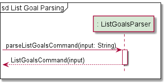

3. The `ListGoalsCommand#runCommand(goalList, printManager, storage, gibberish)` method is called, which in turns calls 
   the `GoalList#listGoals(printManager, gibberish)` method. The string variable `gibberish` is logically equivalent to
   the variable `input`.
4. The `ListGoalsCommand#runCommand(goalList, printManager, storage)` method is called, which in turns calls the
   `GoalList#listGoals(printManager)` method.
5. If the `GoalList` object is empty, the `GoalList#listGoals(printManager)` method returns an exception indicating that
   there are no goals to be printed.
6. Otherwise, the method calls the `PrintManager#printGoalList(goalList, goalList.size(), gibberish)` method, 
   which iterates through all `Goal` objects and prints their respective description line by line in a table.
7. `gibberish` is limited to 40 characters, with any characters after the limit trimmed.

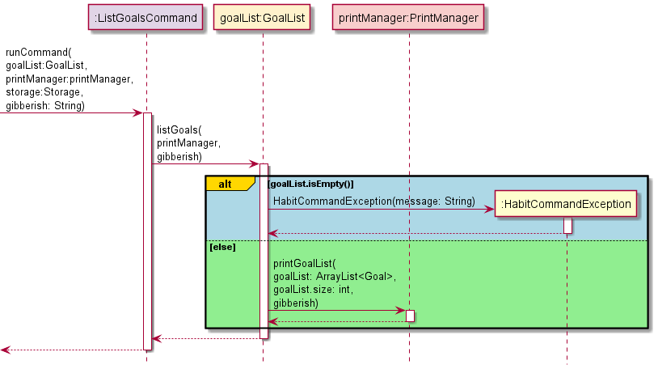

#### 4.3.2. Design Considerations

**Aspect:** Information to be included for the list of goals
* **Alternative 1:** Include minimal information, but add a command that prints in depth statistics of the goal.
    * Pros: The command to list goals acts as a quick view for the user without the clutter of irrelevant information. 
    * Cons: Total number of commands required will be increased, resulting in increased application complexity.
* **Alternative 2 (current choice):** Include all information, inclusive of statistics.
    * Pros: The command acts as an overview of everything the user may need to know about each goal.
    * Cons: Too much upfront information, which may lead to a lot of user scrolling if the list is very long.

### 4.4. Listing all Habits

This section describes the implementation of how the user can display a list of all habits under a tracked goal.

#### 4.4.1. Implementation

1. The `ListHabitParser#parseListHabitCommand(commandInstruction)` method is called, which starts the process of 
   extracting parameters from the user input.
2. The `ListHabitParser#splitInput(commandInstruction)` method splits the user input into an ArrayList of parameters, 
   while the `ListHabitParser#getIndex(parameters, "g/")` method finds the goal index from the parameters ArrayList and 
   checks that the index is a positive integer, returning the goalIndex of the specified goal in the goalList.
3. An `ListHabitsCommand(goalIndex)` object is created and returned from the 
   `ListHabitParser#parseListHabitCommand(commandInstruction)` method.

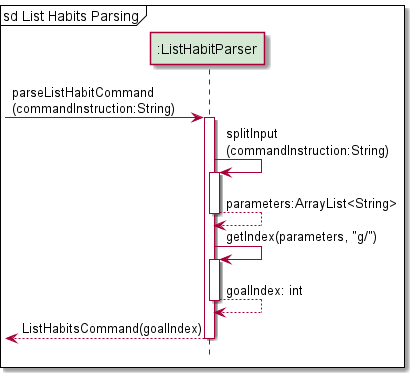

4. The `ListHabitsCommand#runCommand(goalList, printManager, storage)` method is called, which in turns calls the
   `GoalList#listHabitsFromGoal(goalIndex, printManager)` method.
5. Within this newly called method, the `GoalList#getGoal(goalIndex)` method is called to retrieve the `Goal` object
   from the `GoalList` object. 
6. The `Goal#getHabitList()` method is called to retrieve all the habits associated with that `Goal` object.
7. The `Goal#getListLength()` method is called to find the number of habits associated with that `Goal` object.
8. If the habitList is empty, a `HaBitCommandException` is raised to indicate the error that there are no habits
   associated with that goal.
9. Otherwise, the `PrintManager#printHabitList(goalName, habitList, numOfHabits)` method prints all habits associated
   with that goal in a tabular form.

#### 4.4.2. Design Considerations

**Aspect:** The class to get the list of habits from
* **Alternative 1:** Obtain list of habits directly from `Habit` class.
    * Pros: Eliminate the need to pass the list of habits between classes before reaching `PrintManager`.
    * Cons: `GoalList`, `Goal` and `Habit` has to be associated with `PrintManager`, which makes add-ons difficult for
            future developers that have to deal with the high level of class dependency.
* **Alternative 2 (current choice):** Obtain list of habits indirectly from `GoalList` class
    * Pros: Only the `GoalList` class will be associated with the `PrintManager` class.
    * Cons: The list of habits have to passed from the `Habit` class, through the `Goal` class, before being available
            in the `GoalList` class.

### 4.5. Completing a Habit

This section describes the implementation of how the user can mark a habit as completed for the current interval.

#### 4.5.1. Implementation

1. The `DoneParser#parseDoneHabitCommand(commandInstruction)` method is called, which starts the process of extracting 
   parameters from the user input.
2. The `DoneParser#splitInput(commandInstruction)` method splits the user input into an ArrayList of parameters, while 
   the `ListHabitParser#getIndex(parameters, "g/")` and `ListHabitParser#getIndex(parameters, "h/")`methods find the
   goal index and habit index from the parameters ArrayList respectively. These methods check that the index is a 
   positive integer and returns the index, throwing a `HaBitParserException` otherwise.
3. An `DoneHabitCommand(goalIndex, habitIndex)` object is created and returned from the
   `DoneParser#parseDoneHabitCommand(commandInstruction)` method.

4. The `DoneHabitCommand#runCommand(goalList, printManager, storage)` method is called, which in turns calls the
   `GoalList#doneHabitFromGoal(goalIndex, habitIndex, printManager)` method.
5. Within this newly called method, the `GoalList#getGoal(goalIndex)` method is called to retrieve the `Goal` object
   from the `GoalList` object.
6. The `Goal#getHabitList()` method is called to retrieve all the habits associated with that `Goal` object.
7. The `GoalList#getHabit(habitList, habitIndex)` method is called to retrieve the habit at the specified `habitIndex`.
8. The `Goal#doneHabit(habitIndex)` method is called to mark the specified habit as completed.
9. The `Habit#getDoneHabitDates` method is called to get information on the start and end dates of the interval marked 
   as done, as well as the next interval's start date. This is information is required for printing a confirmation
   message to the user.
10. Finally, the `PrintManager#printDoneHabit(goalDescription, habitDescription, strDates)` method is called to
    print a confirmation message on the successful completion of a habit.

#### 4.5.2. Design Considerations

**Aspect:** Backtracking for marking habits as completed
* **Alternative 1 (current choice):** Users are only allowed to mark the current intervals of habit as completed. 
    * Pros: Users will not abuse the tracking application by marking past intervals as completed.
    * Cons: Users temporarily unable to access the application will be penalised for not updating their completion on
            application although the habit has been completed within that interval.
* **Alternative 2:** Users are allowed a fixed number of habit retro-completions.
    * Pros: Users will not be penalised if they did not have access to the application for whatever reason.
    * Cons: Additional logic has to be implemented to ensure that a reduction in number of intervals is also reflected
            with a proportional reduction in retro-completions. Furthermore, the number of retro-completion has to be
            backed by past statistics which we do not have at the moment.

### 4.6. Updating a Goal

This section describes the implementation of how the user can update a goal's name, type and/or end date.

#### 4.6.1. Implementation
1. The `UpdateParser#parseUpdateGoalCommands(commandInstruction)` method is called, which starts the process of
   extracting parameters from the user input.
2. The `UpdateParser#splitInput(commandInstruction)` method splits the user input into an ArrayList of parameters.
3. The `UpdateParser#getUpdateGoalAttributes(parameters)` method is used to confirm what attributes exist in the user
   input and finds the flags for those attributes (goal name, goal type, and goal end date).
4. If `isUpdateGoalName` is true, `UpdateParser#getName(parameters)` is called to get the updated name.
5. Similarly, if `isUpdateGoalType` and `isUpdateGoalEndDate` is true, they will call `UpdateParser#getType(parameters)`
   and `UpdateParser#getDate(parameters)` to get the updated type and updated end date respectively.
6. The `goalIndex` to update is then obtained with the `UpdateParser#getIndex(parameters, FLAG_GOAL_INDEX)` method
7. Any excess attributes provided in the input is found with the `UpdateParser#getExcessGoalAttributes(parameters)`
   method. This is required as a parameter for the `UpdateGoalCommand` constructor. Its use is detailed in the steps 
   below.
8. Finally, an `UpdateGoalCommand(goalIndex, newGoalName, newGoalType, newGoalEndDate, updateAttributes, 
   excessAttributes)` object is created and returned from the `UpdateParser#parseUpdateGoalCommands(commandInstruction)` 
   method.

9. The `UpdateGoalCommand#runCommand(goalList, printManager, storage)` method is called, which in turns calls the 
   `GoalList#updateGoalAttributes(goalIndex, newGoalName, newGoalType, newGoalEndDate, updateAttributes, 
    excessAttributes, printManager)` method.
10. Within this newly called method, the `PrintManager#printLine()` method is called to print a line to separate the
    new messages being printed.
11. Based on the `updateAttributes` parameter, if the first element is true, `GoalList#updateGoalName(goalIndex, 
    newGoalName, printManager)` is called to update the goal name, calling the `PrintManager#printUpdatedGoalName(
    oldGoalDescription, newGoalDescription)` method to print a confirmation message on successful update of goal name.\
    Similarly, if the second element is true, `GoalList#updateGoalType(goalIndex, newGoalType, printManager)` is called 
    to update the goal type, calling the `PrintManager#printUpdatedGoalType(oldGoalTypeName, newGoalTypeName)` 
    method to print a confirmation message on successful update of goal type.\
    Finally, if the third element is true, `GoalList#updateGoalEndDate(goalIndex, newGoalEndDate, printManager)` is 
    called to update the goal end date, calling the `PrintManager#printUpdatedGoalEndDate((goalName, oldDateString, 
    newDateString)` method to print a confirmation message on successful update of end date after performing some date 
    checking to ensure the end date is valid.
12. Lastly, the `PrintManager#printUpdateGoalMessageEnd(excessAttributes)` method is called to print a message if
    some excess parameters can be modified with a different command.
13. Finally, since this command modifies the `goalList` data, the modified data is saved to the program data file with
    `Storage#export(goalList)`. If there were any errors raised during this process, the printManager prints the error 
    with `PrintManager#printError`.

#### 4.6.2. Design Considerations

**Aspect:** Single parameter vs Multiple parameters Update
* **Alternative 1:** Separate commands to update each parameter for a `Goal` object.
    * Pros: Separate classes are written for each command, which streamlines the process for adding more parameters in
            the future.
    * Cons: The user will be swamped by more command keywords.
* **Alternative 2 (current choice):** A single command that can update multiple parameters for a `Goal` object.
    * Pros: The user has to remember only one command keyword to update the parameters of a goal.
    * Cons: Multiple checks have to be carried out within a class, which may be confusing due to long lines of code.

### 4.7. Updating a Habit

This section describes the implementation of how the user can update a habit's name and/or interval length.

#### 4.7.1. Implementation
1. The `UpdateParser#parseUpdateHabitCommands(commandInstruction)` method is called, which starts the process of
   extracting parameters from the user input.
2. The `UpdateParser#splitInput(commandInstruction)` method splits the user input into an ArrayList of parameters.
3. The `UpdateParser#getUpdateHabitAttributes(parameters)` method is used to confirm what attributes exist in the user
   input and finds the flags for those attributes (habit name, habit interval).
4. If `isUpdateHabitName` is true, `UpdateParser#getName(parameters)` is called to get the updated name.
5. Similarly, if `isUpdateHabitInterval` is true, `UpdateParser#getUpdateInterval(parameters)` is called to get the 
   updated interval.
6. The `goalIndex` and `habitIndex` to update is then obtained with the 
   `UpdateParser#getIndex(parameters, FLAG_GOAL_INDEX)` and `UpdateParser#getIndex(parameters, FLAG_HABIT_INDEX)`
   methods respectively.
7. Any excess attributes provided in the input is found with the `UpdateParser#getExcessHabitAttributes(parameters)`
   method. This is required as a parameter for the `UpdateHabitCommand` constructor. Its use is detailed in the steps 
   below.
8. Finally, a `UpdateHabitCommand(goalIndex, habitIndex, newHabitName, newHabitInterval, updateAttributes, 
   excessAttributes)` object is created and returned from the 
   `UpdateParser#parseUpdateHabitCommands(commandInstruction)` method.

9. The `UpdateHabitCommand#runCommand(goalList, printManager, storage)` method is called, which in turns calls the 
   `GoalList#updateHabitAttributes(goalIndex, habitIndex, newHabitName, newHabitInterval, updateAttributes, 
   excessAttributes, printManager)` method.
10. Within this newly called method, the `PrintManager#printLine()` method is called to print a line to separate the
    new messages being printed.
11. Based on the `updateAttributes` parameter, if the first element is true, 
    `GoalList#updateHabitNameFromGoal(goalIndex, habitIndex, newHabitName, printManager)` is called to update the habit 
    name, calling the `PrintManager#printUpdatedHabitName(goalDescription, oldHabitDescription, newHabitDescription)` 
    method to print a confirmation message on successful update of goal name. This is done after performing some checks 
    on whether the new habit name is valid. Exceptions are raised if the new habit name is not valid.\
    Similarly, if the second element of `updateAttributes` is true, 
    `GoalList#updateHabitIntervalFromGoal(goalIndex, habitIndex, newHabitInterval, printManager)` is called
    to update the interval of the specified habit, calling the `PrintManager#printUpdatedHabitInterval(goalDescription, 
    habitDescription, newInterval)` method to print a confirmation message on successful update of habit interval. This 
    is done after performing some checks on whether the new habit interval is valid. Exceptions are raised if it is
    found to be invalid.
12. Lastly, the `PrintManager#printUpdateHabitMessageEnd(excessAttributes)` method is called to print a message if
    some excess parameters can be modified with a different command.
13. Finally, since this command modifies the `goalList` data, the modified data is saved to the program data file with
    `Storage#export(goalList)`. If there were any errors raised during this process, the printManager prints the error
    with `PrintManager#printError`.

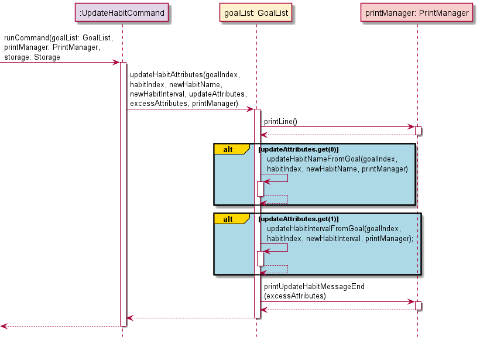

#### 4.7.2. Design Considerations

**Aspect:** Update of habit interval lengths
* **Alternative 1 (current choice):** Allow the length of an interval for a habit to be updated.
    * Pros: The user may find that an interval is too short or long, and switch up their routine accordingly to suit
            their needs.
    * Cons: Since all intervals are generated upon habit creation, logic has to be implemented to remove all existing 
            future intervals, and new intervals have to be regenerated based off this new interval length.
* **Alternative 2:** Prevent a user from changing the interval length after a habit has been created.
    * Pros: The user is prevented from abusing the change of interval length to inflate their completion rate.
    * Cons: If the habit routine initially created by the user does not suit him/her, the entire habit has to be
            recreated, meaning that all past data will be lost.

### 4.8. Deleting a Goal

This section describes the implementation of how the user can delete a goal from their list of tracked goals.

#### 4.8.1. Implementation

1. The `DeleteParser#parseDeleteGoalCommand(input)` method is called, which starts the process of extracting parameters
   from the user input.
2. The `DeleteParser#splitInput(input)` method splits the user input into an ArrayList of parameters.
3. The `goalIndex` to delete is then obtained with `DeleteParser#getIndex(parameters, FLAG_GOAL_INDEX)` method.
4. A `DeleteGoalCommand(goalIndex)` object is created and returned from the `DeleteParser#parseDeleteGoalCommand(input)`
   method.

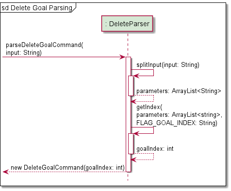)

5. The `DeleteGoalCommand#runCommand(goalList, printManager, storage)` method is called, which in turns calls the
   `GoalList#deleteGoal(goalIndex, printManager)` method.
6. Within this newly called method, the `GoalList#getGoal(goalIndex)` method is called to retrieve the `Goal` object
   from the `goalList`.
7. The `GoalList#updateChosenGoalIndex(goalIndex)` method is called to perform checks on the goal to be deleted.
8. The `Goal` is then deleted with the `GoalList#remove(Goal)` method.
9. Finally, the `PrintManager#printRemovedGoal(goalDescription)` method is called to print a confirmation message on
   the successful deletion of a goal.

#### 4.8.2. Design Considerations

**Aspect:** Goal index of remaining goals
* **Alternative 1:** Maintain the goal index of all other goals after deletion.
    * Pros: Users that has committed the goal index of their tracked goals to memory do not need to worry about changes
            to their goals' indexes after a deletion is made.
    * Cons: Additional logic to be implemented to fill up gaps by deleted goals with new goals.
* **Alternative 2 (current choice):** Goal indexes are flushed whenever a deletion is made. This means that a goal with
                                      an original index of '3' will have its index change to '2' if the goal at index 
                                      '1' is deleted.
    * Pros: Logic for the goal list is easier to implement (simply use the add() and remove() methods of ArrayList).
    * Cons: Users need to constantly check their list of tracked goals to ensure that the correct goal is being updated.

### 4.9. Deleting a Habit

This section describes the implementation of how the user can delete a habit from an associated goal from their list of 
tracked goals.

#### 4.9.1 Implementation

1. The `DeleteParser#parseDeleteHabitCommand(input)` method is called, which starts the process of extracting parameters
   from the user input.
2. The `DeleteParser#splitInput(input)` method splits the user input into an ArrayList of parameters.
3. The `goalIndex` of the associated goal from which a habit to deleted is then obtained with
   `DeleteParser#getIndex(parameters, FLAG_GOAL_INDEX)` method
4. The `habitIndex` of the habit to deleted is then obtained with `DeleteParser#getIndex(parameters, FLAG_HABIT_INDEX)`
   method
5. A `DeleteHabitCommand(goalIndex, habitIndex)` object is created and returned from the
   `DeleteParser#parseDeleteHabitCommand(input)` method.

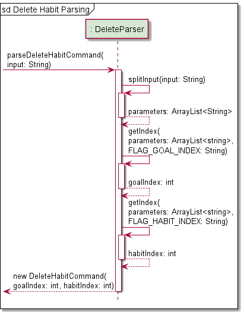

6. The `DeleteHabitCommand#runCommand(goalList, printManager, storage)` method is called, which in turns calls the
   `GoalList#deleteHabitFromGoal(goalIndex, habitIndex, printManager)` method.
7. Within this newly called method, the `GoalList#getGoal(goalIndex)` method is called to retrieve the `Goal` object
   from the `goalList`.
8. An ArrayList of habits associated with this goal is retrieved with `Goal#getHabitList()`.
9. The `GoalList#getHabit(habitList, habitIndex)` method is called to get the habit to be deleted. If `habitIndex` is
   invalid, a `HaBitCommandException` is raised.
10. The `Habit` is then deleted with the `Goal#removeHabit(habitIndex)` method.
11. Finally, the `PrintManager#printRemovedHabit(goalDescription, habitDescription)` method is called to print a
    confirmation message on the successful deletion of a habit.

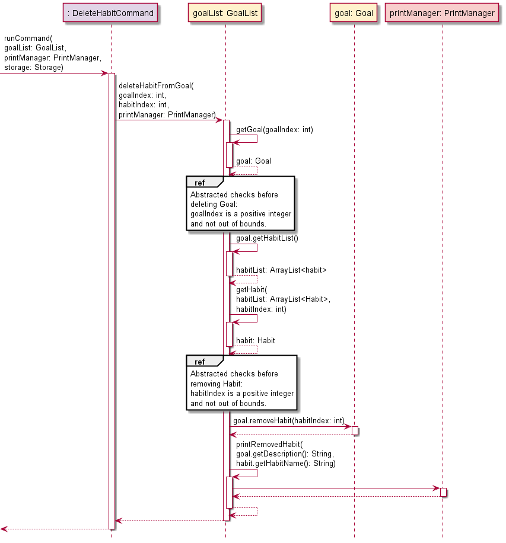

#### 4.9.2. Design Considerations

The design consideration was similar to [Section 4.8.2. Design Considerations](#482-design-considerations), where it was
ultimately decided that the habit indexes will be flushed to avoid gaps instead of being maintained.

### 4.10. Getting Help

This section describes the implementation of how the user can get help. This will open up a command summary with format
information of each command in a tabular form.

#### 4.10.1 Implementation

1. A `HelpCommand()` object is directly created and returned from the `ParserManager#parseCommand(command, details)` 
   method.
2. When the `HelpCommand#runCommand(goalList, printManger, storage)` method is executed it calls the 
   `PrintManager#printCommandList()` method which prints out a table informing the user of all the possible commands and
   their respective formats and options.

#### 4.10.2. Design Considerations

**Aspect:** Type of display for command list
* **Alternative 1 (current choice):** In-application display of entire command list.
    * Pros: The application does not have to be connected to a network if a user needs help with the navigation.
    * Cons: Limited information can be presented on the application itself. Furthermore, a long command list may result
            in a significant amount of scrolling for the user.
* **Alternative 2:** Opens a browser to the command summary of the User Guide.
    * Pros: Every detail (including possible pitfalls) of the command is made known to the user. 
    * Cons: Network connection is required for an application that should be able to operate without sustaining one. In
            addition, a link to the User Guide will be provided in the Start-Up interface.

### 4.11. Storage of Information

This section describes the implementation of how _Ha(ppy)Bit_ handles and stores the information you have entered.

#### 4.11.1. Implementation

**Importing Data**
1. The `Storage#load()` method runs automatically upon startup, which calls `Import#importStorage(filePath)`.
2. The save file `habits.txt` is then scanned line by line, where every line is parsed into discrete and 
   discernible information and then stored in a string array `lineData`.
3. `Import#updateGoalList(lineData, GoalList)` is called for every line till all lines have be scanned.
4. In every iteration of `Import#updateGoalList(lineData, goalList)` being called, the information
   (sorted by goal type) is parsed and stored into `goalList`, updating `goalList`.
5. The completed `goalList` is returned to `Storage`, and then returned to update the main `goalList` 
   attribute in `UiManager`.

The sequence diagram shows how the program imports data from storage file.\

**Exporting Data**
1. The `Storage#export(goalList)` method is called, which in turn calls `Storage#exportToStorage(goalList)`.
2. The `habits.txt` filed is cleared of previous text with `Export#clearFile()`.
3. The `Export#writeToFile(goalList)` then rewrites `habits.txt` using data in `goalList`.
4. The `goalList` is encoded goal by goal. 
5. In a `goal` object, all of its attributes are converted to text in a line. They are segregated
   by a delimiter. The habits are then are encoded habit by habit.
6. In a `habit` all of its attributes are converted to text in a line. They are segregated
   by a delimiter. The intervals are then encoded interval by interval.
7. In an `interval` all of its attributes are converted to text in a line. They are segregated
   by a delimiter.
8. At the end of `Export#writeToFile(goalList)`, all data in `goalList` is stored in `habits.txt`.

The sequence diagram shows how the program exports data to storage file./

#### 4.11.2. Design Considerations

**Aspect:** Storage of application data
* **Alternative 1 (current choice):** Store all data in a text file.
    * Pros: The standard Java library already supports reading and writing to text files.
    * Cons: Interpreting data directly from text files is non-trivial (depending on how the data is saved)
* **Alternative 2:** Store all data in a JSON format.
    * Pros: JSON is a widely accepted standard which is well known, allowing anyone to view and modify the save file
            when necessary.
    * Cons: Various data types are not supported in JSON formatted files.

---------------------------------------------------------------------------------------------------------

## Appendix A: Product Scope

### Target user profile:
* wants to have a work-life balance but is often consumed by work/school
* have goals and aspirations but falls short of them; lacklustre commitment or game plan for action
* doesn't want to rely on smartphone (They're doing everything these days, sheesh!)
* prefers desktop app
* familiar and comfortable with CLI apps, or willing to learn to use

### Value proposition

Users with _Ha(ppy)Bit_ will find themselves cultivating good habits and breaking bad habits despite hectic 
workload or commitments.

## Appendix B: User Stories

|Version| As a ... | I want to ... | So that I can ...|
|--------|----------|---------------|------------------|
|v1.0|new user|see usage instructions|refer to them when I forget how to use the application| 
|v1.0|user|set a new goal I wish to accomplish|start working towards completing the goal|
|v1.0|user|add habits i wish to carry out in the process of accomplishing my goal|break down the journey of achieving my goal into smaller manageable steps
|v1.0|user|remove a goal from my list of goals|remove goals that I no longer wish to work towards|
|v1.0|user|delete a habit added under a goal|remove a habit that I no longer wish to carry out|
|v1.0|user|mark a habit as done|indicate that I have completed that habit|
|v1.0|user|list out all the goals I have|remind myself of the goals I am working towards|
|v1.0|user|view all the habits I have set for each goal|check which habits I have yet to complete|
|v1.0|user|have import and export functionality in the program|access goals and habits previously set from a local data storage
|v2.0|user|have recurring habits at a regular interval|habitually carry out the habits I set for myself|
|v2.0|user|be able to view my progress for any goal|motivate myself in the process|
|v2.0|user|view all my habits due for the day upon entering the program|remember to carry out these habits by the end of the day|

## Appendix C: Non-Functional Requirements

|Non-Functional Requirements | Requirement Type |
| :---------- | :---: |
|App should be operable on Windows, macOS, and Ubuntu running Java `11` or above.|Technical|
|App can be learned anyone who is familiar with computer within minutes of use.|Quality|
|App should be a helpful, encouraging, and a joy to use.|Quality|

## Appendix D: Glossary

* **Goal**: A long term achievement you wish to accomplish
* **Habit**: Checkpoints; actionable tasks to be done to achieve goal

## Appendix E: Instructions for Manual Testing

The instructions below are for the manual testing of the program.

### Launching and Exiting the Program

**Launch**
   * Download the jar file [here](UserGuide.md#1-quick-start) and copy the file into an empty folder.
   * Open your terminal and type in the command `java -jar happybit.jar` to start up the program.
   * You should see the start-up page with the start-up menu as shown below.
  

**Navigation**
   * Select what you are interested in from the start-up menu by typing in the corresponding option number.
   * You can find out more about the various options at our [User Guide](UserGuide.md#12-main-interface).
   * There will be an error message shown if you select an invalid option.
   * Test: `-1` to see the error message.

**Exit**
   * To exit the program, select option `6`. 
   * You should see the exit message before the program terminates as shown below.
  

### Starting the Application

1. Launch the program and select option `5` to start using the application.
2. Upon starting the application, you should see the command screen as shown below.

3. Command screen takes in your input at `Command: `. Press 'enter' after typing in your command.
4. For example, to set a goal: `set n/Wake up at 8am everyday t/sl s/08112021 e/15112021`
   * The name of goal: `Wake up at 8am everyday`
   * The goal is classified as a sleeping goal: `sl`
   * Start the goal at: `08112021` (08 Nov 2021)
   * End the goal at: `15112021` (15 Nov 2021)
5. After you have entered the command to add a goal, you should see that the goal was successfully added.

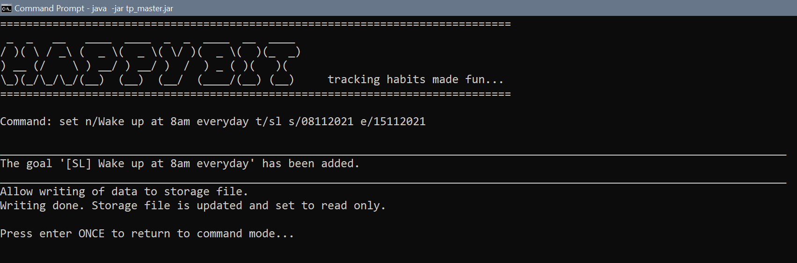

6. Press enter again to return to command screen.

### Deleting Goals or Habits

After adding in a substantial number of goals and habits, you can test out the deletion commands as shown below.

To see all the goals you have added, use command `list`. You should take note of the index of the goal that you
  want to delete. We will be using the list shown below as an example.

To delete a goal, use the command `remove`.
   * Test: `remove g/6` to remove goal at index `6`.

Use the command `list` to see the new index of the goals.
   

Next, use `view` to see the index of the habit under a goal that you want to delete.
   * Test: `view g/6` to view the habits under goal `6`.

To delete a habit, use the command `delete`.
   * Test: `delete g/6 h/1` to delete habit `1` under goal `6`.

After any deletion, the index of the goals or habits will change. Therefore, make sure to use commands
  `list` and/or `view` to check for the new index of the goals and habits.
   * Test: `remove g/7` to remove a goal at index `7` that does not exist. Error will be thrown.

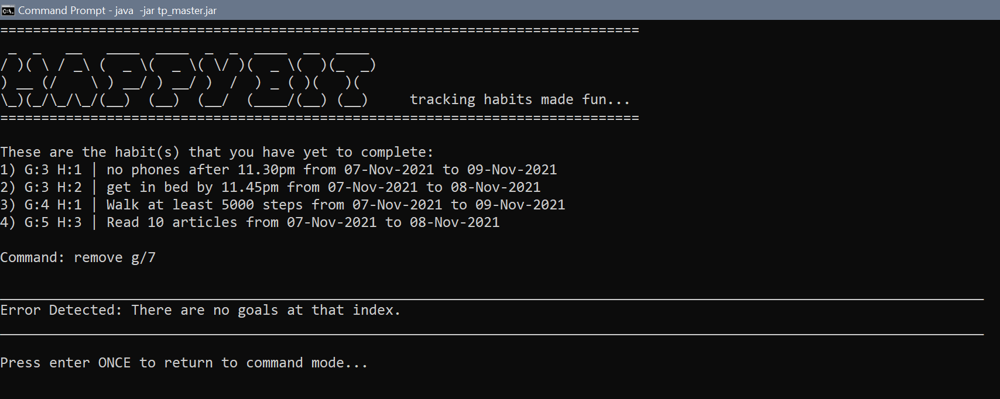

### Storage of Data

To check if the program can save and load your data:

1. Exit the application using command `exit`.
2. Launch the program and enter the application again.
3. Type `list` to check that all your previous data are present.
4. If your data are all present, it means that the program successfully saved and loaded your data
  from the storage file.

> ⚠ The subsequent steps might cause you to lose your data.

To check if the program can create a storage file if it doesn't exist:

1. Go to the folder containing the jar file. You should see a folder `data` that contains a `.txt` file
  which contains your data. Delete the folder `data` or move it somewhere else.

2. Launch the program and enter the application.
3. Type `list` to see that no goals exists since the storage file was deleted. A new empty storage file
  will be created by the program.

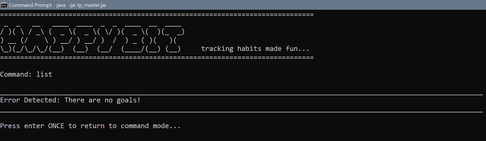

To check if the data file is read-only and if it is possible to corrupt data file:

1. The storage file is set to read-only. To test this, go to `data` folder and open the `.txt` file.
2. Randomly edit the text file to corrupt it.
3. Try to save the changes and there should be an error message preventing you to do so.

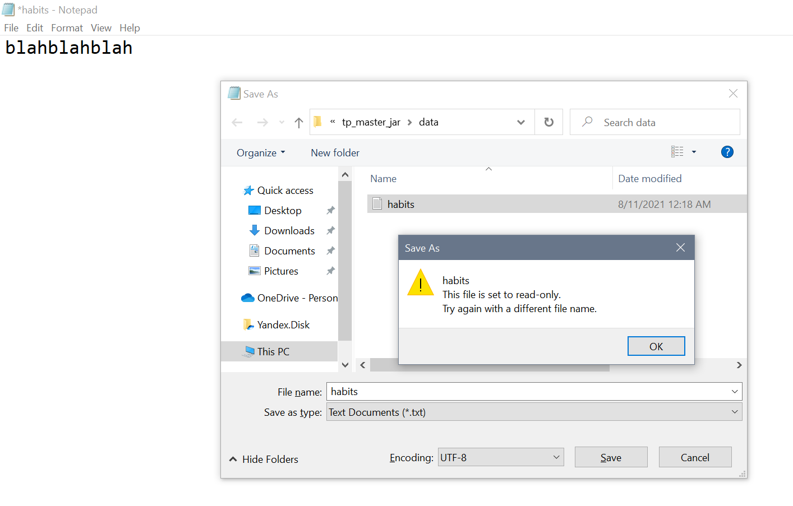

To check that in the event the data file is corrupted, all the data will be wiped off:

1. If the data file is for some reason corrupted, note that you will lose **all** your data.
2. Once you enter the application, and it detects that the file is corrupted, it will clear the file.

3. Without adding any data in the application, exit the program and check back to the corrupted file.
  It should be empty.
