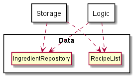
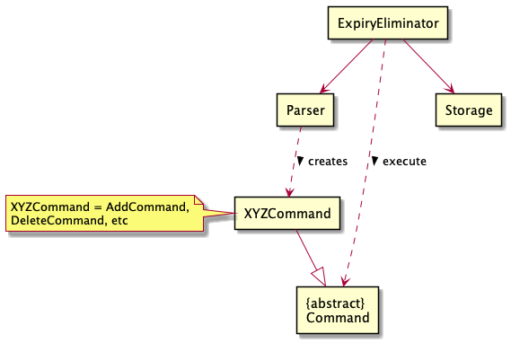
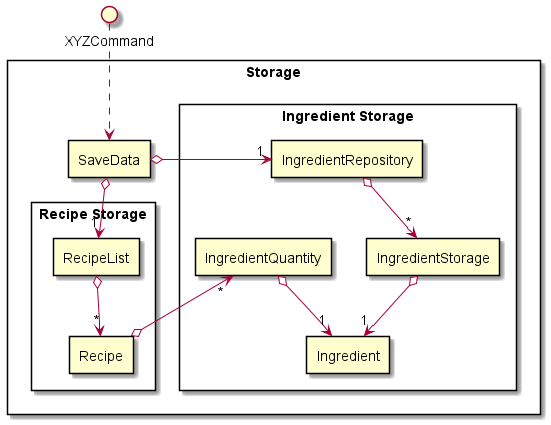
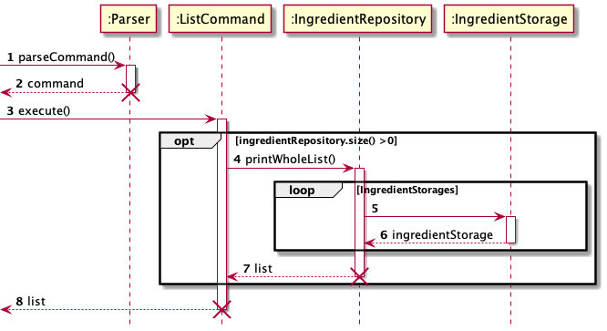
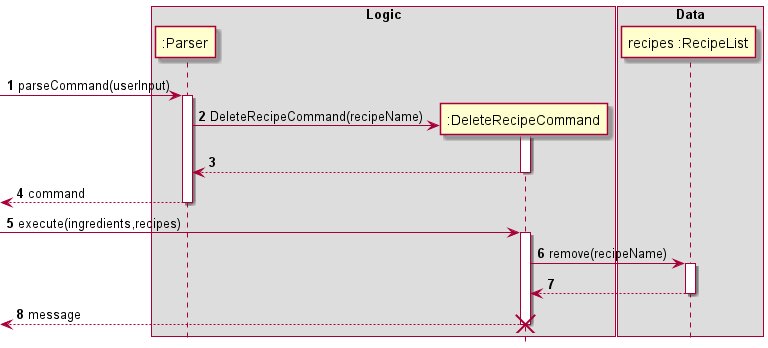
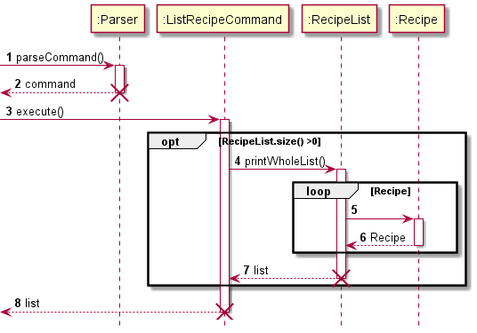
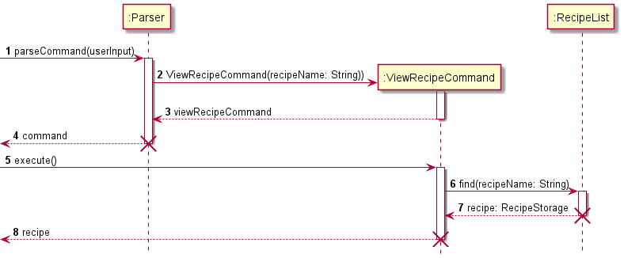
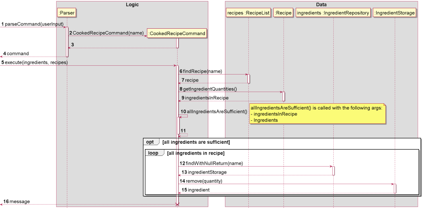

# Developer Guide

* Table of Contents
{:toc}

## Acknowledgements

- The documentation is inspired by and some snippets are adapted from [Address Book (Level 3)](https://github.com/se-edu/addressbook-level3). The `LogsCenter` class also reuses code from [Address Book (Level 3)](https://github.com/se-edu/addressbook-level3), with minor modifications.
- The `IncorrectCommand`, `IllegalValueException`, and `DuplicateDataException` classes reuse code from [Address Book (Level 2)](https://github.com/se-edu/addressbook-level2), with minor modifications.
- The `Ui`, `Parser`, `ExpiryEliminator`, `Command`, and `ByeCommand` classes reuses code from [bernardboey's ip](https://github.com/bernardboey/ip/), with minor modifications.
- Method to convert String to title case references code from [Baeldung](https://www.baeldung.com/java-string-title-case) although there are modifications.

## Design

### Data
**API** : [Data.java](https://github.com/AY2122S1-CS2113-T16-3/tp/tree/master/src/main/java/expiryeliminator/data)

 - The `Data` Component,
     - Stores a list of `Recipe` objects, in the form of `RecipeList`
     - Stores a list of `IngredientStorage`, in the form of `IngredientRepository`
 - Each `Recipe` has its ingredients and respective quantities stored in `IngredientQuantity`
 - The `IngredientStorage` separates a specific ingredient into batches of quantities, 
   according to the expiry date.
 - `Ingredient` stores the information of the ingredients, which are its name and unit, 
   e.g. Chicken and grams.

 - A command in the logic takes the `Ingredient Repository` and `RecipeList` as an input to modify the ingredients and recipes
   based on the command.
 - The storage takes the `Ingredient Repository` and `Recipe List` as an input to save data to the file / load data from the file.

### Logic

- The `Logic' component:
  - When ExpiryEliminator is called upon to execute a command, it uses the Parser class to parse the user command.
  - This results in a Command object (more precisely, an object of one of its subclasses e.g., AddCommand) which is executed by ExpiryEliminator.
  - The command can communicate with the Model when it is executed (e.g. to add an ingredient).

### Storage

- The 'Storage' component:
  - When users type in a command that is to be executed by ExpiryEliminator, it stores all updates that the command
    makes to the Recipe List and Ingredient Repository. The updates are stored to the txt files in the 'data' directory.
    When users restart ExpiryEliminator, it loads all the data from the txt files to the program.
  - The SaveData class saves all the updates of Ingredient Storage and Recipe Storage.
  - The Recipe in the Recipe Storage is interdependent with ingredientQuantity in the Ingredient Storage, as each recipe is
    composed of multiple instances of ingredientQuantity.

### Parser

This is a simplified class diagram of the Parser component, which provides a high level overview. The same diagram will be displayed again later on, but with much greater detail.

This is a more detailed class diagram of the `Parser`, `ArgsParser`, and `Prefix` classes. Note that `Parser` has 5 single arg prefixes, 3 multiple arg prefixes, and 1 optional arg prefix. These prefixes correspond to the various arguments that are accepted by the various commands.

- The `Parser` is the main component that communicates with the various subcomponents. It is called by the main `ExpiryEliminator` class and is responsible for parsing commands.
- The `ArgsParser` is responsible for parsing args. It does this by accepting a list of `Prefix` objects upon creation which will determine what prefixes it should look out for. Then, when instructed to parse, it parses an args string based on the prefixes.
- Each `Prefix` object represent a prefix that can be present in the command args. (E.g. a prefix can correspond to `i/`, `r/`, or `q/`, etc.). In addition to that, a prefix either belongs to a `SingleArgPrefix`, `MultipleArgPrefix`, or `OptionalArgPrefix`.
  - A `SingleArgPrefix` allows the prefix to appear exactly once in the args string.
  - A `MultipleArgPrefix` allows the prefix to appear multiple (i.e. one or more) times in the args string.
  - An `OptionalArgPrefix` allows the prefix to appear once or not at all in the args string.
- With these different prefixes, we can clearly dictate how the command arguments should be structured.

This is a more detailed class diagram of the `SingleArgParser` and `MultipleArgParser` classes.

- The `SingleArgParser` and `MultipleArgParser` objects represents a parser for an individual arg type (e.g. ingredient name).
  - A `SingleArgParser` represents a parser that accepts a single string and parses it according to the arg type.
  - A `MultipleArgParser` represents a parser that accepts either a single string or a list of strings and parses it according to the arg type.

#### How the Parser works
1. When the `Parser` needs to parse a command, (e.g. `add recipe r/Apple Pie i/Apple q/2 i/Flour q/400`), it first separates the command and args (e.g. command: `add recipe`, args: `r/Apple Pie i/Apple q/2 i/Flour q/400`).
2. Then, it matches the command against a list of accepted commands.
   1. If it does not match, then it notifies the user that it is an invalid command, via the `IncorrectCommand` class.
   2. If it finds a match, then it proceeds to parse the args and prepare the corresponding `Command` class
3. Based on the command, there is a specified set of args that it can accept (e.g. `add recipe` needs a single recipe name, and one or more ingredients and quantities). An `ArgsParser` is created based on what args are accepted. For example, for `add recipe`, the `ArgsParser` is created via `new ArgParser(PREFIX_RECIPE, PREFIX_MULTIPLE_INGREDIENT, PREFIX_MULTIPLE_QUANTITY)`. `PREFIX_RECIPE` is created via `new SingleArgPrefix("r")`, and  `PREFIX_MULTIPLE_INGREDIENT` is created via `new MultipleArgPrefix(PREFIX_INGREDIENT)`.
4. After the `ArgsParser` is created, it parses the args based on the specified parameters. It throws an error if it detects an invalid prefix, missing prefix, or there are multiple args when there should have only been none. These errors are handled gracefully by the `Parser`.
5. Assuming there are no errors, the `Parser` will then query the `ArgsParser` for each type of arg and then parse the arg accordingly. For example, for `add recipe`, the `Parser` will ask `ArgsParser` for the arg corresponding to `PREFIX_RECIPE`. Once it has the result, it will then create a `RecipeParser` and parse the arg given by `ArgsParser`. If successful, it will retrieve the parsed data . If unsuccessful, it will handle the error gracefully.
   - Note that there are separate methods to query `ArgsParser` for a single arg (i.e. for a prefix that should appear at most once) and for an arg list (i.e. for a prefix that can appear multiple times). The former method only accepts a `SingleArgPrefix`, while the latter method only accepts a `MultipleArgPrefix`.
6. Finally, the `Parser` will take all the parsed data and return the relevant `Command` class, to be executed by the `ExpiryEliminator`.

This is a (partial) sequence diagram of parsing an "add recipe" command. It demonstrates the interaction between the
`Parser`, `ArgsParser`, and the corresponding single arg and multiple arg parsers (`RecipeParser`, `IngredientParser`, and `QuantityParser`).

> **Note**: The lifelines for `ArgsParser`, `RecipeParser`, `IngredientParser`, and `QuantityParser` should end at the destroy marker (X). However, due to a limitation of PlantUML, the lifelines reach the end of diagram.

> **Note**: This is a simplified diagram, and does not show that the code checks that there are an equal number of ingredients and quantities.  

## Implementation
This section describes how the features are implemented.

### List All Ingredients Feature

The list ingredients feature is performed by `IngredientRepository`. It loops through all the different
ingredient storages, and concatenates them into a string which is shown as the output list. Below is the
sequence diagram for how list works.

### List Expired Ingredients Feature

The list expired ingredients feature is performed by `IngredientRepository`. It loops through all the
ingredient storages. For each ingredient storage, it gets the type of ingredient being stored in that 
storage, and creates an empty storage for that ingredient type to store the batches of that ingredient 
that are expired. The code then loops through all the batches of that ingredients, and add the expired 
batches to the expire ingredient storage. The expired ingredient storage is converted into a string and
is shown as the output. Below is the sequence diagram for how list expired ingredients works.

### Delete Expired Ingredients Feature

The delete expired ingredients feature is performed by the `IngredientRepository`. It loops through all
the ingredient storages. For each ingredient storage, it loops through all the batches of that ingredient.
If the batch has expired, it adds the expiry date of that batch to an array. After it has looped though
all the batches of a specific ingredient, it proceeds to remove all those ingredient batches from the
repository. This process then repeats for the next type of ingredient. Below is the sequence diagram for
how delete expired ingredients works.

### View Ingredient Feature

The view ingredient feature is performed by the `IngredientRepository`. It finds if the ingredient
repository contains an ingredient with the same name as the user input, and return the storage of that
ingredient. The storage data is represented as a string that is shown as an output. Below is the sequence
diagram for how view ingredient works.

### Update Units Feature

The update units feature is performed by both the `IngredientRepository` and `RecipeList`. First, it finds
the ingredient storage of the ingredient and updates the units there. Then it finds the recipes which 
contain the ingredient and updates the units there. Below is the sequence diagram for how update unit
works.

### Shopping List Feature

The shopping list feature is performed by the `IngredientRepository`. It loops through all the recipes 
the user wants to cook and collates all the ingredients and quantities into totalIngredients. It then
loops through all the ingredient storages to see if there is enough ingredients. If there isn't it adds 
the ingredient and respective quantity to the shopping list. It returns the shopping list as a String to
be shown as the output. Below is the sequence diagram for how the shopping list feature works.

### Add Recipe Feature

The add recipe feature is performed by `RecipeList`. It adds a `Recipe` and its respective 
ingredients to the `RecipeList`.

Here is the sequence diagram for how add recipe works if the correct input is given and 
all ingredients exist in the `Ingredient Repository`.

> **Note**: The lifeline for `AddRecipeComand` should end at the destroy marker (X). However, due to a limitation of PlantUML, the lifelines reach the end of diagram.

 `Recipe` checks if an ingredient exists in the `Ingredient Repository` before
 adding the ingredient into the `Recipe`. If it doesn't exist, `Recipe` adds 
 the ingredient into the `Ingredient Repository` without any quantity and expiry date, 
 and it reminds the user to update the units of the ingredients.

The reason for this implementation is so that the user doesn't have to manually add the ingredients,
as the ingredient has to be in the `Ingredient Repository` for the [cooked 
recipe feature](#cooked-recipe-feature) to work

> **Note** : Here are a few cases where an error will be returned, and the `Recipe` 
> will not be saved.
>
> - the `Recipe` already exists in the `RecipeList`,
> - A number less than 1 is entered for one of the quantity of the ingredients of the `Recipe`.
> - Two same ingredients in one `Recipe`.

 

### Delete Recipe Feature

The delete recipe feature is performed by `RecipeList`. It deletes a `Recipe` from the `RecipeList`.

Here is the sequence diagram for how delete recipe works if the `Recipe` exists in the `RecipeList`.

> **Note**: The lifeline for `DeleteRecipeComand` should end at the destroy marker (X). However, due to a limitation of PlantUML, the lifelines reach the end of diagram.

> **Note** : If the `Recipe` doesn't exist in the `RecipeList`, an error will be returned.

 

### List Recipes Feature

The list recipes feature is performed by `RecipeList`. It displays the whole `RecipeList`.

Here is the sequence diagram for how list recipes works.

> **Note**: The lifeline for `ListRecipeComand` should end at the destroy marker (X). However, due to a limitation of PlantUML, the lifelines reach the end of diagram.

 

### View Recipe Feature

The view recipe feature finds the matching `Recipe` in the `RecipeList`.

Here is the sequence diagram for how view recipe works if the `Recipe` exists in the `RecipeList`.

> **Note**: The lifeline for `ViewRecipeComand` should end at the destroy marker (X). However, due to a limitation of PlantUML, the lifelines reach the end of diagram.

> **Note** : If the `Recipe` doesn't exist in the `RecipeList`, an error will be returned.

 

### Cooked Recipe Feature

The cooked recipe feature is performed by `Recipe`. It deletes a certain quantity of ingredients in the
`Ingredient Repository` based on the quantities of ingredients in the `Recipe`.

Here is the sequence diagram for how cooked recipe works if the amount of ingredients in the `Ingredient Repository`
is sufficient to be deducted.

> **Note**: The lifeline for `CookedRecipeComand` should end at the destroy marker (X). However, due to a limitation of PlantUML, the lifelines reach the end of diagram.

The feature leaves the responsibility of dealing with expired ingredients to the user, and
will remove ingredients starting from the earliest batch of ingredients. (ingredients that 
expire the soonest, including those that are already expired.)

> **Note** : Here are a few cases where an error will be returned, and the quantities of the ingredients in the
> `Ingredient Repository` will not be updated.
> 
> - The `Recipe` does not exist in the `RecipeList`
> - There is insufficient ingredients in the `Ingredient Repository` for the `Recipe` to be cooked.

 

### List Recipes User Can Cook Feature

The list recipe user can cook feature is performed by the `ListRecipeUserCanCookCommand`.
It returns a list of recipes that the user can cook with the ingredients the user currently
have.

Here is the sequence diagram for how list recipe user can cook works

> **Note**: The lifeline for `ListRecipesUserCanCookComand` should end at the destroy marker (X). However, due to a limitation of PlantUML, the lifelines reach the end of diagram.

The feature will indicate that the `Recipe` can be cooked even if some of the ingredients have
expired. However, it will inform the user that there are expiring ingredients. The responsibility
of dealing with expired ingredients is left to the user.

The feature will inform the user if there is insufficient ingredients to cook any `Recipe` or if 
there is no `Recipe` in the `RecipeList`.

 

## Product scope
### Target user profile

Young adults who are living in their own home.

### Value proposition

To help young adults who are living in their own home keep track of ingredients and foods that they can make based on the ingredients they have in their kitchen.

## User Stories

|Version| As a ... | I want to ... | So that I can ...|
|--------|----------|---------------|------------------|
|v1.0|user|add an ingredient|record what ingredients I have|
|v1.0|user|delete an ingredient|remove ingredients that I no longer have|
|v1.0|user|increment quantities for a particular ingredient|record how much of that ingredient I have|
|v1.0|user|decrement quantities for a particular ingredient|know how many ingredients are left|
|v1.0|user|list the ingredients with quantities and expiry dates|know the ingredients I have at a glance|
|v1.0|user|view the quantities for a particular ingredient|know how much of a specific ingredient I have|
|v1.0|user|list ingredients expiring within the week|know which ingredients I should use up first|
|v1.0|user|list ingredients that have expired already|know which ingredients to throw away|
|v1.0|user|add the expiry date for a specific ingredient|record when it must be used by|
|v1.0|new user|see usage instructions|refer to them when I forget how to use the application|
|v1.0|user|add a recipe and its constituent ingredients|keep track of what I want to cook|
|v1.0|user|delete a recipe|retain only recipes I want|
|v1.0|user|list recipes|check all the recipes I have at a glance|
|v1.0|user|view a recipe|check the details of a specific recipe|
|v2.0|user|be able to indicate that I have cooked a recipe|keep my ingredient repository accurate|
|v2.0|user|list recipes i can cook based on the ingredients I have|save time on checking the ingredients I have|
|v2.0|user|generate a shopping list for a particular recipe/recipes|know what ingredients to buy|
|v2.0|user|delete all ingredients that have expired at one go|all ingredients I keep track of are not expired|
|v2.0|user|update the units of an ingredient|accurately quantify each ingredient|
|v2.0|user|update recipes|modify the quantities of ingredients in the recipe according to my own flavour|

## Non-Functional Requirements

1. Should work on Windows, Mac, and any mainstream Linux OS as long as it has Java 11 or above installed.
2. Should be able to hold up to 100 ingredients and 100 recipes without a noticeable sluggishness in performance for typical usage.
3. The file size of the executable should be less than 100MB.
4. The user's data should be safe in the event of an unexpected crash.
5. The user's data should be able to be transferred to another computer.

## Glossary

* *unit / units* - Refers to a unit of measurement (e.g. grams, kilograms, bottles, cans, packs, etc.). Does **not** refer to the amount/quantity of an ingredient.
* *ingredient batch* - Refers to a group of one or more units of an ingredient, all having the same expiry date (e.g. if there are 3 apples expiring today and 5 apples expiring next week, there are two ingredient batches for apples - one ingredient batch with quantity 3 which is expiring today, and another ingredient batch with quantity 5 which is expiring next week).
* *ingredient storage* - Collectively refers to all ingredient batches of a single ingredient.
* *ingredient repository* - Collectively refers to all the ingredient storages. This represents all the ingredients (and quantities) a user has.

## Instructions for manual testing

### Launch and Shutdown
1. Initial launch
    1. Download the [jarfile](https://github.com/AY2122S1-CS2113-T16-3/tp/releases) of the latest release and copy it into an empty folder.
    2. Launch the command line and navigate to the folder that contains the jar file.
    3. Type `java -jar fileName.jar`, where `fileName` is the name of the jar file.
       Expected: Shows the welcome message of the application

2. Shutdown
    1. Type `bye`
       Expected: the program exits.

### Add ingredient
1. Add ingredient.
   1. Prerequisites: The ingredient "Red Apple" does not exist in the ingredient repository.
   2. Test case: `add i/Red Apple`  
      Expected: The ingredient is added.
   3. Incorrect commands to try: `add`, `add i/Red Apple!!!`, `add Red Apple`, `add i/ Red Apple`  
      Expected: No ingredient added. Details of the errors are shown.
2. Add ingredient with unit
   1. Prerequisites: The ingredient "Salt" does not exist in the ingredient repository.
   2. Test case: `add i/Salt u/g`  
      Expected: The ingredient is added, together with the associated unit.
   3. Incorrect commands to try: `add i/Red Apple u/5`  
      Expected: No ingredient added. Details of the errors are shown.
3. Add ingredient that already exists
   1. Prerequisites: The ingredient "Red Apple" exists in the ingredient repository.
   2. Test case: `add i/Red Apple`  
      Expected: The ingredient is added.

### Increment quantities
1. Increment quantities for ingredient
   1. Prerequisites: The ingredient "Red Apple" exists in the ingredient repository.
   2. Test case: `increment i/Red Apple q/5 e/2021-01-01` 
      Expected: Ingredient quantity is incremented.
   3. Incorrect commands to try: `increment`, `increment i/Red Apple q/-5 e/2021-01-01`, `increment i/Red Apple q/5 e/June 20` 
      Expected: Ingredient quantity is not incremented. Details of the errors are shown.
2. Increment quantities for ingredient that does not exist
   1. Prerequisites: The ingredient "Dummy" does not exist in the ingredient repository:
   2. Test case: `increment i/Dummy q/5 e/2021-01-01` 
      Expected: Ingredient quantity is not incremented. Details of the errors are shown.

### Decrement quantities
1. Decrement quantities for ingredient
   1. Prerequisites: The ingredient "Red Apple" exists in the ingredient repository and there are multiple batches of expiry dates and there is at least a quantity of 2.
   2. Test case: `decrement i/Red Apple q/1` 
      Expected: Ingredient quantity is decremented from the batch with the oldest expiry date.
   3. Incorrect commands to try: `decrement`, `decrement i/Red Apple q/-5`, `decrement i/Red Apple q/5.5` 
      Expected: Ingredient quantity is not decremented. Details of the errors are shown.
2. Decrement quantities for ingredient that does not have sufficient quantity.
   1. Prerequisites: The ingredient "Red Apple" exists in the ingredient repository and there are less than 1000 quantities.
   2. Test case: `decrement i/Red Apple q/1000` 
      Expected: Ingredient quantity is not decremented. Details of the errors are shown.
3. Decrement quantities for ingredient that does not exist.
   1. Prerequisites: The ingredient "Dummy" does not exist in the ingredient repository:
   2. Test case: `decrement i/Dummy q/1` 
      Expected: Ingredient quantity is not decremented. Details of the errors are shown.

### Delete ingredient
1. Delete ingredient
   1. Prerequisites: The ingredient "Red Apple" exists in the ingredient repository.
   2. Test case: `delete i/Red Apple`  
      Expected: The ingredient is deleted.
   3. Incorrect command to try: `delete`, `delete Red Apple`  
      Expected: No ingredient deleted. Details of the errors are shown.
2. Delete ingredient that does not exist
   1. Prerequisites: The ingredient "Dummy" does not exist in the ingredient repository.
   2. Test case: `delete i/Dummy`  
      Expected: No ingredient deleted. Details of the errors are shown.

### List
1. List ingredients when ingredient repository contains ingredients.
   1. Test case: `list`  
      Expected: A list of each ingredient and each of its batches.

2. List ingredients when ingredient repository does not contain ingredients.
   1. Test case: `list`  
      Expected: A message that tells you the ingredient repository is empty appears.

### List Expiring
1. List expiring ingredients when ingredient repository contains ingredients expiring within the week.
   1. Test case: `list expiring`  
      Expected: A list of the ingredient and its batches that are expiring.

2. List expiring ingredients when ingredient repository does not contain ingredients expiring within the week.
   1. Test case: `list expiring`  
      Expected: The message "Here are the expiring ingredients in your list", however, no ingredients are listed out.

### List Expired
1. List expired ingredients when ingredient repository contains ingredients that have expired.
    1. Test case: `list expired`  
       Expected: A list of the ingredient and its batches that have expired.

2. List expired ingredients when ingredient repository does not contain ingredients that have expired.
    1. Test case: `list expired`  
       Expected: The message "Here are the expired ingredients in your list", however, no ingredients are listed out.

### View an ingredient
1. View an ingredient which exists.
   1. Prerequisite: The ingredient "Chicken" exists in the ingredient repository.
   2. Test case: `view i/chicken`  
   Expected: A list of that specific ingredient and all its batches.
   
2. View an ingredient which does not exist.
   1. Prerequisite: The ingredient "Chicken" does not exist in the ingredient repository.
   2. Test case: `view i/chicken`  
   Expected: The message "Sorry. No matching ingredients found!"

### Update units of an ingredient
1. Update units of an ingredient that exists.
   1. Prerequisite: The ingredient "Chicken" exists in the ingredient repository.
   2. Test case: `update units i/chicken u/kg`  
   Expected: The message "The units for this ingredient has been updated to kg."

2. Update units of an ingredient that does not exist.
   1. Prerequisite: The ingredient "Beef" does not exist in the ingredient repository.
   2. Test case: `update units i/beef u/kg`  
   Expected: The message "Sorry. No matching ingredients found!"

3. Delete the units of an ingredient.
   1. Prerequisite: The ingredient "Chicken" exists in the ingredient repository.
   2. Test case: `update units i/chicken u/`  
   Expected: The message "The units for this ingredient has been deleted."

4. Update units of an ingredient to a number.
   1. Prerequisite: The ingredient "Chicken" exists in the ingredient repository.
   2. Test case: `update units i/chicken u/6`  
   Expected: Units are not updated. Error message thrown.

### Add a recipe
1. Add a recipe 
    1. Prerequisite: 
    The ingredient "Chicken" and "Salt" exist in the IngredientRepository. The recipe "Chicken Soup" doesn't exist in the RecipeList.
    2. Test case: `add recipe r/Chicken Soup i/Chicken q/1 i/Salt q/20`  
       Expected: Recipe added. Details of the recipe added shown. Number of recipes in the RecipeList shown.
    3. Test case: `add recipe`  
    Expected: No recipe added, Details of error shown.
    4. Other incorrect add recipe commands to try `add recipe r/1 i/Chicken q/1`,`add recipe r/Chicken Soup i/1 q/1`,`...`  
   Expected: Similar to previous.
    

2. Add a recipe when the recipe already exists.
    1. Prerequisite: The recipe "Chicken Soup" exists in the RecipeList.
    2. Test case: `add recipe r/Chicken Soup i/Chicken q/1 i/Salt q/20`  
       Expected: No recipe added. Details of the error are shown.

3. Add a recipe with zero quantity for an ingredient.
    1. Test case: `add recipe r/Chicken Soup i/Chicken q/0 i/Salt q/20`  
       Expected: No recipe added. Details of the error are shown.

4. Add a recipe with some ingredients having no quantity or quantities without a corresponding ingredient.
   1. Test case: `add recipe r/Chicken Soup i/Chicken i/Salt q/20`  
     Expected: No recipe added. Details of the error are shown, command usage message is shown.
   2. Test case: `add recipe r/Chicken Soup q/1 i/Salt q/20`  
    Expected: Similar to previous.
   
### Delete a recipe
1. Delete a recipe
    1. Prerequisite: The recipe "Chicken Soup" exist in the RecipeList.
    2. Test case: `delete recipe r/Chicken Soup`  
       Expected: Recipe deleted. Details of the deleted recipe shown. Number of recipes in the RecipeList shown.
    3. Incorrect delete recipe command to try: `delete recipe`, `delete recipe r/1`,`...`  
       Expected: No recipe deleted. Details of the errors are shown.

2. Delete a recipe that doesn't exist in the RecipeList.
    1. Prerequisite: The recipe "Apple Pie" doesn't exist in the RecipeList.
    2. Test case: `delete recipe r/Apple Pie`  
       Expected: No recipe deleted. Details of the error is shown.

### List recipes
1. List recipes when there are some recipes stored in the recipe list.
    1. Test case: `list recipes`  
       Expected: A list of recipes with all ingredients in this recipe.  

2. List recipes when the recipe does not exist in the recipe list.
    1. Test case: `list recipes`  
       Expected: A message that tells you the recipe list is empty appears.  

### View a recipe
1. View a recipe that is stored in the recipe list.
    1. Prerequisite: The recipe "Apple Pie" exists in the recipe list.
    2. Test case: `view recipe r/Apple Pie`  
       Expected: The recipe named "Apple Pie" and its ingredients with corresponding quantities and units.  

2. View a recipe which does not exist.
    1. Prerequisite: The recipe "Chicken Soup" does not exist in the recipe list.
    2. Test case: `view recipe r/Chicken Soup`  
       Expected: The message "Sorry. No matching recipes found!"  

### Update a recipe
1. Update a recipe which does not exist in the recipe list.
    1. Prerequisite: The recipe "Apple Pie" does not exist in the recipe list.
    2. Test case: `update recipe r/Apple Pie i/Flour q/10`  
       Expected: The message "Unable to update this recipe: Apple Pie. No matching recipes or ingredients found, please 
       check your input again."  

2. Update a recipe by adding a new ingredient
    1. Prerequisite: The recipe "Chicken Soup" exists in the recipe list, and the ingredient "Chicken" was not 
       added before.
    2. Test case: `update recipe r/Chicken Soup i/Chicken q/10`  
       Expected: The message "I've updated this recipe: Chicken Soup. You may want to use the 'list recipes' 
       command to check the whole recipe list."  
   
3. Update a recipe by deleting an ingredient in this recipe (not the last ingredient)
    1. Prerequisite: The recipe "Chicken Soup" exists in the recipe list, and the ingredient "Chicken" has been
       added before, and "Chicken" is not the last ingredient in the recipe. i.e., after deleting "Chicken", there
       are still some ingredients in this "Chicken Soup" recipe.
    2. Test case: `update recipe r/Chicken Soup i/Chicken q/0`  
       Expected: The message "I've updated this recipe: Chicken Soup. You may want to use the 'list recipes'
       command to check the whole recipe list."  

4. Update a recipe by deleting an ingredient in this recipe (the last ingredient)
    1. Prerequisite: The recipe "Chicken Soup" exists in the recipe list, and the ingredient "Chicken" has been
       added before, and "Chicken" is exactly the last ingredient in the recipe. i.e., after deleting "Chicken", there
       are no ingredients in this "Chicken Soup" recipe.
    2. Test case: `update recipe r/Chicken Soup i/Chicken q/0`  
       Expected: The message "Unable to update this recipe: Chicken Soup. Why update fails: There should be at least 
       one ingredient in the recipe. But your command may result in a recipe without any ingredients. Therefore, please
       add another ingredient first if you still want to delete this ingredient."  

5. Update a recipe by modifying the quantity of ingredients in the recipe
    1. Prerequisite: The recipe "Chicken Soup" exists in the recipe list, and the ingredient "Chicken" has been
       added before, and its quantity is not 0. In fact, you are allowed to update multiple ingredients in the recipe 
       at one time by typing in more "i/" and "q/" for each ingredient.
    2. Test case: `update recipe r/Chicken Soup i/Chicken q/10`  
       Expected: The message "I've updated this recipe: Chicken Soup. You may want to use the 'list recipes'
       command to check the whole recipe list."  

### Cooked a recipe

1. Cooked a recipe
    1. Prerequisite: 
       - The recipe "Chicken Soup" exist in the RecipeList, with 1 quantity for "Chicken" and 20 quantities for "Salt". 
       - The ingredients "Chicken" and "Salt" exist in the IngredientRepository with at least 1 and 20 quantities respectively.
    2. Test case: `cooked r/Chicken Soup`  
       Expected: Quantities of remaining ingredients in the IngredientRepository shown.
    3. Incorrect cooked recipe commands to try: `cooked`, `cooked r/1`, `...`  
       Expected: No ingredients deleted, Details of error messages shown.

2. Try to cook a recipe with insufficient ingredients
    1. Prerequisite: 
       - The recipe "Chicken Soup" exist in the RecipeList, with 1 quantity for "Chicken" and 20 quantities for "Salt".
       - The ingredients "Chicken" and "Salt" exist in the IngredientRepository with less than 1 and 20 quantities respectively.
    2. Test case: `cooked r/Chicken Soup`  
       Expected: No ingredients deleted. Informs the user to generate a shopping list to determine ingredients they're missing.

3. Try to cook a recipe that doesn't exist in the RecipeList.
    1. Prerequisite: The recipe "Apple Pie" doesn't exist in the RecipeList.
    2. Test case: `cooked r/Apple Pie`  
       Expected: No ingredients deleted. Details of error message shown.

### List recipes user can cook

1. Sufficient ingredients to cook a certain recipe
    1. Prerequisite: 
       - Only "Chicken Soup" exist in the RecipeList, with 1 quantity for "Chicken" and 20 quantities for "Salt". 
       - The ingredients "Chicken" and "Salt" exist in the IngredientRepository with at least 1 and 20 quantities respectively.
    2. Test case: `list recipes i can cook`  
       Expected: "Chicken Soup" and its ingredients shown. A reminder will be given to the user if some ingredients are expired.

    
2. Insufficient ingredients to cook a certain recipe
    1. Prerequisite: 
       - Only "Chicken Soup" exist in the RecipeList, with 1 quantity for "Chicken" and 20 quantities for "Salt". 
       - The ingredients "Chicken" and "Salt" exist in the IngredientRepository with less than 1 and 20 quantities respectively.
    2. Test case: `list recipe i can cook`  
       Expected: No recipes shown. Informs user they don't have enough ingredients.

3. No recipes in RecipeList
    1. Prerequisite: RecipeList is empty
    2. Test case: `list recipe i can cook`  
       Expected: Informs user that the RecipeList is empty.

### Generate a shopping list
1. Generate a shopping list for one recipe.
   1. Prerequisite: The recipe "Chicken Soup" exists in the recipe list.
   2. Test case: `shopping list r/chicken soup`  
   Expected: A list of ingredients and quantities needed to be bought on top of ingredients that already exist in the ingredient repository to make that recipe.
2. Generate a shopping list for multiple recipes.
   1. Prerequisite: The recipes "Chicken Soup" and "Pork Soup" exist in the recipe list.
   2. Test case: `shopping list r/chicken soup r/pork soup`  
   Expected: A list of ingredients and quantities needed to be bought on top of ingredients that already exist in the ingredient repository to make those recipes.
3. Generate a shopping list for recipe that is not in the recipe list.
   1. Prerequisite: The recipe "Apple Pie" does not exist in the recipe list.
   2. Test case: `shopping list r/apple pie`  
   3. Expected: Error message "Sorry. One or more of your recipes are not found!"
4. Generate a shopping list for multiple recipes, and one of those recipes is not in recipe list.
   1. Prerequisite: The recipe "Chicken Soup" exists but the recipe and "Apple Pie" does not exist in the recipe list.
   2. Test case: `shopping list r/chicken soup r/apple pie`  
   Expected: Error message "Sorry. One or more of your recipes are not found!"
