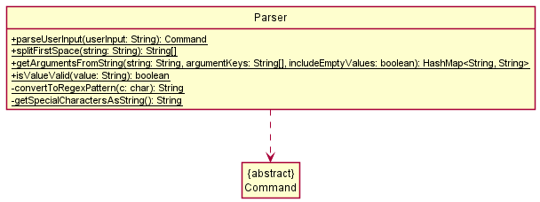
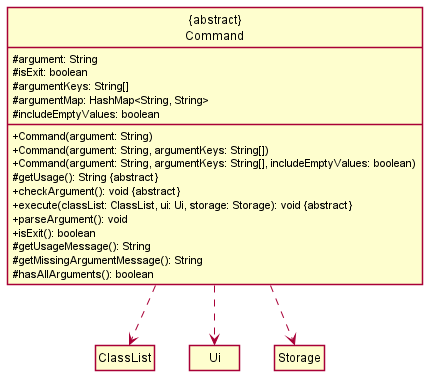

# Developer Guide
* [Acknowledgements](#acknowledgements)
* [Design](#design)
  * [Architecture](#architecture)
  * [Ui Component](#ui-component)
  * [Parser Component](#parser-component)
  * [Command Component](#command-component)
  * [ClassList Component](#classlist-component)
  * [Util Component](#util-component)
  * [Storage Component](#storage-component)
* [Implementation](#implementation)
  * [Add Class](#add-class)
  * [Add Student](#add-student)
  * [Add Assessment](#add-assessment)
  * [Set Marks](#set-marks)
  * [Set Attendance](#set-attendance)
* [Project scope](#product-scope)
* [User Stories](#user-stories)
* [Non-Functional Requirements](#non-functional-requirements)
* [Glossary](#glossary)

## Acknowledgements

{list here sources of all reused/adapted ideas, code, documentation, and third-party libraries -- include links to the original source as well}

## Design
### Architecture

The _Architecture Diagram_ shown above illustrates the high-level design of the Application.

**Overview of components**
* `Main`
  * On app launch: Creates and runs an instance of `Taa`.
* `UI`
  * Handles UI operations.
* `Taa`
  * On creation: Initializes the `UI` and `Storage` components.
  * On run: Loads persistent data from `Storage`, receives user input from `UI`, and uses `Parser` to parse the user input.
* `Parser`
  * Handles input parsing and determines which command to run.
* `Command`
  * Defines how a command is to be executed.
* `ClassList`
  * Contains a list of `TeachingClass` objects currently being managed by the app.
* `Util`
  * Contains useful methods (e.g. Check if a string is integer/double, convert string to integer/double).
* `Storage`
  * Handles data storage operations (e.g. Reading from and writing to data file).

 

**Interaction between components**

The _Architecture Sequence Diagram_ shown above shows how the components usually interact with each other.

 

### Ui Component

The `Ui` class handles all user interactions in the application.

`Ui` implements the following functionalities:
* Print messages with a standard output format.
* Print exception messages with a standard output format.
* Read user input through the `getUserInput` method.

 

### Parser Component

The `Parser` class provides methods to parse a user input and return a `Command` object which represents the command that
the user wishes to execute, and verify the validity of a value or provided by the user or read from `Storage`.

`Parser` implements the following functionalities:
* Parse a user input string and returning the respective `Command` object.
* Check if a value is valid (e.g. Does not contain any illegal characters).

 

### Command Component

The `Command` class is an _abstract_ class inherited by other `Command` classes such as `AddClassCommand`, `EditClassCommand`,
`DeleteClassCommand`, `HelpCommand`, etc.

`Command` implements the following functionalities:
* Check the validity of arguments provided by the user through the `checkArgument` method.
* Perform the logic of the command run by the user through the `execute` method.

 

### ClassList Component
TODO

 

### Util Component
TODO

 

### Storage Component

The `Storage` class handles all data file operations in the application. It depends on the `ClassListDeserializer` to
deserialize the data read from the JSON file.

`Storage` implements the following functionalities:
* Save `ClassList` into a JSON file.
* Read and parse JSON file into a `ClassList` object.
* Filter out invalid data read from the JSON file.

 

## Implementation
### Add Class
The sequence diagram shown below illustrates how the `add_class` command works:

Below is an example scenario of how the add class feature behaves at each step: 
* Step 1 - The user executes `add_class i/CS2113T-F12 n/Tutorial Group F12` to add a class. The `add_class` command calls the
`AddClassCommand.execute` method.
* Step 2 - Within `AddClassCommand.execute`, `ClassList.getModule("CS2113T-F12")` is called to ensure that
there is no existing class with ID `CS2113T-F12`.
* Step 3 - If no existing class with ID `CS2113T-F12` is found, a new `TeachingClass` object with ID and name set to `CS2113T-F12`
and `Tutorial Group F12` respectively.
* Step 4 - Then, `ClassList.addClass` is called to add the newly created `TeachingClass` object into the `classes` ArrayList
within `ClassList`.

 

### Add Student
The sequence diagram shown below illustrates how the `add_student` command works:

Below is an example scenario of how the add student feature behaves at each step: 
* Step 1 - The user executes `add_student c/CS2113T i/a0217978j n/jonny` to add a student. The `add_student` command 
calls the `AddStudentCommand.execute` method. Within `AddStudentCommand.execute`, `ModuleList.getModule("CS2113T")` is 
called to ensure that there is an existing module with code `CS2113T`.
* Step 2 - If an existing module with code `CS2113T` is found, a new `Student` object with id and name set to 
`a0217978j` and `jonny` respectively. Then, `StudentList.addModule` is called to add the newly created `Student` 
object into the `students` ArrayList within `StudentList`.

 

### Add Assessment
The sequence diagram shown below illustrates how the `add_assessment` command works:

Below is an example scenario of how the add assessment feature behaves at each step:
* Step 1 - The user executes `add_assessment c/cs2113t n/midterms m/20 w/10` to add an assessment. The `add_assessment`
  command calls the `AddAssessmentCommand.execute` method. Within `AddAssessmentCommand.execute`,
  `ModuleList.getModuleWithCode("cs2113t")` is called to ensure that there is an existing module with code `cs2113t`.
* Step 2 - If an existing module with code `cs2113t` is found, the `MAXIMUM_MARKS` and `WEIGHTAGE` arguments are checked
  to ensure that they are valid.
* Step 3 - If the `MAXIMUM_MARKS` and `WEIGHTAGE` arguments are valid, a new `Assessment` object with name,
  maximum marks and weightage set to `midterms`, `20` and `10` respectively is created under the existing `Module` with
  code `cs2113t`. Then, `AssessmentList.addAssessment` is called to add the newly created `Assessment` object into the
  `assessments` ArrayList within `AssessmentList`.
* Step 4 - Within `AssessmentList.addAssessment`, the name of the newly created `Assessment` object is checked to ensure
  there is no existing assessment with name `midterms`. At the same time, the weightage of the newly created
  `Assessment` object is also checked to ensure that the total weightage of the assessments in the `cs2113t` module
  will not exceed 100 with the addition of the weightage of the newly created `Assessment` object.
* Step 5 - If the name and weightage of the newly created `Assessment` object are valid, the newly created `Assessment`
  object is added into the `assessments` ArrayList within `AssessmentList`.

 

### Set Marks
The sequence diagram shown below illustrates how the `set_mark` command works:

Steps:
1. The `Taa` instance reads in a user input through the `Ui.getUserInput()` method.
2. The user input is then parsed using the `Parser.parseUserInput(userInput:String)` static method and a `Command` object
   is returned.
3. `AddModuleCommand.checkArguments()` is then called to check if the arguments are valid.
4. After checking the arguments, `Command.execute(moduleList:ModuleList, ui:Ui, storage:Storage)` will be called.
5. The `module:Module` which the student and assessment belongs to is retrieved with 
`getModuleWithCode(moduleCode:String)`.
6. Using `module:Module`, we are able to get the `studentList:StudentList` and `assessmentList:AssessmentList`.
7. The `student:Student` and `assessment:Assessment` are then retrieved from their lists using 
`getStudentAt(studentIndex:Integer)` and `getAssessment(assessmentName:String)` respectively.
8. Finally, `setMarks(assessmentName:String, marks:Double)` is called to set the marks of the assessment in the 
student's `results` HashMap.
9. A message will then be printed out to indicate to the user that the marks have been set successfully.

 

### Set Attendance
The sequence diagram shown below illustrates how the `set_attendance` command works:

Below is an example scenario of how the set attendance feature behaves at each step:
* Step 1 - The user executes `set_attendance c/CS2113T s/1 l/1 p/1` to set an attendance to `Present` for student at 
index `1`, lesson number `1` to set a student's attendance for a lesson. The `set_attendance` command calls the 
`SetAttendanceCommand.execute` method. Within `SetAttendanceCommand.execute`, `AttendanceList.getAttendance("1")` is 
called to ensure that there is no existing attendance with the
lesson number `1`for student at index `1`.
* Step 2 - If no existing attendance object with lesson number `1` for student at index `1` is found, a new 
`Attendance` object
with lesson number `1` and attendance record `Present` is set as its lesson number and attendance record respectively.
Then, `AttendanceList.addAttendance` is called to add the newly created `Attendance` object into the `attendances` 
ArrayList within `AttendanceList`.

 

## Product scope
### Target user profile

* Teaching assistant who has a need to manage a significant number of students and their information.
* Prefers desktop app over other types of apps.
* Can type fast.
* Prefers typing to mouse interactions.
* Reasonably comfortable using CLI apps.

### Value proposition

* Manage student information faster than a typical mouse/GUI driven app.

## User Stories

|Version| As a ... | I want to ... | So that I can ...|
|--------|----------|---------------|------------------|
|v1.0|Teaching Assistant|Add module|Keep track of all the modules that I am teaching|
|v1.0|Teaching Assistant|Add student|Keep track of students taking the module|
|v1.0|Teaching Assistant|Add assessment|Monitor what assessments there are in the module|
|v1.0|Teaching Assistant|Set marks|Record how much marks students score for the assessment|
|v1.0|Teaching Assistant|Set attendance|Monitor the attendance of students|
|v1.0|Teaching Assistant|Calculate the average marks of an assessment|Estimate the capabilities of students|
|v2.0|Teaching Assistant|Edit module|Change module details (e.g. code and name)|
|v2.0|Teaching Assistant|Delete module|Remove unnecessary data and reduce clutter|
|v2.0|Teaching Assistant|Edit student|Change any student's information|
|v2.0|Teaching Assistant|Delete student|Remove students who are no longer part of the class|
|v2.0|Teaching Assistant|Edit assessment|Change the name or weightage of the assessment|
|v2.0|Teaching Assistant|Delete assessment|Remove a particular assessment from the module|
|v2.0|Teaching Assistant|Edit marks|Modify the marks of the student for a particular assessment|
|v2.0|Teaching Assistant|Delete marks|Remove the marks entry of a student for a particular assessment|
|v2.0|Teaching Assistant|Delete attendance|Remove the attendance entry of a student|

## Non-Functional Requirements
1. Should work on any mainstream OS as long as it has `Java 11` installed.
2. A user with above average typing speed for regular English text (i.e. not code, not system admin commands) should 
be able to accomplish most of the tasks faster using commands than using the mouse.

## Glossary
* Mainstream OS: Windows, Linux, Unix, OS-X
