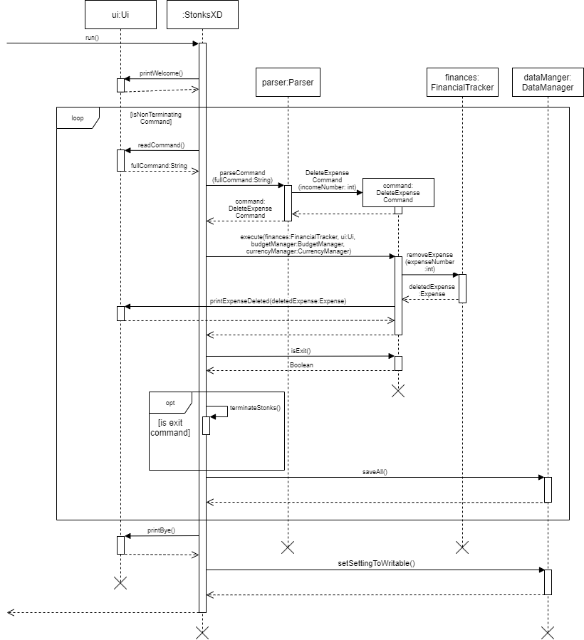
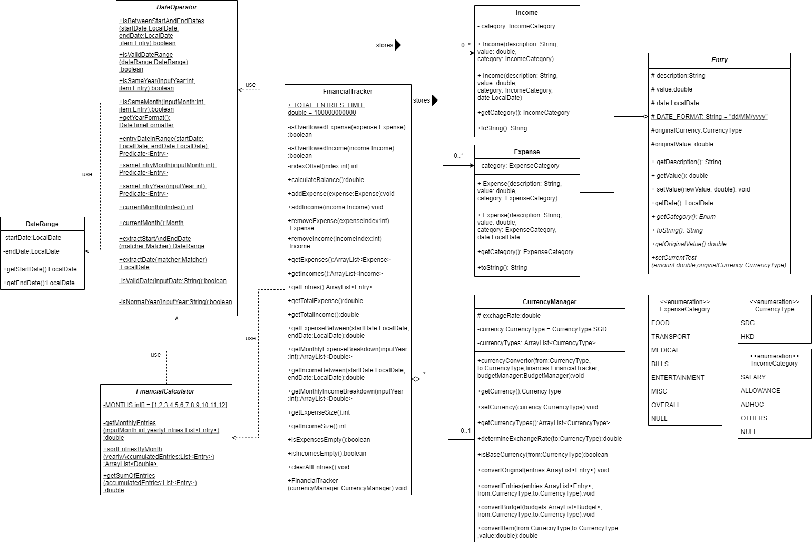
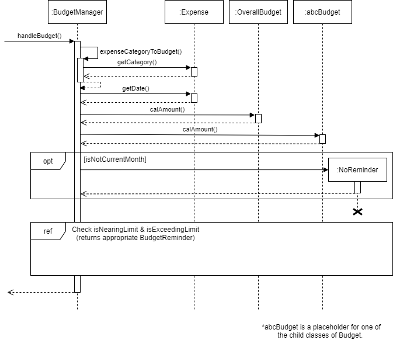

# Developer Guide

## Acknowledgements
Snippets of code from Baeldung’s guide to unit testing of system.out.println() with junit were used.

Source: https://www.baeldung.com/java-testing-system-out-println

Snippets of code from addressbook-level2’s Parser.java were used.

Source: https://github.com/se-edu/addressbook-level2/blob/master/src/seedu/addressbook/parser/Parser.java

## Design & implementation
### Architecture

The __Architecture Diagram__ above explains the high-level design of the StonksXD app.
Given below is a quick overview of the main components of the application and how they interact with each other:
 

`Ui` is the class responsible for interfacing with the user. 
It receives user input and passes it to`StonksXD`.
It also receives data from `Command` to output to the user.

`User` &harr; `Ui` &rarr; `StonksXD`

`Ui` &larr; `Command`

 

`StonksXD` is the main class of the app. It has 2 main functions: 
1. Upon opening the app, it loads saved data by calling `DataManager`. Before closing the app, it calls `DataManager` again to save data.
2. Runs a loop receiving new user input from `Ui` and passing it to `Parser`.

`StonksXD` &rarr; `DataManager`

`Ui` &rarr; `StonksXD` &rarr; `Parser`

 

`Parser` is the class responsible for interpreting the user input. 
It ensures the appropriate input format, and passes the input data to the appropriate command.

`StonksXD` &rarr; `Parser` &rarr; `Command`

 

`Command` is the class responsible for the execution of all commands.
It contains child classes for all possible commands.
It interacts with `FinancialTracker` and `BudgetManager` to execute commands, before sending information to `Ui` for output.

`Parser` &rarr; `Command` &harr; `FinancialTracker`

`Parser` &rarr; `Command` &harr; `BudgetManager`

`Ui` &larr; `Command`

 

`FinancialTracker` is the class containing and handling all income and expense entries input by the user.
It interacts with `Command` to execute tasks, and writes to `DataManager` to save its data.
It also retrieves data from `DataManager` when the program is loaded.

`Command` &harr; `FinancialTracker`

`FinancialTracker` &harr; `DataManager`

 

`BudgetManager` is the class containing and handling all budget information.
It interacts with `Command` to execute tasks, and writes to `DataManager` to save its data.
It also retrieves data from `DataManager` when the program is loaded.

`Command` &harr; `BudgetManager`

`BudgetManager` &harr; `DataManager`

 

`DataManager` is the class responsible for reading data from the `StonksXD_entries.csv` and `StonksXD_budget.csv` files upon boot up,
and writing save data to the files before terminating the program.
It interacts with `FinancialTracker` and `BudgetManager` and receives commands from `StonksXD`.

`FinancialTracker` &harr; `DataManager`

`BudgetManager` &harr; `DataManager`

`DataManager` &larr; `StonksXD_data.csv`

The Sequence Diagram below shows how the components interact with each other in a typical feedback loop.
It is illustrated using the hypothetical scenario where the user issues the command `del_ex i/1`.

The sections below provide more information on the respective components.

---

### Ui Component
Ui contains a Scanner object that takes in user inputs from the command line.
The Ui’s main role is to provide feedback whenever the user enters a command through the form of messages. It also 
handles the indexing of each element in the listing methods before printing out to the standard output for users to see.

The image below illustrates the sequence diagram in the context of listing methods
which includes listExpense, listIncome and listFind.

---

### Command Component

The `Command` class is a parent class that contains all the basic command features required to operate on incoming income or expense data.

Each method is abstracted into an appropriate child class (for e.g. `AddExpenseCommand`) in accordance with SLAP and OOP rules to handle only one function.

After obtaining the attributes of an entry from the `entry` class and the required command given by the user from the `parser` class, it directs the inputs to the respective methods for execution.

The image below shows the sequence diagram of how the `AddExpenseCommand` class is used and the other classes involved with it as well.

---

### Parser component

The `Parser` class is in charge of:
1. Converting user inputs to commands. 
2. It is also in charge of converting important user information to `csv` data, vice versa.

#### Implementation

`Parser` mainly uses regex to parse items.

---

### Financial Tracker Component

The `FinancialTracker` class is in charge of storing, deleting, and retrieving income and 
expense related calculations while the program is running. It performs these operations based
on the different commands it receives from the user.

The class diagram below shows the structure of `FinancialTracker`.

 

The `FinancialTracker` component,

- Uses `ArrayList` to store `income` and `expense` objects, which inherits from the parent class `entry`.
- It also uses `DateOperator` and `FinancialCalculator` as helper class, used to perform calculation and dates related operation

The sequence diagram below is used to illustrate how `FinancialTracker` utilizes the helper classes.

---

##### Converting user inputs to commands

1. When the user gives an input, it will first be split into 2 parts command word and arguments using regex.
2. The command word will be matched with the list of expected command words. If there is no match, return an 
invalid command and the process stops here.
3. If there is a match, `Parser` will check the validity of the arguments the user gave. This is also done
using regex.
4. If the arguments are valid, the corresponding command will be returned.
5. If invalid, return an invalid command.

##### Converting user information to `csv` data

Every important field will be separated by `Parser` with a `,` before saving them into the respective `csv` files.

##### Converting `csv` data to user information

When a line of data is obtained from the `csv` file, `Parser` will check if the line fits the required format using
regex.

### Budget Component

The Budget component consists mainly of the `BudgetManager` class and the `Budget` class.

 

The `BudgetManager` class is the main class containing all methods relating to budget operations.
On the other hand, the `Budget` class is the parent class of all the budget categories. 
There are currently 7 child classes of `Budget` (i.e. 7 legal budget categories in the program).

 

How the Budget compoment works:
- Upon start-up, a new `BudgetManager` is initialised in `StonksXD`.
- `BudgetManager` initialises all `Budget` sub-classes with respective budget limit values loaded from `DataManager`.
- When an entry is added by the user, `BudgetManager` parses the category input by the user and calls the relevant `Budget` sub-class.
- The `handleBudget` method is performed on the `Budget` sub-class.
- The relevant budgeting information is then sent to the `Ui` class for printing.

 

Below is a sequence diagram of the Budget component when `handleBudget` is executed:

_------Work in Progress------_

---

### Graphing Component
Below is a class diagram to show the classes that interacts with StonksGraph. When the ShowGraphCommand is called it would call the execute method
which calls the constructor of StonksGraph to generate a graph based on current year values or a year entered by the user. These values are calculated based on the data in FinancialTracker.
The constructed StonksGraph will then be printed out by the Ui class through the printGraph method.

#### Class Diagram

In the class diagram above the StonksGraph class has a 2D array as a private attribute representing the graph.
It also contains multiple methods used to write the proper characters to each parts of the 2D array.

Below is a list of some of the more important methods
1. drawBorder() is used to set all characters in the border of the 2D array grid to the border character and the rest to blank
2. writeToGraph() takes in 2 integers representing coordinates and a string to be written to inside the 2D array
3. determineBarValue() is used to determine the skill of the graph based on the biggest value of that report's year, scaled to the nearest representing 10,100,1000..... For example a value of 7672 will have a scale of 10,000/10 = 1000 and a value of 0.01 will have a scale of 0.1/10 = 0.01

---

In the following section all coordinates will be in the form of (Row from the top, Column from the left) and coordinates mark with X is a don't care.

Description of graphing component
1. The graphing component consists mainly of the StonksGraph class which contains a 20 by 100 2D array.
2. When first initialised, the StonksGraph constructor will call setBorder() which will loop through the 2D array and set
   all border characters as the given border character 'x' while keeping the others as the char blank.
3. It then calculates the balance of the financial tracker using the calculateBalance() method and write the value with its descriptor starting from coordinate (2,4).
4. Next it calls the drawReport() method, first it writes the title "Your Yearly Report" at coordinate (5,4).
   Then it writes the separator at (6,X), followed by a legend at (2,75) the top right. It also writes the x-axis with its month labels.
5. It then calls the getMonthlyIncomeBreakdown(year) and getMonthlyExpenseBreakdown(year) methods to retrieve all total expenses and total incomes
   for input year when the user is using the app. The user can choose between showing the current year or the year of their choice.
6. Using this 24 data set in total (12months for both expenses and incomes) it will calculate the scale for each bar unit
7. Then it plots the bar graph based on whichever column it looped through using the drawBar() method.

---

Below is a sequential diagram for the constructor of StonksGraph that shows the different method calls when a new StonksGraph object is instantiated.

#### Sequential Diagram

---

### Data storage Component

The saving and loading of data is handled by the `DataManager` class. There are 2 `csv` files that will be storing 
data. 

First file is `StonksXD_Entries.csv` which will be storing entries. They are:
1. `Expense` entries.
2. `Income` entries.

Second file is `StonksXD_Settings.csv` which will be storing settings. They are:
1. Budget settings for various expense category.
2. The currency setting.
3. The threshold setting.

Every important fields will be separate by a `,`. 
These 2 files will be located in the same directory as `StonksXD.jar`.

`DataManager` requires an instance of the `Parser`, `FinancialTracker`, `Ui`, `CurrencyManager` and `BudgetManager` 
at the moment of creation. 

- When saving data into the csv files, `DataManager` uses Java's `FileWriter` and `BufferedWriter` class to 
interact with the csv files.
- When loading data from the csv files, `DataManager` uses Java's `FileInputStream` and `Scanner` to interact with 
the csv files. 

The image below illustrates the class diagram in the context of data saving and loading.

#### Loading of data

Loading of data will take place immediately when `StonksXD` starts. Settings will be loaded in first followed by 
entries immediately.

##### Loading of settings from `StonksXD_Settings.csv`

1. Create a `FileInputStream`.
2. Create a `Scanner` with the `FileInputStream`.
3. Check if the first line of the `csv` file has the correct header. If the header is not correct, a warning will be 
shown to the user.
4. Read the second line,called `data`, which should contain all the settings.
5. Pass `data` into `Parser` to obtain the `CurrencyType` and load it into `CurrencyManager`.
6. Pass `data` into `Parser` to obtain the threshold value and load it into `BudgetManager`.
7. Pass `data` into `Parser` to obtain the different budget settings and load them into `BudgetManager`.
8. Return.
9. Now DataManager will begin loading all the entries from `StonksXD_Entries.csv`.

##### Loading of Entries from `StonksXD_Entries.csv`

9. Create a `FileInputStream` to the `csv` file.
10. Create a `Scanner` with the `FileInputStream`.
11. Check if the first line of the `csv` file has the correct header. If the header is not correct, a warning will be
shown to the user.
12. Read from the `csv` file line by line.
13. For every line, `x`, 2 things can happen (they will not happen concurrently):
    - If `x` can be loaded as an `Expense` entry, `Parser` will convert it to an `Expense` and load it into 
    `FinancialTracker`. Start reading for the next line.
    - If `x` can be loaded as an `Income` entry, `Parser` will convert it to an `Income` and load it into
      `FinancialTracker`. Start reading for the next line.
14. If there are corrupted entries (cannot be loaded as `Expense` or `Income`), a warning will be 
shown to the user.
15. Return the control to caller.

The sequence diagrams below will illustrate the loading process. Note that the diagrams do not show the full
details to reduce complexity.

#### Saving

Saving of data will take place after every user input. Entries will be saved first followed by
settings immediately.

##### Saving of entries into `StonksXD_Entries.csv`

1. Create a `FileWriter` to the `csv` file.
2. Create a `BufferedWriter` using the `FileWriter`. `BufferedWriter` is used as since we are writing many times, it
could be the faster option.
3. Write in the `csv` header.
4. Obtain all `Expense` entries from `FinancialTracker`.
5. For each `Expense`, convert it to a `String` through `Parser` and write the `String` to the `csv` file.
6. Obtain all `Income` entries from `FinancialTracker`. (Will not be shown in diagram as it is similar to step 4.)
7. For each `Income`, convert it to a `String` through `Parser` and write the `String` to the `csv` file.
(Will not be shown in diagram as it is similar to step 5.)
8. Close the buffer and return.
9. Begin saving the settings.

##### Saving of settings into `StonksXD_Settings.csv`

10. Create a `FileWriter` to the `csv` file.
11. Create a `BufferedWriter` using the `FileWriter`. `BufferedWriter` is used as since we are writing many times, it
could be the faster option.
12. Write in the `csv` header.
13. Use `Parser` to convert all settings to a `String`.
14. Write the `String` to the `csv` file.
15. Close the buffer.
16. Return the control to the caller.

The sequence diagrams below will illustrate the saving process. Note that the diagrams do not show the full
details to reduce complexity.

## Product scope
### Target user profile

The Stonks XD program is meant to target computing students that have trouble managing their finances and require reminders/advice to aid them in their financial journey.
It is designed to fit the needs of students who travel frequently and prefer logging their financial records daily. Our goal as developers of this app is to provide users with the feeling of having a combination of both a journal and a snapshot.

### Value proposition

StonksXD a global financial tracking journal, capable of both budgeting and 
analysis to serve financial needs while traveling. It is highly operable and 
intuitive command line program that is simple to use and is optimized for 
anyone on the go. Using a minimalistic command format, we aim to empower 
youth to manage their finances by making personal finance entries simple.

---

## User Stories

|Version| As a ... (role)| I want to ... (Function)| So that I can … (Benefit)|
|--------|----------|---------------|------------------|
|v1.0|New User|List out all possible commands|Know what I can key into the CLI interface|
|v1.0|User|Be able to record my spendings|Keep track of all my expenses|
|v1.0|User|View all expense entries|See which spending I can cut down on and better manage my finances|
|v1.0|User|Delete my expense entries|Delete wrong entries due to possible typos|
|v1.0|User|View total expense|See if I need to reduce my spending in the future|
|v1.0|User|Delete my income entries|Delete wrong entries due to possible typos|
|v1.0|Worker|Create income entries|Keep track of my total income and not spend more than that amount|
|v1.0|User|See all income entries|Have an understanding of income history|
|v1.0|User|View total income|Know what my spending limits are|
|v2.0|User|Have my entries saved into the hard disk automatically|My data would not be lost when I close the application|
|v2.0|User|Convert income / expense entries to different currencies|Do not have to manually convert currencies|
|v2.0|User|View my expenditure in the form of bar charts|Gain more useful insights on my overall financial situation|
|v2.0|Frugal spender|Set monthly budgets (overall budget and categorical budgets)|Plan my spending in advance|
|v2.0|Large spender|Receive reminders when I am about to overspend|Cut back on my spending|
|v2.0|Big spender|Get assistance readjusting my budget when I overspend|Can minimize the damage of spending too much|
|v2.0|Financially conscious user|Receive daily tips on saving, budgeting and spending|Can be more frugal and wiser with my financial decisions|
|v2.0|Long term user|See my account net balance|Can make appropriate plans / adjustments for the future|
|v2.0|User|Find expense / income entry with keyword search|Narrow down the entries I want to see|
|v2.0|User|See expenditure each month|Budget how much I need each month|
|v2.0|User|See income earned each month|Be more motivated to save|
|v2.0|User|Clear all my entries|Start afresh|

---

## Non-Functional Requirements

- Accessibility requirements: the application should be accessible by anyone with the `.jar` file
- Constrains: the CSV files created by the application should be able to run on different machines running the same application
- Fault tolerance requirements: the application should handle inputs with a reasonable amount of errors
- Interoperability requirements: the application should run on macOS, Windows and Linux operating systems
- Stability requirements: Application should run without internet so that user can access the application anywhere without having to connect to the internet

---

## Glossary

* *glossary item* - Definition

---

## Instructions for manual testing

### Initial start-up guide:

1. Ensure that you have Java 11 or above installed.

2. Download the latest version of `StonksXD.jar` from [here](https://github.com/AY2122S1-CS2113T-T12-3/tp/releases).

3. Copy the file to the folder you want to use as the home folder for your `StonksXD`.

4. Open the Command-Line interface (CLI) and navigate to the directory where you saved the `.jar` file and run `java -jar tp.java` in the command line. `StonksXD` will start up.

### Testing Guide:

Below are a few types of testing that you can perform:

- Manual Testing
- JUnit Testing
- Gradle Daemon Testing
- I/O Re-direction Testing

### Manual Testing

This is a non-exhaustive list of some common manual tests that can given as commands during run-time to test code defensibility:

- #### _Adding Income/ Expense entries_
  1. Test Case: `add_ex d/DESCRIPTION a/AMOUNT c/CATEGORY`. 

     Expected : Adds an expense item to the list. Displays confirmation message with timestamp.
  
   
  
  2. Test Case: `add_ex` but leave `d/`, `/a`, `/c` or all  empty. 

     Expected : No item is added. Error message displayed showing correct syntax.
  
   
  
  3. Test Case: `add_ex` but give non-existent category for `/c`.
     Expected : No item added. Error message displayed showing available categories.

- #### _Delete Income/ Expense entries_
  1. Pre-requisite: List expense or income using `list_ex`/ `list_in. Must have one or more entries.
  
   
  
  2. Test Case: `del_in i/1` or `del_ex i/1` 

     Expected : Deletes the 1st entry in Income/ Expense list. Displays confirmation message.
  
   
  
  3. Test Case: `del_in i/0`, `del_in i/ABC` or `del_in i/-3`. 

     Expected : Displays error message saying invalid index.

   

  4. Test Case: `del_in i/x` where x is larger than list size.
     Expected : Similar error message as before.

- #### _List Income/ Expense entries_
  1. Test Case: `list_ex` or `list_in` 

     Expected : Lists all entries added so far.
  
   
  
  2. Test Case: `list_ex` or `list_in` but no items in both lists.
     Expected : Displays message saying no items in list.

### JUnit Testing 

JUnit testing modules are available in the test folder. They can be run separately or all together based on developer requirements.

Below is a list of the currently available tests:

- _CommandTest:_ Tests if commands like add, delete, list etc. are calling their respective methods and providing with the appropriate parameters.

- _DataManagerTest:_ Tests the data saving function of program.

- _DukeTest:_ Used as driver to run main().

- _ExpenseTest:_ Tests if expense entries are processed correctly into their appropriate attributes.

- _IncomeTest:_ Tests if income entries are processed into their appropriate attributes.

- _FinancialTrackerTest:_ 

### Gradle Daemon Testing

Intellij comes with an in-built Gradle Daemon that can be used to run the following test:

- `.\gradlew test` to check if all test files have passed.
- `.\gradlew checkStyleTest` to check if test files comply with certain coding standards and conventions.
- `.\gradlew checkStyleMain` to check if main program complies with all JAVA coding standards.
 

### I/O Re-direction Testing

This form of testing involves loading sample data stored in the `text-ui-test` folder. It can be performed as follows:

1. Enter new sample data or use the pre-existing test data that can be found in the `input.txt` file.

3. Open CLI terminal and navigate to the `text-ui-test` directory using the following command - `cd /text-ui-test`

2. Run `.\runtest.bat` in CLI and see if you receive the message `"Test Passed!"`.

3. The IDE will compare the output in the `EXPECTED.TXT` and `ACTUAL.TXT` files to see if they are exactly the same to pass this test.