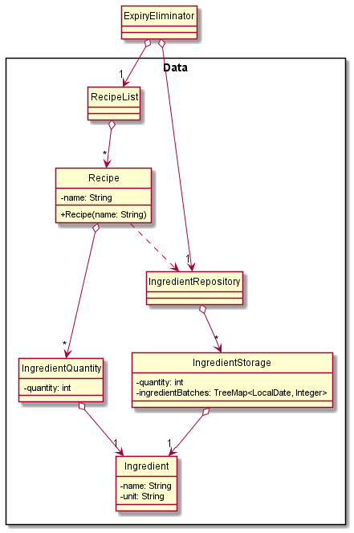
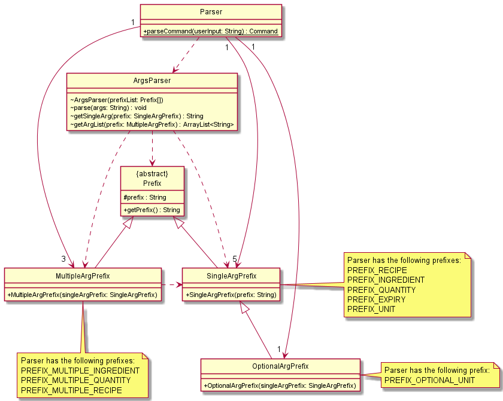

# Developer Guide

## Acknowledgements

- Documentation and code references [Address Book (Level 2)](https://github.com/se-edu/addressbook-level2) and [Address Book (Level 3)](https://github.com/se-edu/addressbook-level3).
- Some portion of the code references [bernardboey's ip](https://github.com/bernardboey/ip/).
- Method to convert String to title case references [Baeldung](https://www.baeldung.com/java-string-title-case).

## Design

### Data
**API** : [Data.java](https://github.com/AY2122S1-CS2113-T16-3/tp/tree/master/src/main/java/expiryeliminator/data)

 - The `Data` Component,
     - Stores a list of `Recipe` objects, in the form of `RecipeList`
     - Stores a list of `IngredientStorage`, in the form of `IngredientRepository`
 - Each `Recipe` has its ingredients and respective quantities stored in `IngredientQuantity`
 - The `Ingredient Storage` separates a specific ingredient into batches of quantities, 
   according to the expiry date.
 - `Ingredient` stores the information of the ingredients, which are its name and unit, 
   e.g. Chicken and grams.

### Parser

This is a simplified class diagram of the Parser component, which provides a high level overview. The same diagram will be displayed again later on, but with much greater detail.

This is a more detailed class diagram of the `Parser`, `ArgsParser`, and `Prefix` classes. Note that `Parser` has 4 single arg prefixes, 3 multiple arg prefixes, and 3 optional arg prefixes. These prefixes correspond to the various arguments that are accepted by the various commands.

- The `Parser` is the main component that communicates with the various subcomponents. It is called by the main `ExpiryEliminator` class and is responsible for parsing commands.
- The `ArgsParser` is responsible for parsing args. It does this by accepting a list of `Prefix` objects upon creation which will determine what prefixes it should look out for. Then, when instructed to parse, it parses an args string based on the prefixes.
- Each `Prefix` object represent a prefix that can be present in the command args. (E.g. a prefix can correspond to `i/`, `r/`, or `q/`, etc.). In addition to that, a prefix either belongs to a `SingleArgPrefix`, `MultipleArgPrefix`, or `OptionalArgPrefix`.
  - A `SingleArgPrefix` allows the prefix to appear exactly once in the args string.
  - A `MultipleArgPrefix` allows the prefix to appear multiple (i.e. one or more) times in the args string.
  - An `OptionalArgPrefix` allows the prefix to appear once or not at all in the args string.
- With these different prefixes, we can clearly dictate how the command arguments should be structured.

This is a more detailed class diagram of the `SingleArgParser` and `MultipleArgParser` classes.

- The `SingleArgParser` and `MultipleArgParser` objects represents a parser for an individual arg type (e.g. ingredient name).
  - A `SingleArgParser` represents a parser that accepts a single string and parses it according to the arg type.
  - A `MultipleArgParser` represents a parser that accepts either a single string or a list of strings and parses it according to the arg type.

#### How the Parser works
1. When the `Parser` needs to parse a command, (e.g. `add recipe r/Apple Pie i/Apple q/2 i/Flour q/400`), it first separates the command and args (e.g. command: `add recipe`, args: `r/Apple Pie i/Apple q/2 i/Flour q/400`).
2. Then, it matches the command against a list of accepted commands.
   1. If it does not match, then it notifies the user that it is an invalid command, via the `IncorrectCommand` class.
   2. If it finds a match, then it proceeds to parse the args and prepare the corresponding `Command` class
3. Based on the command, there is a specified set of args that it can accept (e.g. `add recipe` needs a single recipe name, and one or more ingredients and quantities). An `ArgsParser` is created based on what args are accepted. For example, for `add recipe`, the `ArgsParser` is created via `new ArgParser(PREFIX_RECIPE, PREFIX_MULTIPLE_INGREDIENT, PREFIX_MULTIPLE_QUANTITY)`. `PREFIX_RECIPE` is created via `new SingleArgPrefix("r")`, and  `PREFIX_MULTIPLE_INGREDIENT` is created via `new MultipleArgPrefix(PREFIX_INGREDIENT)`.
4. After the `ArgsParser` is created, it parses the args based on the specified parameters. It throws an error if it detects an invalid prefix, missing prefix, or there are multiple args when there should have only been none. These errors are handled gracefully by the `Parser`.
5. Assuming there are no errors, the `Parser` will then query the `ArgsParser` for each type of arg and then parse the arg accordingly. For example, for `add recipe`, the `Parser` will ask `ArgsParser` for the arg corresponding to `PREFIX_RECIPE`. Once it has the result, it will then create a `RecipeParser` and parse the arg given by `ArgsParser`. If successful, it will retrieve the parsed data . If unsuccessful, it will handle the error gracefully.
   - Note that there are separate methods to query `ArgsParser` for a single arg (i.e. for a prefix that should appear at most once) and for an arg list (i.e. for a prefix that can appear multiple times). The former method only accepts a `SingleArgPrefix`, while the latter method only accepts a `MultipleArgPrefix`.
6. Finally, the `Parser` will take all the parsed data and return the relevant `Command` class, to be executed by the `ExpiryEliminator`.

This is a (partial) sequence diagram of parsing an "add recipe" command. It demonstrates the interaction between the
`Parser`, `ArgsParser`, and the corresponding single arg and multiple arg parsers (`RecipeParser`, `IngredientParser`, and `QuantityParser`).

> **Note**: The lifelines for `ArgsParser`, `RecipeParser`, `IngredientParser`, and `QuantityParser` should end at the destroy marker (X). However, due to a limitation of PlantUML, the lifelines reach the end of diagram.

> **Note**: This is a simplified diagram, and does not show that the code checks that there are an equal number of ingredients and quantities.  

## Implementation
This section describes how the features are implemented.

### List All Ingredients Feature

The list ingredients feature is performed by `IngredientRepository`. It loops through all the different
ingredient storages, and concatenates them into a string which is shown as the output list. Below is the
sequence diagram for how list works.

### List Expired Ingredients Feature

The list expired ingredients feature is performed by `IngredientRepository`. It loops through all the
ingredient storages. For each ingredient storage, it gets the type of ingredient being stored in that 
storage, and creates an empty storage for that ingredient type to store the batches of that ingredient 
that are expired. The code then loops through all the batches of that ingredients, and add the expired 
batches to the expire ingredient storage. The expired ingredient storage is converted into a string and
is shown as the output. Below is the sequence diagram for how list expired ingredients works.

### Delete Expired Ingredients Feature

The delete expired ingredients feature is performed by the `IngredientRepository`. It loops through all
the ingredient storages. For each ingredient storage, it loops through all the batches of that ingredient.
If the batch has expired, it adds the expiry date of that batch to an array. After it has looped though
all the batches of a specific ingredient, it proceeds to remove all those ingredient batches from the
repository. This process then repeats for the next type of ingredient. Below is the sequence diagram for
how delete expired ingredients works.

### View Ingredient Feature

The view ingredient feature is performed by the `IngredientRepository`. It finds if the ingredient
repository contains an ingredient with the same name as the user input, and return the storage of that
ingredient. The storage data is represented as a string that is shown as an output. Below is the sequence
diagram for how view ingredient works.

### Update Units Feature

The update units feature is performed by both the `IngredientRepository` and `RecipeList`. First, it finds
the ingredient storage of the ingredient and updates the units there. Then it finds the recipes which 
contain the ingredient and updates the units there. Below is the sequence diagram for how update unit
works.

### Shopping List Feature

The shopping list feature is performed by the `IngredientRepository`. It loops through all the recipes 
the user wants to cook and collates all the ingredients and quantities into totalIngredients. It then
loops through all the ingredient storages to see if there is enough ingredients. If there isn't it adds 
the ingredient and respective quantity to the shopping list. It returns the shopping list as a String to
be shown as the output. Below is the sequence diagram for how the shopping list feature works.

### Add Recipe Feature

The add recipe feature is performed by `RecipeList`. It adds a `Recipe` and its respective 
ingredients to the `RecipeList`.

Here is the sequence diagram for how add recipe works if the correct input is given and 
all ingredients exist in the `Ingredient Repository`.

 `Recipe` checks if an ingredient exists in the `Ingredient Repository` before
 adding the ingredient into the `Recipe`. If it doesn't exist, `Recipe` adds 
 the ingredient into the `Ingredient Repository` without any quantity and expiry date, 
 and it reminds the user to update the units of the ingredients.

The reason for this implementation is so that the user doesn't have to manually add the ingredients,
as the ingredient has to be in the `Ingredient Repository` for the [cooked 
recipe feature](#cooked-recipe-feature) to work

> **Note** : Here are a few cases where an error will be returned, and the `Recipe` 
> will not be saved.
>
> - the `Recipe` already exists in the `RecipeList`,
> - A number less than 1 is entered for one of the quantity of the ingredients of the `Recipe`.
> - Two same ingredients in one `Recipe`.

 

### Delete Recipe Feature

The delete recipe feature is performed by `RecipeList`. It deletes a `Recipe` from the `RecipeList`.

Here is the sequence diagram for how delete recipe works if the `Recipe` exists in the `RecipeList`.

> **Note** : If the `Recipe` doesn't exist in the `RecipeList`, an error will be returned.

 

### Cooked Recipe Feature

The cooked recipe feature is performed by `Recipe`. It deletes a certain quantity of ingredients in the
`Ingredient Repository` based on the quantities of ingredients in the `Recipe`.

Here is the sequence diagram for how cooked recipe works if the amount of ingredients in the `Ingredient Repository`
is sufficient to be deducted.

The feature leaves the responsibility of dealing with expired ingredients to the user, and
will remove ingredients starting from the earliest batch of ingredients. (ingredients that 
expire the soonest, including those that are already expired.)

> **Note** : Here are a few cases where an error will be returned, and the quantities of the ingredients in the
> `Ingredient Repository` will not be updated.
> 
> - The `Recipe` does not exist in the `RecipeList`
> - There is insufficient ingredients in the `Ingredient Repository` for the `Recipe` to be cooked.

 

### List Recipes User Can Cook Feature

The list recipe user can cook feature is performed by the `ListRecipeUserCanCookCommand`.
It returns a list of recipes that the user can cook with the ingredients the user currently
have.

Here is the sequence diagram for how list recipe user can cook works

The feature will indicate that the `Recipe` can be cooked even if some of the ingredients have
expired. However, it will inform the user that there are expiring ingredients. The responsibility
of dealing with expired ingredients is left to the user.

The feature will inform the user if there is insufficient ingredients to cook any `Recipe` or if 
there is no `Recipe` in the `RecipeList`.

 

## Product scope
### Target user profile

Young adults who are living in their own home.

### Value proposition

To help young adults who are living in their own home keep track of ingredients and foods that they can make based on the ingredients they have in their kitchen.

## User Stories

|Version| As a ... | I want to ... | So that I can ...|
|--------|----------|---------------|------------------|
|v1.0|user|add an ingredient|record what ingredients I have|
|v1.0|user|delete an ingredient|remove ingredients that I no longer have|
|v1.0|user|increment quantities for a particular ingredient|record how much of that ingredient I have|
|v1.0|user|decrement quantities for a particular ingredient|know how many ingredients are left|
|v1.0|user|list the ingredients with quantities and expiry dates|know the ingredients I have at a glance|
|v1.0|user|view the quantities for a particular ingredient|know how much of a specific ingredient I have|
|v1.0|user|list ingredients expiring within the week|know which ingredients I should use up first|
|v1.0|user|list ingredients that have expired already|know which ingredients to throw away|
|v1.0|user|add the expiry date for a specific ingredient|record when it must be used by|
|v1.0|new user|see usage instructions|refer to them when I forget how to use the application|
|v1.0|user|add a recipe and its constituent ingredients|keep track of what I want to cook|
|v1.0|user|delete a recipe|retain only recipes I want|
|v2.0|user|be able to indicate that I have cooked a recipe|keep my ingredient repository accurate|
|v2.0|user|list recipes i can cook based on the ingredients I have|save time on checking the ingredients I have|
|v2.0|user|generate a shopping list for a particular recipe/recipes|know what ingredients to buy|
|v2.0|user|delete all ingredients that have expired at one go|all ingredients I keep track of are not expired|

## Non-Functional Requirements

1. Should work on Windows, Mac, and any mainstream Linux OS as long as it has Java 11 or above installed.
2. {more to be added}

## Glossary

* *glossary item* - Definition

## Instructions for manual testing

{Give instructions on how to do a manual product testing e.g., how to load sample data to be used for testing}
