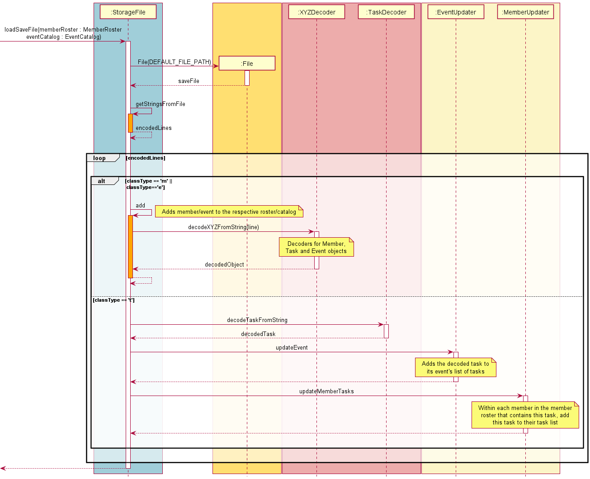

# Developer Guide

## Acknowledgements

{list here sources of all reused/adapted ideas, code, documentation, and third-party libraries -- include links to the original source as well}

## Design & implementation

{TO DELETE: Describe the design and implementation of the product. Use UML diagrams and short code snippets where applicable.}

This section describes some noteworthy details on how certain features are designed and implemented.

### Logic component

**API**: `Parser.java` {NOTE: this may change based on further implementations}

(insert relevant information here about taking in user input and parsing it etc.)

#### Delete Functionality
How deleting works:

1. When the `Parser` class parses `delete` as the command from the user, a new `Command` object, `DeleteCommand` is created.
2. The `DeleteCommand` constructor processes the entire input from the user by calling `prepareInputs`.
3. `DeleteCommand` has 3 uses: deleting an `Event`, a `Task`, or to delete all `Event`s through the command `delete all`.
4. The constructor processes the usage for `DeleteCommand` and executes the actual deletion through `execute` which returns a `CommandResult` object with the associated deletion message from the `Ui` class.
5. `delete all` will not immediately invoke the `clear()` method on the global `eventCatalog` ArrayList and will instead prompt a confirmation from the user before deleting all `Event`s.

#### Select Functionality

How selecting an `Event` or an event's nested `Task` works:
1. When the `Parser` class parses `select` as the command from the user, a new `Command` object, `SelectCommand` is created.
2. If the command contains a valid flag (`-e` or `-t`), `SelectCommand` processes the input from the user by calling `prepareInputs`.
3. If the user selects an `Event`, `SelectCommand` updates the index of this `Event` in `Parser`.
4. `SelectCommand` then passes the processed inputs back to `Parser`, which passes it back to `Duke`.
5. `Duke` then calls the `execute` method in `SelectCommand` which will return an object of type `CommandResult`, and the respective output will be printed.

### Storage component

#### Save Functionality

How the `save` functionality works: 
1. When the `save` method is called, `StorageFile` constructs a new `File` object using the configured `DEFAULT_FILE_PATH` (see Step 2 in diagram).
2. Checks for the presence of the `File` object on the local system and creates the `data` directory and `.txt` file if required (see Steps 4-5 in diagram).
3. For each `Member` in the provided `memberRoster`, the `encodeMemebersList` method will be called to parse each member and its respective member into an overall `ArrayList<String>` and return this (see Steps 6-7 in diagram).  
4. For each `Event` in the provided `eventsList`, the `encodeEventsList` method will be called to parse each event and its respective tasks into an overall `ArrayList<String>` and return this (see Steps 8-9 in diagram). 
5. The `writeToFile` method will be called to write the two returned `ArrayList<String>` into the `.txt` save file locally for future uses of the program (see Steps 10-11 in diagram).

#### Load Functionality 

How the `load` functionality works: 
1. When the `load` method is called, `StorageFile` constructs a new `File` object using the configured `DEFAULT_FILE_PATH` (see Step 2 in diagram). 
2. If the detected line contains data regarding a `Member` or `Event` object, the `StorageFile` instance will decode and construct the `Member` and `Event` objects, adding them to `MemberRoster` and `EventCatalog` respectively (see Steps 4-7 in diagram)
3. If the detected line contains data regarding a `Task` object:
   1. The `StorageFile` instance will get the previously added event (see Step 8 in diagram) and save it as an `Event` variable `currEvent`
   2. The current encoded line will be decoded to construct a new `task:Task` object (see Step 10-11 in diagram). 
   3. The past added event will be set to the `event` attribute of the new `task`, and the `task` will be added to the list of tasks in `currEvent`. The `task` will also be assigned to `Member` objects in `MemberRoster` if the `Member` objects are assigned to the `task` (bidirectional association) (see Steps 12-13 in diagram).

The `load` functionality asserts the following based on **SLAM**'s core design principles:
- No tasks can exist without a member assigned to it, but a member can exist without an assigned task. As such, member objects will be first created and added to the roster when loading ([refer to Save functionality to understand how this is achieved](#save-functionality)).

## Product scope
### Target user profile

{Describe the target user profile}

### Value proposition

{Describe the value proposition: what problem does it solve?}

## User Stories

|Version| As a ... | I want to ... | So that I can ...|
|--------|----------|---------------|------------------|
|v1.0|new user|see usage instructions|refer to them when I forget how to use the application|
|v2.0|user|find a to-do item by name|locate a to-do without having to go through the entire list|

## Non-Functional Requirements

{Give non-functional requirements}

## Glossary

* *glossary item* - Definition

## Instructions for manual testing

{Give instructions on how to do a manual product testing e.g., how to load sample data to be used for testing}
