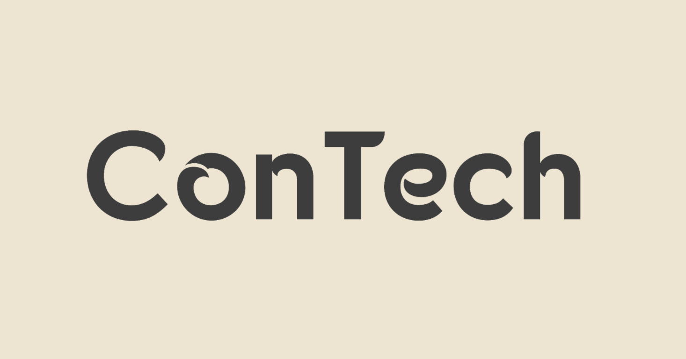

**ConTech** (pronounced as Contact) is a **Command Line Interface (CLI) application for managing computing-related
contacts**. Specially designed to be optimised for use on the CLI, **ConTech** allows you to seamlessly **add**, **edit**,
**view**, **list**, **search**, and **import** your contacts.

If you are a computing professional that often uses the command line for work, **ConTech** can get your contact
management tasks done faster than any traditional GUI app.

**ConTech** aims to improve your efficiency at work, be it by cutting down the time required to look up for various
usernames when working with colleagues, or by importing hundreds of contacts with just one simple command.

____

Here are some links that might help you out:
* [User Guide](UserGuide.md) :book:
* [Developer Guide](DeveloperGuide.md) :computer:
* [About Us](AboutUs.md) :family_man_boy::family_man_boy_boy:
