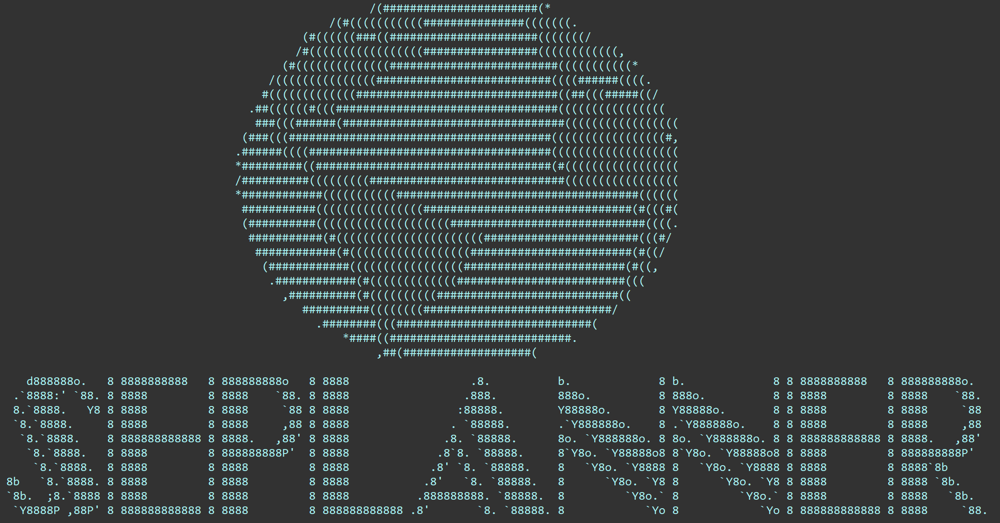

--
layout: page
title: SEPlanner
---

SEPlanner is a lightweight desktop application for Computer Engineering undergraduates from the National University of Singapore
to plan for their Student Exchange Program, optimised for use via Command Line Interface (CLI). If you are familiar with command line,
SEPlanner can streamline your planning process when compared to other Graphical User Interface (GUI) apps.

Useful links:
* Check out our [User Guide](UserGuide.md) if you would like to try SEPlanner out!
* If you would like to contribute to SEPlanner, take a look at our [Developer Guide](DeveloperGuide.md).
* Finally a little [About Us](AboutUs.md)

Thank you for checking SEPlanner out, and we wish you the safest of travels. 