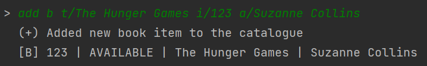
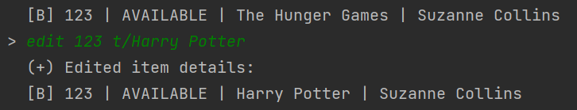

# User Guide

## Introduction

Libmgr is a desktop app for managing the inventory of libraries, optimised for use via a Command Line Interface (CLI).
Designed for fast typists, it can help to augment the day-to-day tasks of a librarian and can help them to get tasks
done in an efficient manner.

- [Quick Start](#Quick-Start)
- [Features](#Features)
  - [Adding an item: `add`](#Adding-an-item)
  - [Editing an item: `edit`](#Editing-an-item)
  - [Removing an item: `remove`](#Removing-an-item)
  - [List: `list`](#Listing-all-items)
  - [Searching by ID: `search`](#Searching-by-ID)
  - [Searching by title: `search`](#Searching-by-title)
  - [Searching by status: `search`](#Searching-by-status)
  - [Exiting the program: `exit`](#Exiting-the-program)
- [FAQ](#FAQ)
- [Command Summary](#Command-Summary)

## Quick Start

1. Ensure that you have Java `11` or above installed.
2. Down the latest version of `Libmgr.jar` from [here](https://github.com/AY2122S1-CS2113-T16-1/tp/releases).
3. Copy the file to the folder you want to use as the _home folder_ for Libmgr.
4. Open a terminal/command prompt and run `java -jar Libmgr.jar` to start the application.

## Features

### Adding an item
Adds a new item to the catalogue. Supported item types are Book, Audio, Magazine and Video. 

### Editing an item 
Edits an attribute of an existing item in the catalogue

Format: `edit ID MARKER/new attribute`

* For Book, valid markers are: t/TITLE, i/ID and a/AUTHOR
* For Audio, valid markers are: t/TITLE, i/ID, a/ARTIST and d/DURATION
* For Magazine, valid markers are: t/TITLE, i/ID, p/PUBLISHER and e/EDITION
* For Video, valid markers are: t/TITLE, i/ID, p/PUBLISHER and d/DURATION

Examples of usage: 

`edit 123 t/Harry Potter` Edits the title of an item with ID 123 to Harry Potter

### Removing an item
Removes an existing item from the catalogue.

Format: `remove i/ID`

* The item specified by `ID` will be deleted.

Examples of usage:

`remove i/012350`

### List
Lists all items in the library.

Format: `list`

### Searching by ID
Search for the item matching the keyword ID

Format: `search i/ID`

* The item specified by `ID` will be listed out.

Examples of usage:

`search i/001`

### Searching by title
Search for items containing the keyword title

Format: `search t/title`

* The items with titles containing specified `title` will be listed out.

Examples of usage:

`search t/beauty and beast`

### Searching by status
Search for items matching the keyword status

Format: `search s/AVAILABLE` or `search s/LOANED` or `search s/RESERVED`

* The items with the corresponding `status` matching the keyword will be listed out.

Examples of usage:

`search s/AVAILABLE`

### Exiting the program
Exits the program.

Format: `exit`

## FAQ

**Q**: What happens if I mistype a command not recognised by the program? 

**A**: A message will be shown saying that the program does not recognise your command.
You can then key in a command again. 

## Command Summary

{Give a 'cheat sheet' of commands here}

* Add todo `todo n/TODO_NAME d/DEADLINE`
