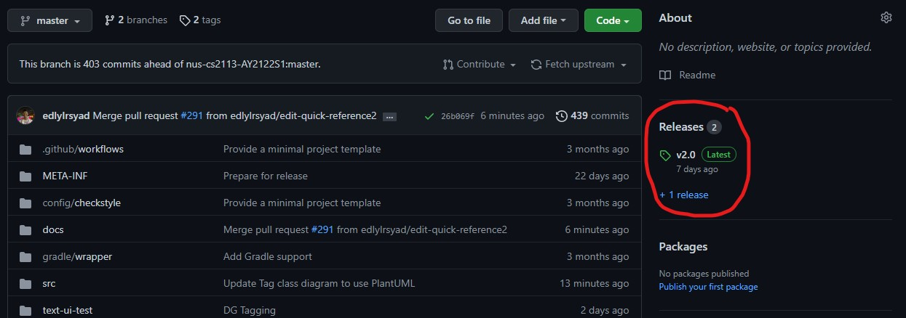
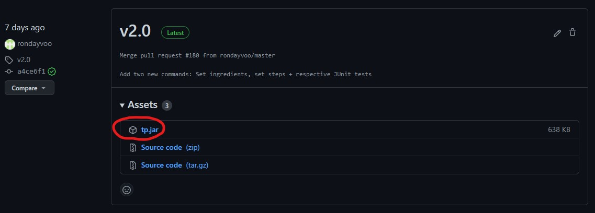
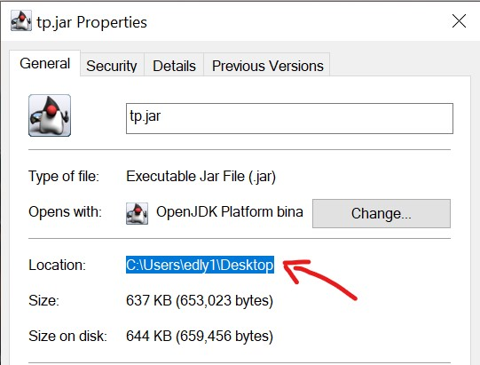

# Gordon's User Guide

## Contents

* [**How do you use this guide?**](#how-do-you-use-this-guide)
* [**Who is Gordon?**](#who-is-gordon)
* [**How do you start Gordon?**](#how-do-you-start-gordon)
* [**What can Gordon do?**](#what-can-gordon-do)
  1. [Add a recipe](#1-add-a-recipe-addrecipe)
  1. [Delete a recipe](#2-delete-a-recipe-deleterecipe)
  1. [Look up a recipe](#3-look-up-a-recipe-check)
  1. [Display all recipes](#4-display-all-recipes-listrecipes)
  1. [Exit Gordon](#5-exit-gordon-exit)
  1. [Lend a hand](#6-lend-a-hand-help)
  1. [Set attributes of a recipe](#7-set-attributes-of-a-recipe-set)
  1. [Find a recipe by attribute](#8-find-a-recipe-by-attribute-find)
  1. [Do cool stuff with tags](#9-do-cool-stuff-with-tags)
      1. [Tag a recipe](#91-adding-tags-to-recipes-tag)
      1. [Untag a recipe](#92-untagging-tags-from-recipes-untag)
      1. [Delete a tag](#93-deleting-tags-from-cookbook-deletetag)
      1. [List all tags](#94-find-a-recipe-by-their-tags-find)
      1. [Find recipes by tag](#95-list-all-your-tags-listtags)
  1. [Save and load your recipes](#10-saving-and-loading)
* [**Cheat sheet**](#cheat-sheet)  

## How do you use this guide?

* Use the [Contents](#contents) section to navigate to anywhere in this user guide.
* Use the [Cheat sheet](#cheat-sheet) for a quick lookup of commands.
* Pages you need to navigate to or buttons you need to press are enclosed in quotation marks like 'This page'.
* Code you need to type are shown like `this code`.
* Parameters you can type are capitalised, like THIS_PARAMETER.
* Whatever Gordon is telling you in the terminal will be enclosed in larger shaded boxes
```
like this output
```

## Who is Gordon?

<!-- Images -->


It's me, **Gordon v2.0**, and today, I'm gonna teach you donkeys how to use the Gordon application.

I am a Command Line Interface (CLI)-based recipe database application, and I can help you to;

1. Store your recipes (including ingredients and steps required)
1. Check them when you're ready to cook
1. Organise your collection of recipes with tags and other attributes so they are easier to find
1. Delete recipes like the chicken you cooked so raw I can still hear it clucking

If you're one of them so-called 'developers', head on over to our [Developer Guide](https://ay2122s1-cs2113t-w13-2.github.io/tp/DeveloperGuide.html).

It's absolutely bonkers. Now let's get down to business.

## How do you start Gordon?

If you're using a Windows system, follow this guide:

1. Checkout the latest version of **Gordon** [here](https://github.com/AY2122S1-CS2113T-W13-2/tp)
   1. Go to the 'Releases' section on the right-side of the page
     
   1. Download the file named 'tp.jar'
     
1. Find the 'tp.jar' file in your computer
   1. Search for 'tp.jar' in your search bar
   1. Right-click on the file
   1. Select 'Properties'
   1. Copy the location of the file
      
        
1. Ensure that you have Java 11 or above installed
   1. Search for 'Command Prompt' in your search bar, then open the Command Prompt
   1. In the Command Prompt terminal, type `java -version`
      1. The terminal should display this:
      
      1. If you don't have Java 11, you can install it [here](https://www.oracle.com/java/technologies/downloads/#java11)
1. Run the Gordon program 
   1. In your terminal, type `java -jar` then paste the location of the file to run Gordon
   1. If everything works, you should be able to see this welcome message:
   

## What can Gordon do?

### 1. Add a recipe: `addRecipe`

Adds a new recipe to my database of recipes.

#### Format: `addRecipe RECIPE_NAME /ingredients INGREDIENT1+INGREDIENT2 /steps STEP1+STEP2`

* The `RECIPE_NAME` can be in a natural language format.
* Each individual `INGREDIENT` can be separated by a '+' sign.
* Each individual `STEP` can be separated by a '+' sign.
* You cannot add two recipes with the same name.
* You cannot use "/" in the recipe name or steps.

#### Example of usage: 

`addRecipe Chicken Rice /ingredients Chicken+Rice /steps Cook+Mix`

#### Expected outcome:

```
Added Chicken Rice recipe! Yum!
Chicken Rice
Ingredients needed: 
1. Chicken
2. Rice 
Method: 
1. Cook
2. Mix
```

#### Description of the outcome:

- I'll let you know that the recipe has been added
- I'll list down the ingredients and steps required for said recipe
- Finally, some good ******** food...

**Quick reference: \| [Contents](#contents) \| [Cheat sheet](#cheat-sheet) \|**

---

### 2. Delete a recipe: `deleteRecipe`

Removes an existing recipe from my database of recipes.

#### Format: `deleteRecipe RECIPE_INDEX`

* The `RECIPE_INDEX` must be a positive integer representing the index of the recipe you want to remove.
* `RECIPE_INDEX` refers to the index of the recipe after you use listRecipe.
  * **Warning:** This is not the same index as the index given by the `find` command. Use deleteRecipe with caution to prevent losing your recipes.
  * I recommend using the `listRecipes` command first to check for the index of the recipe you want to delete.

#### Example of usage:

`deleteRecipe 1`

#### Expected outcome:

```
OK! The recipe has been deleted from your cookbook.
```

#### Description of the outcome:

- I'll let you know that the recipe has been removed.
- You can type `listRecipes` to confirm if the correct recipe has been removed.

**Quick reference: \| [Contents](#contents) \| [Cheat sheet](#cheat-sheet) \|**

---

### 3. Look up a recipe: `check`

Prints the details of the specified recipe.

#### Format: `check RECIPE_NAME`

* The `RECIPE_NAME` must be part of a valid existing recipe.
* `RECIPE_NAME` cannot be blank.
* `RECIPE_NAME` is case-insensitive.
* This command looks for substrings, for example if you look for "rice" the recipes shown can be "Chicken Rice" and "Duck Rice".

#### Example of usage:

`check Chicken Rice`

#### Expected outcome:

```
Finding recipes called Chicken Rice.....
--------------------
Chicken Rice
Ingredients needed: 
1. Chicken
2. Rice 
Method: 
1. Cook
2. Mix
--------------------
```

#### Description of the outcome.

* I'll show you the ingredients you need for that recipe, and the steps required to prepare it, as well as any other attributes you might have assigned it.

**Quick reference: \| [Contents](#contents) \| [Cheat sheet](#cheat-sheet) \|**

---

### 4. Display all recipes: `listRecipes`

Shows all recipes saved in my database.

#### Format: `listRecipes`

#### Example of usage:

`listRecipes`

#### Expected outcome:

```
1. Chicken Rice
2. Lemon Tea
3. McSpicy
```
#### Description of the outcome:

- I'll show you all the existing recipes saved in my database.

**Quick reference: \| [Contents](#contents) \| [Cheat sheet](#cheat-sheet) \|**

---

### 5. Exit Gordon: `exit`

Wow, giving up so early? This command leaves the program.

#### Format: `exit`

#### Example of usage:

`exit`

#### Expected outcome:

```
Pack your bags, you're off the show
```

#### Description of the outcome:

* Pass me your apron...

**Quick reference: \| [Contents](#contents) \| [Cheat sheet](#cheat-sheet) \|**

---

### 6. Lend a hand: `help`

Shows you the proper format of commands.

#### Format: `help`

#### Example of usage:

`help`

#### Expected outcome:

```
1. Add a recipe: addRecipe "recipe name" "/ingredients" 1+2 "/steps" 1+2
2. Delete a recipe: deleteRecipe "Index of recipe"
3. List all your recipes: listRecipes
4. Find a recipe: find "keyword" "number/item name",where keyword is either /calories, /difficulty, /ingredients, /price, /tags or /time
5. Check a specific recipe: check "Name of Recipe"
6. Add calories to recipe: set "recipe name" "/calories" numberOfCalories
7. Add difficulty levels to recipe: set "recipe name" "/difficulty" difficultyLevel
8. Add cooking and preparation time to recipe: set "recipe name" "/time" cookingTime "," preparationTime
9. Add price to recipe: set "recipe name" "/price" recipePrice
10. Tag a recipe: tag "/ recipe name" "/ tagName1 + tagName2 + ..."
11. Untag a recipe: untag "/ recipe name" "/ tagName1 + tagName2 + ..."
12. Delete tags from Cookbook: deleteTag "/ tagName1 + tagName2 + ..."
13. List all tags: listTags
14. Help me: help
```

#### Description of the outcome.

* I'll show you the proper format for using every command
* Just type `help` anywhere in the terminal for a quick guide if you forget any command

**Quick reference: \| [Contents](#contents) \| [Cheat sheet](#cheat-sheet) \|**

---

### 7. Set attributes of a recipe: `set`

Sets the attributes of recipes, e.g. time needed, calories etc.

**Format:** `set RECIPE_NAME /ATTRIBUTE_TYPE ATTRIBUTE_VALUE`

* The program first looks for the recipe using `RECIPE_NAME`, similar to find.
* `ATTRIBUTE_TYPE` can be any one of the following:
  * `/Calories` (`ATTRIBUTE_VALUE` must be an integer)
  * `/Difficulty` (`ATTRIBUTE_VALUE` must be one of these: `None`, `Easy`, `Medium` and `Hard`)
  * `/Price` (`ATTRIBUTE_VALUE` must be a decimal)
  * `/Time` (`ATTRIBUTE_VALUE` must be two integers, separated by a comma)
    * The first integer represents the preparation time required for the dish
    * The next integer then represents the cooking time
* For `/Calories`, `/Price` and `/Time`, setting the `ATTRIBUTE_VALUE` to `-1` in a recipe will prevent that attribute from showing up in that recipe.
* Any values below -1 are not accepted.
* `ATTRIBUTE_TYPE` is not case-sensitive.

#### Examples of usage:
 
`set Chicken Rice /calories 350`  
`set Chicken Rice /difficulty hard`  
`set Chicken Rice /price $3.00`  
`set Chicken Rice /time 20, 40`

```
Setting calories...
Calories set successfully.
Setting difficulty...
Difficulty set successfully.
Setting price...
Price set successfully.
Setting times...
Times set successfully.
```

**Quick reference: \| [Contents](#contents) \| [Cheat sheet](#cheat-sheet) \|**

---

### 8. Find a recipe by attribute: `find`

Finds recipes by their attributes, e.g. time needed, calories etc.

#### Format: `find /ATTRIBUTE_NAME ATTRIBUTE_VALUE ` 

* For `/Calories`, `/Price`, and `/Time`;
  * I'll automatically sort the results from greatest to smallest `ATTRIBUTE_VALUE`.
  * I'll show you recipes whose `ATTRIBUTE_TYPE` is less than or equal to the `ATTRIBUTE_VALUE` you specified.
* For `/Ingredients` and `/Difficulty`;
  * I'll automatically sort the results in alphabetical order.
  * I'll show you recipes with the exact `ATTRIBUTE_VALUE` you are looking for.
* If the `ATTRIBUTE_TYPE` of any recipe is not set, I'll send you an error.
* **Warning:** When using the `deleteRecipe` command, `RECIPE_INDEX` refers to the index given by the `listRecipes` command and not the `find` command. Keep this in mind before deleting a recipe.

#### Example of usage:

`find /calories 400`  
`find /difficulty medium`  
`find /price $5.00`  
`find /time 30`     
`find /ingredients rice`

#### Expected outcome

```
Searching by calories...
1. Chicken Rice (Calories (kcal): 350)
2. Caprese Salad (Calories (kcal): 150)
Searching by difficulty...
1. Cookies (Difficulty: Medium)
Searching by price...
1. Chicken Rice (Price: $3.00)
2. Cookies (Price: $1.50)
Searching by total time...
1. Cookies (Total time: 30)
2. Caprese Salad (Total time: 10)
Searching by ingredient...
1. Chicken Rice
2. Duck Rice
```

**Quick reference: \| [Contents](#contents) \| [Cheat sheet](#cheat-sheet) \|**

---

### 9. Do cool stuff with tags

I've got a variety of tagging-related functions, for better organization of your recipes.

#### 9.1 Adding Tags to Recipes: `tag`
> Tag recipes in your cookbook.
> 
> #### Format: `tag / RECIPE_NAME / TAG_NAME1 + TAG_NAME2 + ...`
> * I'll name your tag as defined in `TAG_NAME`
> * Within a recipe, you are not allowed to have duplicate tag names
> * You can associate multiple tags to a single recipe in one command
> 
> #### Example of usage:
> `tag / Mee Pok / Hawker Food + Noodles`
> </br>
 `tag / Duck Rice / Hawker Food + Favorites`
> 
> #### Expected outcome
> 
> ```
> Successfully tagged Mee Pok under Hawker Food
> Successfully tagged Mee Pok under Noodles
> Successfully tagged Duck Rice under Hawker Food
> Successfully tagged Duck Rice under Favorites
> ```
 
#### 9.2 Untagging Tags from Recipes: `untag`
> Untag recipes in your cookbook.
>
> #### Format: `untag / RECIPE_NAME / TAG_NAME1 + TAG_NAME2 + ...`
> * I'll untag all tags as defined in `TAG_NAME`, from your Recipe.
> * You can untag multiple tags from a single recipe in one command.
> * If untagging causes the Tag to have no associated recipes, a prompt will be shown.
>
> #### Example of usage:
>
> assume that _Fatty Foods_ tag only has _Chocolate Milkshake_ under it
> ```
> untag / Mee Pok / Hawker Food + Noodles
> untag / Chocolate Milkshake / Fatty Foods
> ```
> 
> #### Expected outcome
>
> ```
> Successfully untagged Mee Pok from Hawker Food
> Successfully untagged Mee Pok from Noodles
> Successfully untagged Chocolate Milkshake from Fatty Foods
> Fatty Foods tag will no longer have any recipes under it. You might want to delete it!
> ```

#### 9.3 Deleting Tags from Cookbook: `deleteTag`
> Delete tags from your cookbook.
>
> #### Format: `deleteTag / TAG_NAME1 + TAG_NAME2 + ...`
> * I'll delete all tags as defined in `TAG_NAME` from your Cookbook.
> * Note that deleting a tag will remove **ALL** instances of that tag from **ALL** recipes!
> * You can delete multiple tags from your Cookbook in one command.
>
> #### Example of usage:
> `deleteTag / Hawker Food + Noodles`
> <br>
> 
> #### Expected outcome
> ```
> Successfully deleted Hawker Food tag
> Successfully deleted Noodles tag
> ```

#### 9.4 Find a Recipe by their tag(s): `find`
> Finds recipes by their tag(s)
>
> #### Format: `find /tag TAG_NAME1 + TAG_NAME2 + ...`
> * I'll search for recipes that have **ALL** tags as defined in `TAG_NAME`.
>
> #### Example of usage:
> Assume that _Mee Pok_ is under _Hawker Food_ and _Noodles_ tag
> <br>
> Assume that _Duck Rice_ is under _Hawker Food_ and _Favorites_ tag
> ```
> find /tag Hawker Food
> find /tag Hawker Food + Noodles
> ```
>
> #### Expected outcome
> ```
> Searching by tags...
> 1. Mee Pok
> 2. Duck Rice
> 
> Searching by tags...
> 1. Mee Pok
> ```

#### 9.5 List all your Tags: `listTags`
> List all the tags in your Cookbook.
>
> #### Format: `listTags`
>
> #### Example of usage:
> ```
> listTags
> ```
>
> #### Expected outcome
> ```
> 1. Hawker Food
> 2. Noodles
> 3. Favorites
> ```

### 10. Saving and Loading

I will automatically save all of your recipes to a .txt file, "saveFile.txt", 
in the same directory where you ran the app. It loads the recipes when you start up Gordon.

<div markdown="span" class="alert alert-danger">

**Warning:** It is not advised to edit the save file directly unless you are very 
familiar with the syntax of how the file structured. Misuse may cause the save file to be deleted
altogether, or cause errors in the main software. If the program fails to start, close the application
and delete the save file before trying again.
</div>

---

## Cheat sheet

**Quick reference**: [**Contents**](#contents)

Instruction | Command format
------------ | -------------
[Add a recipe](#1-add-a-recipe-addrecipe) | `addRecipe RECIPE_NAME /ingredients INGREDIENTS /steps STEPS`
[Delete a recipe](#2-delete-a-recipe-deleterecipe) | `deleteRecipe RECIPE_INDEX`
[Look up a recipe](#3-look-up-a-recipe-check) | `check RECIPE_NAME`
[Display all recipes](#4-display-all-recipes-listrecipes) | `listRecipes`
[Exit Gordon](#5-exit-gordon-exit) | `exit`
[Get some help](#6-lend-a-hand-help) | `help`
[Set attributes of a recipe](#7-set-attributes-of-a-recipe-set) | `set RECIPE_NAME /ATTRIBUTE_NAME ATTRIBUTE_VALUE`
[Find a recipe by attribute](#8-find-a-recipe-by-attribute-find) | `find /ATTRIBUTE_NAME ATTRIBUTE_VALUE`
[Tag a recipe](#91-adding-tags-to-recipes-tag) | `tag / RECIPE_NAME / TAG_NAME1 + TAG_NAME2 + ...`
[Untag a recipe](#92-untagging-tags-from-recipes-untag) | `untag / RECIPE_NAME / TAG_NAME1 + TAG_NAME2 + ...`
[Delete a tag](#93-deleting-tags-from-cookbook-deletetag) | `deleteTag / TAG_NAME1 + TAG_NAME2 + ...`
[List all tags](#94-find-a-recipe-by-their-tags-find) | `listTags`
