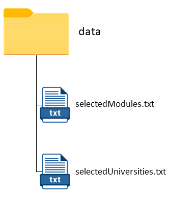

## Purpose Of This User Guide 

This User Guide is an introduction to the features, commands, and tips of SEPlanner. If you are a first-time user,
or you simply wish to explore SEPlanner to its fullest potential, this is the page for you. Use the [Content Page](#Content-Page)
to easily access the different sections of this guide, and we hope you have a pleasant experience.

## Content Page
* [Introduction](#introduction)
* [Program overview](#program-overview)
* [Quick Start](#quick-start)  
* [How to use this guide](#how-to-use-this-guide)
* [Universities, Modules and Module Mappings](#universities-modules-and-module-mappings)
* [Features](#features)  
  * [Viewing all available universities](#viewing-all-available-universities)
  * [Viewing all available modules](#viewing-all-available-modules)
  * [Adding a partner university](#adding-a-partner-university)
  * [Adding a NUS module](#adding-a-nus-module)
  * [Viewing all selected universities](#viewing-all-selected-universities)
  * [Viewing all selected modules](#viewing-all-selected-modules)
  * [Searching for available module mappings for a specific university](#searching-for-available-module-mappings-for-a-specific-university)
  * [Searching for available module mappings for all selected universities](#searching-for-available-module-mappings-for-all-selected-universities)
  * [Adding a module mapping](#adding-a-module-mapping)
  * [Finding a specific university](#finding-a-specific-university)
  * [Finding a specific module by module name](#finding-a-specific-module-by-module-name)
  * [Finding a specific module by module code](#finding-a-specific-module-by-module-code)
  * [Removing a selected university](#removing-a-selected-university)
  * [Removing a selected NUS module](#removing-a-selected-nus-module)
  * [Removing a selected module mapping](#removing-a-selected-module-mapping)
  * [Help](#help)
  * [Exit](#exit)
  * [Storage](#storage)
  * [Logs](#logs)
* [FAQ](#faq)
* [Command Summary](#command-summary)
* [Glossary](#glossary)
* [Troubleshooting](#troubleshooting)

## Introduction

SEPlanner is a lightweight **desktop application** for Computer Engineering undergraduates from the National University of Singapore (NUS)
to plan for their **Student Exchange Program (SEP)**, optimized for use via **Command Line Interface** (CLI). If you are familiar with the command line, SEPlanner can streamline your planning process when compared to other Graphical User Interface (GUI) apps.

## Program Overview

This SEPlanner allows you to search for pre-approved module mappings through our platform. To do so, you can follow the following steps:
1. Add partner universities that you are interested in.
2. Add potential NUS modules that you want to add.
3. Search for potential mapping for a particular selected university.
4. Select a mapping and add the mapping.

<div style="page-break-after: always;"></div>

## Quick Start

1. Ensure that you have Java 11 or above installed.
2. Download the latest version of `SEPlanner` from [here](https://github.com/AY2122S1-CS2113T-T09-2/tp/releases/tag/v2.1).
3. Copy the file to the folder you want to use as the home folder for your SEPlanner.
4. In your preferred command-line interface, navigate to that directory.
5. Enter the command `java -jar seplanner.jar`.
6. If you can see the graphic below, congratulations! You are ready to start using SEPlanner.
```
                                                       /(#######################(*
                                                 /(#(((((((((((###############(((((((.
                                             (#((((((###((######################(((((((/
                                            /#(((((((((((((((((#################((((((((((((,
                                          (#((((((((((((((#########################(((((((((((*
                                        /(((((((((((((((##########################((((######((((.
                                       #(((((((((((((##############################((##(((#####((/
                                     .##((((((#(((#################################((((((((((((((((
                                      ###(((######(#################################(((((((((((((((((
                                    (###(((#######################################(((((((((((((((((#,
                                   .######((((####################################(((((((((((((((((((
                                   *#########((###################################(#(((((((((((((((((
                                   /##########(((((((((#############################(((((((((((((((((
                                   *############(((((((((((####################################((((((
                                    ###########((((((((((((((((###############################(#(((#(
                                    (##########((((((((((((((((((((#############################((((.
                                     ###########(#((((((((((((((((((((((#######################(((#/
                                      ############(#((((((((((((((((((########################(#((/
                                       (############(((((((((((((((((########################(#((,
                                        .############(#(((((((((((((#########################(((
                                          ,##########(#((((((((((###########################((
                                             ##########((((((((############################/
                                               .########(((#############################(
                                                   *####((###########################.
                                                        ,##(###################(

       d888888o.   8 8888888888   8 888888888o   8 8888                  .8.          b.             8 b.             8 8 8888888888   8 888888888o.
  .`8888:' `88. 8 8888         8 8888    `88. 8 8888                 .888.         888o.          8 888o.          8 8 8888         8 8888    `88.
  8.`8888.   Y8 8 8888         8 8888     `88 8 8888                :88888.        Y88888o.       8 Y88888o.       8 8 8888         8 8888     `88
     `8.`8888.     8 8888         8 8888     ,88 8 8888               . `88888.       .`Y888888o.    8 .`Y888888o.    8 8 8888         8 8888     ,88
      `8.`8888.    8 888888888888 8 8888.   ,88' 8 8888              .8. `88888.      8o. `Y888888o. 8 8o. `Y888888o. 8 8 888888888888 8 8888.   ,88'
       `8.`8888.   8 8888         8 888888888P'  8 8888             .8`8. `88888.     8`Y8o. `Y88888o8 8`Y8o. `Y88888o8 8 8888         8 888888888P'
        `8.`8888.  8 8888         8 8888         8 8888            .8' `8. `88888.    8   `Y8o. `Y8888 8   `Y8o. `Y8888 8 8888         8 8888`8b
 8b   `8.`8888. 8 8888         8 8888         8 8888           .8'   `8. `88888.   8      `Y8o. `Y8 8      `Y8o. `Y8 8 8888         8 8888 `8b.
 `8b.  ;8.`8888 8 8888         8 8888         8 8888          .888888888. `88888.  8         `Y8o.` 8         `Y8o.` 8 8888         8 8888   `8b.
  `Y8888P ,88P' 8 888888888888 8 8888         8 888888888888 .8'       `8. `88888. 8            `Yo 8            `Yo 8 888888888888 8 8888     `88.
```
<div markdown="span" class="alert alert-primary"> :bulb: **Tip:**
If the visual that appears does not look like this, you might want to maximize your console window.
Don't worry, the features of SEPlanner still work regardless of window size, but doing so allows you to enjoy the beautiful ASCII art!
</div>

## How to use this guide
This user guide provides useful tools to help you acclimatize to SEPlanner. 

Here is a list of the different types of text formatting and what they mean. 

<div markdown="span" class="alert alert-primary"> :bulb: **Tip:**
Tips give helpful information to make your experience better.
</div>

<div markdown="span" class="alert alert-warning"> :exclamation: **Caution:**
Warnings caution you about certain actions that might be dangerous.
</div>

<div markdown="block" class="alert alert-info"> :information_source: **Note:**
Notes are important pieces of information.
</div>

```
Code blocks contain either your inputs or program outputs.  
```

## Universities, Modules and Module Mappings

SEPlanner consists of 3 main data types, `University`, `Module`, and `Module Mapping`. 

### University

A University consists of the following: 
1. Index
2. Name
3. A list of module mappings

### Module

A Module consists of the following: 
1. Index
2. Module code
3. Name
4. Module Credits (MCs)

### Module Mapping

A Module Mapping consists of the following: 
1. NUS module
2. Overseas module

An example of a module mapping might look like this: 
```
[1]   CS2040 - Cs112 : Introduction to Computer Science 2 : 4.0
```
Here,   
* `[1]` refers to the index within its Universities' module mapping list. 
* `CS2040` is the module code of the NUS module.
* `Cs112` is the module code of the Overseas module name.
* `Introduction to Computer Science 2` is the name of the Overseas module name.
* `4.0` is the module credits of the NUS module. 

<div style="page-break-after: always;"></div>

## Features

### Viewing all available universities: 

Displays all modules from the master list of universities that you can choose from.  

#### Format: `list /muni`  

#### Example of usage:

* Example 1   
Input: `list /muni`  
Expected output:
```
Here are the universities for exchange:  
[1]  Aarhus School of Business
[2]  Aarhus University
[3]  Arizona State University  
...  
[78] Uppsala University
[79] Waseda University
[80] Western University 
```

### Viewing all available modules: 

Displays all modules from the master list of modules that you can choose from.

<div markdown="span" class="alert alert-primary"> :bulb: **Tip:**
The master list of modules also displays each modules module credits on the right. 
</div> 

#### Format: `list /mmod`  

* Example 1  
Input: `list /mmod`  
Expected output:  
```
Here are the modules in the list:  
[1]   ACC1701X : Accounting for Decision Makers          4.0
[2]   ACC2706  : Managerial Accounting                   4.0
[3]   AR2102   : Design 4                                8.0
...  
[803] TR3008   : Technological Innovation                4.0
[804] UD5221   : Urban Design Theory and Disco           4.0
[805] UD5628   : Critique of Contemporary Urban Design   4.0
```

### Adding a partner university

Adds a partner university that you are interested to your *Selected University List*.

#### Format: `add /uni <UNIVERSITY_INDEX>` or `add /uni <UNIVERSITY_NAME>`

<div markdown="span" class="alert alert-primary"> :bulb: **Tip:**
This command accepts either the `<UNIVERSITY_INDEX>` or `<UNIVERSITY_NAME>` as arguments. 
The `<UNIVERSITY_INDEX>` can be found via `list /muni` command. 
</div> 

* Example 1  
Input: `add /uni 24`  
Expected output:
```
New university added: 
[24] Korea Advanced Inst of Sci & Tech
```
* Example 2  
Input: `add /uni University of California`  
Expected output:
```
New university added: 
[59] University of California
```

### Adding a NUS module

Adds an NUS module that you want to complete during SEP into your *Selected Module List*.

#### Format: `add /mod <MODULE_INDEX>` or `add /mod <MODULE_CODE>` 

<div markdown="block" class="alert alert-info"> :information_source: **Note:**
This command accepts either the `<MODULE_INDEX>` or `<MODULE_CODE>` as arguments.
The `<MODULE_INDEX>` can be found via `list /mmod` command.
</div>

* Example 1  
Input: `add /mod 77`  
Expected output:
```
New module added: 
[77]  CS1010   : Programming Methodology                 4.0
```
* Example 2   
Input: `add /mod CS1010`  
Expected output:
```
New module added: 
[77]  CS1010   : Programming Methodology                 4.0
```

### Viewing all selected universities:

Displays all universities you have added into the *Selected University List*, as well as all module mappings added to each university.  

#### Format: `list /suni`

* Example 1   
  Input: `list /suni`  
  Expected output:
```
Here are the universities and module mappings in your list:
[40] Technical University of Munich -------------------- 4.0
      [1]   IE4056 - WI001098 : Introduction to Production Scheduling Theory : 4.0
[80] - Western University
```

### Viewing all selected modules

Displays all modules you have added into the *Selected Module List*.

#### Format: `list /smod`

* Example 1  
  Input: `list /smod`  
  Expected output:
```
Here are the modules in the list:
[1]   ACC1701X : Accounting for Decision Makers          4.0
[2]   ACC2706  : Managerial Accounting                   4.0
[10]  AR3421   : Introduction to Architectural           4.0
[28]  BSP2701  : Global Economy                          2.0
[48]  CM1991   : Exchange Enrichment Level 1000          4.0
[77]  CS1010   : Programming Methodology                 4.0   
```

### Searching for available module mappings for a specific university:

Displays all available module mappings for a specific university that matches the *Selected Module List*.

<div markdown="block" class="alert alert-info"> :information_source: **Note:**
Mappings here are labeled with a mapping index, which will be used for `add /map` and `remove /map` commands.
</div>

#### Format: `searchmap <UNIVERSITY_INDEX>`

* Example 1  
  Input: `searchmap 4`  
  Expected Output:
```
Potential mappings for Boston University [4]  :
      [1]   CS2030 - MET CS 232 : Programming with Java : 4.0
      [2]   BT4222 - MET CS688 : Web Analytics and Mining : 4.0
      [3]   BT3102 - CAS MA 589 : Computational Statistics : 4.0
      [4]   CS2040 - Cs112 : Introduction to Computer Science 2 : 4.0
```
<div markdown="block" class="alert alert-primary"> :information_source: **Note:**
The output of this command might differ from the example given, based on the modules added into the selected module 
list. For instance, the above output is executed with the following modules in the selected module list: CS2030, CS2040,
 BT3102, BT4222. 
</div>

### Searching for available module mappings for all selected universities:  

Displays all available module mappings for all the universities in the *Selected University List* and modules in *Selected Module List*.

#### Format: `searchmap all`

* Example 1  
  Input: `searchmap all`  
  Expected Output: 
```
Potential mappings for Aarhus School of Business [1]  :
Potential mappings for Boston University [4]  :
      [1]   CS3244 - ENG EC 414 : Introduction to Machine Learning : 4.0
      [2]   CS3243 - MET CS 664 : Artificial Intelligence : 4.0
Potential mappings for ETH Zurich [17] :
      [1]   CS3244 - 252-0220-00L : Learning and Intelligent Systems : 4.0
      [2]   CS3244 - 227-0105-00L : Introduction to Estimation and Machine Learning : 4.0
Potential mappings for Korea Advanced Inst of Sci & Tech [24] :
Potential mappings for University of California [59] :
```

<div markdown="block" class="alert alert-primary"> :information_source: **Note:**
Similar to the example for the previous command, the output of this command might also differ from the example given based on the modules and universities in the selected list. For instance, the output shown in this example is based on
the same selected modules as the example in the previous command, with the following universities in the selected list:
Arhus School of Business, Boston University, ETH Zurich, Korea Advanced Inst of Sci & Tech, University of California.
</div>

### Adding a module mapping

Adds a specific pair of module mapping under a selected university.

#### Format: `add /map <UNIVERSITY_INDEX> <MODULE_MAPPING_INDEX>`

<div markdown="span" class="alert alert-primary"> :bulb: **Tip:**
The `<UNIVERSITY_INDEX>` can be found via `list /suni`command and the `<MODULE_MAPPING_INDEX>` can be 
found via `searchmap <UNIVERSITY_INDEX>` command for the specific university.
</div>

* Example 1  
Input: `add /map 4 2`  
Expected output:
```
New module mapping added: 
      [2]   BT4222 - MET CS688 : Web Analytics and Mining
```

### Finding a specific university

Looks for universities that match your entered keyword.  
* The output also consists of the index of the university, which is needed for subsequent commands.  


#### Format: `find /uni <KEYWORD>`

* Example 1   
Input: `find /uni California`  
Expected output:
```
[59] University of California
[60] University of California, Berkeley
[61] University of California, Davis
[62] University of California, Irvine
[63] University of California, Los Angeles
[64] University of California, Merced
[65] University of California, Riverside
[66] University of California, San Diego
[67] University of California, Santa Barbara
[68] University of California, Santa Cruz
```
* Example 2   
Input: `find /uni  e`

Expected output:
```
[5]  CentraleSupelec - Ecole Centrale Paris
[13] Ecole Centrale Des Arts Et Manufactures, Paris
[46] The University of Edinburgh
```

<div markdown="block" class="alert alert-info"> :information_source: **Note:**
Note the space before the character 'e' in the keyword " e".
The find command takes into account spaces as part of the keyword when searching. 
</div>

### Finding a specific module by module name

Looks for modules with module names that match your entered keyword.
* The output also consists of the index of the module, which is needed for subsequent commands.

#### Format: `find /mod <KEYWORD>`

* Example 1   
Input: `find /mod programming`  
Expected output:
```
[77]  CS1010   : Programming Methodology
[78]  CS1010E  : Programming Methodology
[79]  CS1010J  : Programming Methodology
[80]  CS1010S  : Programming Methodology
[82]  CS2030   : Programming Methodology II
[88]  CS2104   : Programming Language Concepts
[93]  CS2113   : Software Engineering & Object Oriented Programming
[105] CS3226   : Web Programming and Applicatio
[108] CS3233   : Competitive Programming
[123] CS4215   : Programming Language Implement
[167] DAO2702  : Programming for Biz Analytics
[547] MA3236   : Non-Linear Programming
```

### Finding a specific module by module code

Looks for modules with module codes that match your entered keyword.
* The output also consists of the index of the module, which is needed for subsequent commands.

#### Format: `find /code <KEYWORD>`

* Example 1   
  Input: `find /code cs1010`  
  Expected output:
```
[77]  CS1010   : Programming Methodology
[78]  CS1010E  : Programming Methodology
[79]  CS1010J  : Programming Methodology
[80]  CS1010S  : Programming Methodology
```

* Example 2  
  Input: `find /code cs20`  
  Expected output:  
```
[82]  CS2030   : Programming Methodology II
[83]  CS2040   : Data Structures and Algorithms
[84]  CS2040C  : Data Structures and Algorithms
```

### Removing a selected university

Removes a partner university from the *Selected University List*.

#### Format: `remove /uni <UNIVERSITY_INDEX>` or `remove /uni <UNIVERSITY_NAME>` 

* Example 1    
Input: `remove /uni 4`   
Expected output:
```
This university is removed: 
[4]  Boston University --------------------------------- 0.0
```
* Example 2   
Input: `remove /uni Boston University`  
Expected output:
```
This university is removed: 
[4]  Boston University --------------------------------- 0.0
```

### Removing a selected NUS module

Removes a module from the *Selected Module List*.

#### Format: `remove /mod <MODULE_CODE>` or `remove /mod <MODULE_INDEX>`

* Example 1   
Input: `remove /mod 81`  
Expected output:
```
This module is removed: 
[81]  CS1231   : Discrete Structures
```
* Example 2  
Input: `remove /mod CS1231`  
Expected output:
```
This module is removed: 
[81]  CS1231   : Discrete Structures
```


### Removing a selected module mapping

Removes a module mapping under a selected university.

#### Format: `remove /map <UNIVERSITY_INDEX> <MAPPING_INDEX>`  

* Example 1  
Input: `remove /map 4 2`  
Expected output:  
```
This module mapping is removed: 
      [2]   CS1231 - CAS CS131 : Combinatoric Structures
```
 
<div markdown="block" class="alert alert-info"> :information_source: **Note:**
Removing a module does not automatically remove all module mappings associated with it.
</div>

### Help 

Displays the list of commands for SEPlanner and their respective descriptions 

#### Format: `help`

### Exit 

Exits SEPlanner. For information about your data when SEPlanner is exited, refer to [Storage](#storage). 

#### Format: `exit`


### Storage

Your *Selected Module List* and *Selected University List* are stored in the text files, `selectedModules.txt` and 
`selectedUniveristies.txt` respectively.

<p align = "center">

</p>

Whenever your *Selected Module List* and *Selected University List* gets updated, the data stored in the files will get
updated immediately.

<div markdown="span" class="alert alert-warning"> :exclamation: **Caution:**
Do not edit the data stored in the text file, as the storage feature removes the invalid data stored in the files.
</div>

### Logs

In your working directory, you might notice the `log` directory. The log directory contains files that track the status 
and records events that occur while SEPlanner is in use. 

The logging information is used for the identification and tracking of bugs for developers, as we continue to improve SEPlanner
for you.

## FAQ

**Q**: How do I transfer my data to another computer?  
**A**: Install the app on the other computer and overwrite the empty data file it creates with the file that 
contains the data of your previous SEPlanner home folder.

<div markdown="span" class="alert alert-warning">:exclamation: **Caution:**
Do not delete the `/data` directory or any of its files as this will cause you to lose your saved information!
</div>

**Q**: How do I save my selected universities and modules?  
**A**: All your universities, modules, and module mappings are automatically saved at 
each command and will be auto-loaded on program start.

<div style="page-break-after: always;"></div>

## Command Summary

Command | Format &nbsp; &nbsp; &nbsp; &nbsp; &nbsp; &nbsp; &nbsp; &nbsp; &nbsp; &nbsp; &nbsp; &nbsp; &nbsp; &nbsp; &nbsp; &nbsp; &nbsp; &nbsp; &nbsp; &nbsp; &nbsp; &nbsp; &nbsp; &nbsp; &nbsp; &nbsp; &nbsp; &nbsp; &nbsp; &nbsp; &nbsp; &nbsp; &nbsp; | Purpose
--------|---------|-----------
`add` | `add /uni <UNI_INDEX>`, <br /> `add /uni <UNI_NAME>`, <br />`add /mod <MOD_INDEX>`, <br /> `add /mod <UNI_NAME>`,<br />`add /map <UNI_INDEX> <MAP_INDEX>` | Add a university/module/mapping
`remove` | `remove /uni <UNI_INDEX>`, <br /> `remove /uni <UNI_NAME>`, <br />`remove /mod <MOD_INDEX>`, <br /> `remove /mod <UNI_NAME>`,<br />`remove /map <UNI_INDEX> <MAP_INDEX>` | Remove a university/module/mapping
`list` | `list /muni`<br />`list /mmod`<br />`list /suni`<br />`list /smod` | List master/selected university list or module list
`searchmap` | `searchmap <UNI_INDEX> <MAP_INDEX>`<br />`searchmap all`| Search for potential mappings for the selected university/ all universities in the selected university list
`find` | `find /uni <KEYWORD>`<br />`find /mod <KEYWORD>`<br />`find /code <KEYWORD>` | Find the possible university or module
`help` | `help` | Display the functionalities of all Commands
`exit` | `exit` | Exit the application

## Glossary

* *UNI_INDEX* The unique identifier corresponding to a particular university.
* *MOD_INDEX* The unique identifier corresponding to a particular module.
* *MAPPING_INDEX* The identifier corresponding to a particular module mapping within a university.
* *Master University List* The list of all partner universities.
* *Master Module List* - The list of all NUS modules available for mapping.
* *Selected University List* - The list of partner universities you selected along with your selected module mappings
  for each university
* *Selected Module List* - The list of NUS modules you selected.
* *SEP* - Student Exchange Programme
* *NUS* - National University of Singapore

## Troubleshooting

### Permission denied for data files
In the event that the program crashes on startup, and display the following message:  
```data/selectedUniversities.txt (Permission denied) ``` or  
```data/selectedUniversities.txt (No such file or directory)```  
This happens if the file permission of the files in the data folder has been changed.  
There are two possible solutions to this problem:
1. Change the file permissions for `selectedUniversity.txt` and `selectedModules.txt` to the appropriate settings base on your operating system. Else;
2. Delete the data folder. This will remove all the data.
