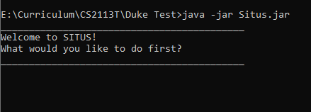

# User Guide

## Introduction

The Smart Inventory Tracking and Updating System (SITUS) is a **desktop app for tracking
ingredient inventory.**

### How to use this guide
#### Format notes
* Words/phrases in this format: `example`, are command snippets
* Words/phrases within square bracket `[square bracket]` are user's inputs.  
  For example,`delete [INGREDIENT_NUMBER]`, `INGREDIENT_NUMBER` could be user's input numbers,
  such as `delete 1`.

## Contents

[**1. Quick Start**](#1-quick-start)   
[**2. Features**](#2-features)   
&nbsp;&nbsp;[2.1. Viewing Help](#21-viewing-help)  
&nbsp;&nbsp;[2.2. Adding Ingredients](#22-adding-an-ingredient)  
&nbsp;&nbsp;[2.3. Listing Ingredients](#23-listing-all-ingredients)  
&nbsp;&nbsp;[2.4 Updating Ingredients](#24-updating-an-ingredient)  
&nbsp;&nbsp;[2.5. Delete Ingredients](#25-stop-tracking-an-ingredient)  
&nbsp;&nbsp;[2.6. Setting Thresholds](#26-tba-setting-thresholds)  
&nbsp;&nbsp;[2.7. Show Expiring Ingredients](#27-tba-show-expiring-ingredients)  
&nbsp;&nbsp;[2.8. Exit Program](#28-exiting-the-program)  
[**3. FAQ**](#3-faq)  
[**4.Command Summary**](#command-summary)  

## 1. Quick Start

1. Ensure that you have Java 11 or above installed.
2. Download the latest version of `Situs` from [here](https://github.com/AY2122S1-CS2113T-T09-3/tp/releases/tag/v1.0).
3. Copy the jar file to the folder that you want to use SITUS.
4. Open a terminal and navigate to the folder containing the jar file.
5. Type `java -jar Situs.jar` in the terminal window.
6. If successful, you will see the following message:

   

   *Figure 1: welcome message in terminal*
## 2. Features

### 2.1. Viewing help

Shows a list of available commands and their syntax.

Format: `help`

### 2.2. Adding an ingredient

Adds an ingredient to the ingredient list.

Format: `add n/[INGREDIENT_NAME] a/[AMOUNT] u/[UNITS] e/[EXPIRY]`

The parameters used in the command are:
* `INGREDIENT_NAME`: name of the ingredient.
* `AMOUNT`: amount of the ingredient.
* `UNITS`: units specified to associate with `AMOUNT`.
* `EXPIRY`: expiration date of ingredient, in format of [TBA]

Examples:
* `add n/carrot a/200 u/sticks e/22/10/2021`
* `add n/potato a/500 u/g e/25/10/2021`

### 2.3. Listing all ingredients

Displays a list of all ingredients in the ingredient list

Format: `list`

### 2.4. Updating an ingredient

Updates the amount, unit and expiry of an ingredient in the ingredient list

Format: `update n/[INGREDIENT_NAME] a/[AMOUNT] u/[UNITS] e/[EXPIRY]`

The parameters used in the command are:
* `INGREDIENT_NAME`: name of the ingredient.
* `AMOUNT`: updated amount of the ingredient.
* `UNITS`: updated unit of the ingredient.
* `EXPIRY`: updated expiration date of the ingredient.

Examples:
* `update n/carrot a/100 u/sticks e/21/10/2021`
* `update n/potato a/0.6 u/kg e/27/10/2021`

### 2.5. Stop tracking an ingredient

Deletes an ingredient from the ingredient list based on its index in the list.

Format: `delete [INGREDIENT_NUMBER]`

The parameter used in the command is:
* `INGREDIENT_NUMBER`: the ingredient number to remove

Example: `delete 1`

### 2.6. [TBA] Setting thresholds

_TO BE ADDED_

### 2.7. Show expiring ingredients

Lists the ingredients that will expire by a specified date.

Format: `expire [DATE]`

The parameter used in the command is:
* `DATE`: the date of interest

Example: `expire 12/11/2021`

### 2.8. Exiting the program

Exits the program

Format: `exit`

## 3. FAQ

**Q**: How do I transfer my data to another computer?

**A**: {your answer here}

## Command Summary

{Give a 'cheat sheet' of commands here}

* Add todo `todo n/TODO_NAME d/DEADLINE`
