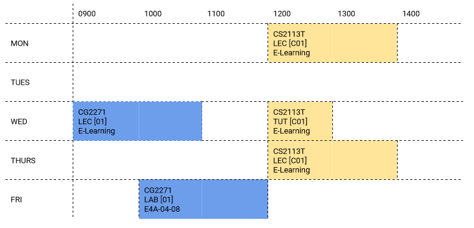

# User Guide


# About The Project

It’s August 5th, and the Academic Year is right around the corner!
ModReg is about to start, and you have no idea what modules to take and what your timetable might even look like.

Introducing **UNI Mods**, an easy to use application that provides information on all available NUS modules and lets you
pick and choose the modules and classes you want to take for that semester!
Depending on the classes you decide to take, a timetable will be generated to keep track of your daily schedule and your
total workload:



<br>

---

# Table of Contents

- [Quick Start](#quick-start)
- [Features](#features)
    * [Viewing help](#viewing-help--help)
    * [Listing tasks](#listing-tasks-list)
    * [Querying tasks](#querying-tasks-find-regex-type-tasktype-limit-querylimit)
    * [Adding a Todo](#adding-a-todo-todo-description)
    * [Adding a Deadline](#adding-a-deadline-deadline-description-by-datetime)
    * [Adding an Event](#adding-an-event-event-description-at-datetime)
    * [List valid DateTime Formats](#list-valid-datetime-formats-dates)
    * [Removing a task](#removing-a-task-delete-idx)
    * [Marking a task as done](#marking-a-task-as-done-done-idx)
    * [Exit](#exit-the-application--bye)
    * [Local Save](#local-save)
- [FAQ](#faq)
- [Command Summary]()

<br>

---

# Quick Start

1. Ensure you have **Java 11** or above installed in your Computer.
2. Download the latest **unimods.jar** from here.
3. Copy the file to the folder you want to use as the home folder for your Unimods.
4. Double-click the file to start the app.
5. Type the command in the command box and press Enter to execute it.

   Some example commands you can try:

       - help : to list all the commands with their description
       - search <module_code> : lists module code based on the given partial regex
       - show <module_code>: displays the module information
       - add <module_code> : to add the module to the timetable
       - delete <module_code> : to remove the module from the timetable
       - timetable : lists all modules added to the timetable
       - exit : Exits the app.
       - Refer to the Features below for details of each command.

<br>

---

# Features

> :information_source: **Notes about the command formats**
> - Words in `<UPPER_CASE>` are the parameters to be given by the user. <br />
    > e.g. in `show <MODULE_CODE>`, <MODULE_CODE> is a parameter and be called like so : `show CS2113T`
    <br /><br />
> - Items in square brackets are optional <br />
    > e.g. find `search <KEYWORD> [-l]`
    > can be called as `search GEH` OR `search GEH -l`.
    <br /><br />
> - Parameters can be in any order for optional flags <br />
    > e.g. `search <KEYWORD> [-l]` is equivalent to `search [-l] <KEYWORD> `
    <br /><br />
> - Extraneous parameters for commands that do not take in parameters (such as `help`, `list`, `bye`) will be ignored.<br />
    > e.g. `help abc` will be interpreted as  `help`

## Viewing Help: `help`

If you are stuck wondering how to even begin using this application, simply type `help` into the terminal and you will
be able to see all the available commands!
You will also be provided a link to the User Guide of this application which you can refer to, for detailed descriptions
of the commands.

Output:

```shell
~$ help
____________________________________________________________________________
	UNIMods accepts the following commands:-
		| No.| Command Syntax          |            Command Action                      |
		| 1. | search <module_code>    | Search module based on the given partial regex |
		| 2. | show <module_code>      | Display module information                     |
		| 3. | add <module_code>       | Add module to the Timetable                    |
		| 4. | delete <module_code>    | Remove module from the Timetable               |
		| 5. | clear                   | Remove all modules from the Timetable          |
		| 6. | timetable               | Display the Timetable                          |
		| 7. | exit                    | Exit From Program                              |
	 ** Note: For details, refer to the User Guide of NUSModsLite at: 
		https://ay2122s1-cs2113t-w12-2.github.io/tp/UserGuide.html
____________________________________________________________________________

```

To begin, perhaps try looking up CS2113T by running the following command:

<br>

## Display Module Info: `show <MODULE_CODE>`

If you want to find out more about a module, type `show <module_code>` to display the following:

* Name
* MCs
* Department which offers the module
* Description
* Prerequisites
* S/U option Availability
* Semester Availability

For example, try typing `show CS2113T` and see the magic happen!

```shell
~$ show CS2113T
Title: Software Engineering & Object-Oriented Programming
MCs: 4
Department: Computer Science
This module introduces the necessary skills for systematic and
rigorous development of software systems. It covers requirements,
design, implementation, quality assurance, and project management
aspects of small-to-medium size multi-person software projects. The
module uses the Object Oriented Programming paradigm. Students of this
module will receive hands-on practice of tools commonly used in the
industry, such as test automation tools, build automation tools, and
code revisioning tools will be covered.
Prerequisites: CS2040C or ((CS2030 or its equivalent) and CS2040/S)
S/U able: No
Semester Availability: [1, 2]

```

<br>

## Search Module: `search <KEYWORD> [-l]`

Maybe you don't know what modules are out there, and want to know what GEH modules are available.

You can type `search GEH` to display all CG modules available:

```shell
~$ search GEH
GEH1001 Globalisation and New Media 4MC
GEH1002 Economic Issues in Dev World 4MC
GEH1004 Chinese Heritage: History and Literature 4MC
GEH1005 Crime Fiction in Eng & Chinese 4MC
GEH1006 Chinese Music, Language and Literature (in English) 4MC
GEH1007 Asian Cinema: The Silent Era 4MC
GEH1008 Nations & Nationalism in South Asia 4MC
GEH1009 Framing Bollywood: Unpacking The Magic 4MC
GEH1010 Beasts, People and Wild Environments in South Asia 4MC
GEH1011 Film and History 4MC
:
:
```

You can also apply the following flags to refine the search:

- -l (small L) : performs a local search using locally saved module data which might not be the most updated version

<br>

## Add to timetable: `add <MODULE_CODE>`

You want to start planning your timetable and your semester workload. Try adding your first module!

Let's add for example, `CS2113T` to the timetable

<br>

## Delete from timetable: `delete <module_code>`

You can remove any module that you added to your timetable using this command.

For example: If you have CS2113T already added to your timetable. You can type
`delete CS2113T` to remove this module from your timetable.

```shell
~$ delete CS2113T
CS2113T is successfully deleted from your Timetable.
```

<br>

## Clear timetable: `clear`

You can remove **all** added modules from your timetable by typing `clear`. You can then view the empty timetable by
typing the command `timetable`.

For Example:

```shell
~$ clear
All modules have been successfully removed from your Timetable.

```

<br>

## View timetable: `timetable`

You can view the current timetable which details your daily schedule as well as the total MCs taken and classes and time
slots for each day of the week in a timetable structure.

Simply type `timetable` into the input and voila!

```shell
~$ timetable

				900             1000            1100            1200            1300            1400            1500            1600            1700            1800            
-----------------------------------------------------------------------------------------------------------------------------------------------------------------------------------
				                                                |   CS2113T                     |                                                                               
		MON		                                                |   LEC[C01]                    |                                                                               
				                                                |   E-Learn_C                   |                                                                               
-----------------------------------------------------------------------------------------------------------------------------------------------------------------------------------
				                                                                                                                                                                
		TUE		                                                                                                                                                                
				                                                                                                                                                                
-----------------------------------------------------------------------------------------------------------------------------------------------------------------------------------
				                                                |   CS2113T     |                                                                                               
		WED		                                                |   LEC[C01]    |                                                                                               
				                                                |   E-Learn_C   |                                                                                               
-----------------------------------------------------------------------------------------------------------------------------------------------------------------------------------
				                                                |   CS2113T                     |                                                                               
		THU		                                                |   LEC[C01]                    |                                                                               
				                                                |   E-Learn_C                   |                                                                               
-----------------------------------------------------------------------------------------------------------------------------------------------------------------------------------
				                                                                                                                |   CS2113T                     |               
		FRI		                                                                                                                |   LEC[C01]                    |               
				                                                                                                                |   E-Learn_C                   |               
-----------------------------------------------------------------------------------------------------------------------------------------------------------------------------------
				                                                                                                                                                                
		SAT		                                                                                                                                                                
				                                                                                                                                                                
-----------------------------------------------------------------------------------------------------------------------------------------------------------------------------------
				                                                                                                                                                                
		SUN		                                                                                                                                                                
				                                                                                                                                                                

*******************
Modules taken this semester: 

CS2113T Software Engineering & Object-Oriented Programming 4MC

Total MCs taken this semester: 4.0

*******************

```

<br>

## Exit: `exit`

You can end the application anytime by typing `exit` into the terminal

```shell
~$ exit
____________________________________________________________________________
> Bye friend!
> See you again! :)
____________________________________________________________________________
```

<br>

---

# FAQ

**Q**: How do I save my timetable so I don’t have to add all my modules again?</br>
**A**: The timetable is saved automatically on every update (add/delete etc.)

**Q**: How do I add additional comments/tags to my timetable so I can keep track of additional deadlines?</br>
**A**: Stay tuned for v2.0!

<br>

---

## Command Summary

| Command                   | Meaning                                                                                           |
| --------------            | ----------                                                                                        |
| `help`                    | Shows available commands and flags. </br> Example: `help`                                         |
| `search <KEYWORDd> [-l]`  | Lists modules that have partial matches by regex to the keyword. </br> Example: `search GEH -l`   |
| `show <MODULE_CODE>`      | Display relevant module information. </br> Example: `show CS2113T`                                |
| `add <MODULE_CODE>`       | Adds the module to the timetable. </br> Example: `add CS2113T`                                    |
| `delete <MODULE_CODE>`    | Deletes the module from the timetable. </br> Example: `delete CS2113T`                            |
| `clear`                   | Deletes all modules from the timetable. </br> Example: `clear`                                    |
| `timetable`               | Displays timetable with total MCs taken. </br> Example: `timetable`                               |
| `exit`                    | Exit the application. </br> Example:`exit`                                                        |

---
