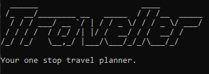

# Traveller User Guide

## Introduction


Thank you for choosing to use Traveller!

Traveller is a travel planner app that is designed to help holidaymakers like you plan your overseas trips with ease.

It is created for individuals who prefer to use a Command Line Interface (CLI) over a Graphical User Interface (GUI), 
while still retaining the ease of use of a GUI.

Use Traveller so that you can plan your trips with ease and focus on what matters most: Fun!

### What is a Command Line Interface (CLI)?
A CLI is a way of interacting with applications via lines of text, instead of the usual way of clicking on the application.
Each computer will have their own CLI, such as the Windows' Powershell and the macOS's Terminal.

### What is this guide for?
This guide's purpose is to help users like you understand how to use the Traveller application to its fullest potential.

For users who can't wait to start using Traveller, see [here](#1-quick-start) for a quick guide on how to set it up.
The [command summary](#5-command-summary) provides you with a summary of the various functionalities currently 
supported by Traveller too.

For users who are seeking to understand the full functionality of Traveller, details, along with tips and tricks, of 
each functionality are explained in the [features](#2-features) section.

### Legend

|Icon|Explanation|
|:---:|:---:|
||Shows how this user guide is formatted.|
||Shows useful tips when using Traveller.|
||Shows potential problems when using Traveller.|

---

## Contents Table

* [1. Quick Start](#1-quick-start)
* [2. Features](#2-features)
  * [2.1. help](#21-getting-help-help)
  * [2.2. new](#22-creating-a-trip-new)
  * [2.3. add-day](#23-adding-a-day-to-trip-add-day)
  * [2.4. add-item](#24-adding-an-item-to-a-day-add-item)
  * [2.5. view](#25-viewing-trips-view)
  * [2.6. delete](#26-delete-a-trip-delete)
  * [2.7. delete-day](#27-deleting-a-day-from-a-trip-delete-day)
  * [2.8. delete-item](#28-deleting-an-item-from-a-day-delete-item)
  * [2.9. edit](#29-edit-a-trip-edit)
  * [2.10. edit-item](#210-edit-an-item-edit-item)
  * [2.11. search-item](#211-searching-for-an-item-search-item)
  * [2.12. shortest-time](#212-shortest-time-shortest-time)
  * [2.13. shortest-cost](#213-least-cost-shortest-cost)
  * [2.14. exit](#214-exiting-the-program-exit)
* [3. FAQ](#3-faq)
* [4. Supported Countries Summary](#4-supported-countries-summary)
* [5. Command Summary](#5-command-summary)

<br/>

## 1. Quick Start
This section provides a guide on how to get Traveller up and running on your computer.

1. Ensure that you have Java 11 or above installed.
2. Download the latest version of `Traveller.zip` from [here](https://github.com/AY2122S1-CS2113T-W13-1/tp/releases).
3. Unzip the downloaded folder in an empty directory of your choice.
4. Navigate to the directory containing `Traveller.jar` in your desired CLI and run `java -jar Traveller.jar`.
   You should see Traveller's welcome message as shown below.

   

5. Enter a command.

   Some of our basic commands are:
   * `new FamilyTrip2021 /from SIN /to MLY` : Creates a new trip called `FamilyTrip2021` from Singapore (`SIN`) to Malaysia (`MLY`).
   * `view FamilyTrip2021` : Shows your existing trips and their details.
   * `delete FamilyTrip2021` : Deletes the trip called `FamilyTrip2021`.
   * `exit` : Exits the program.

<br/>

## 2. Features
This section provides details for all commands that Traveller supports.

For a quick summary of all commands, please click [here](#5-command-summary) instead.

>  As Traveller is a CLI based app, what and how you type your commands is *very important*.
> Each command has its specific format so that Traveller can understand what you want to do!

<br/>

### 2.1. Getting help: `help`
The help command would return the basic commands that are supported by Traveller.
The purpose of the help command is to ensure that even if there is no internet connection, the user is able to utilise the CLI without having to refer to the user guide.

#### Format: `help`

<br/>

### 2.2. Creating a trip: `new`
Creates a new trip.

#### Format: `new TRIP_NAME /from SOURCE_COUNTRY /to DESTINATION_COUNTRY`
   * Keywords `/from` and `/to` must be included **before** the SOURCE_COUNTRY and DESTINATION_COUNTRY respectively.
   * `SOURCE_COUNTRY` and `DESTINATION_COUNTRY` destinations must be [supported countries codes](#4-supported-countries-summary).

#### Usage Example:

```
____________________________________________________________
$ new FamilyTrip2021 /from SIN /to MLY
____________________________________________________________
	You have just created a new trip called FamilyTrip2021.
____________________________________________________________
```
>  A trip is a basic building block of Traveller. To start planning your trips, 
> create a trip using this command first. Then, when planning your trip, all details will be tagged to this trip that 
> you have created.
> 
>  If you have accidentally created unwanted trips, use the 
> [delete](#26-delete-a-trip-delete) command to delete the unwanted trips.
> 
>  After creating a trip, you can [view](#25-viewing-trips-view) the trip to find 
> the shortest flight path to get to your desired country (Yes, it is automated! :)).
> 
>  If you encounter an issue where either your Start or End destinations are not recognised by Traveller.
> Take a look in *flightData/time.txt* or *flightData/cost.txt* to see how Traveller recognises them!

<br/>

### 2.3. Adding a day to Trip: `add-day`
Your overseas trip may span multiple days.

This command allows you to create any number of days in your trip.

#### Format: `add-day TRIP_NAME /day NUMBER_OF_DAYS`
   * The maximum number of days allowed per trip is 30 days.

#### Usage Example:

```
____________________________________________________________
$ add-day FamilyTrip2021 /day 3
____________________________________________________________
	Added 3 days to trip FamilyTrip2021.
____________________________________________________________
```

>  After creating a trip, what's next is to specify the number of days your trip will 
> last. Use this command to do so.
> 
>  If you have accidentally created more days than you want, you can delete the days 
> you have created at any time using the [delete-day](#27-deleting-a-day-from-a-trip-delete-day) command.

<br/>

### 2.4. Adding an item to a Day: `add-item`
Use this command to add an item to a day of your trip. An item represents an activity that you will do in a day.

#### Format: `add-item TRIP_NAME /day DAY_INDEX /time ITEM_TIME /name ITEM_NAME`
   * The maximum number of items allowed per day is 50 days.

#### Usage Example:

```
____________________________________________________________
$ add-item trip1 /day 0 /time 1900 /name Check-in to HolidayInn
____________________________________________________________
	Added a new item to day 0 of trip FamilyTrip2021.
____________________________________________________________
```

>  In each day of your trip, you will want to have multiple items planned out, 
> such as visiting a museum or relaxing at the beach. Use this command to create these items in your trip. Items are
> very flexible in what they can represent, so do use them to their fullest!
> 
>  Days are 0-indexed based. That is, the first day of your trip is day 0.
> 
>  If you decided that you want to remove some items, simply use 
> the [delete-item](#28-deleting-an-item-from-a-day-delete-item) command.
> 
>  If your item spans the whole day, just type in `All day` for the time field!

<br/>

### 2.5. Viewing trips: `view`
Shows you details of your existing trips.

#### Format: `view TRIP_NAME`

#### Usage Example:

```
____________________________________________________________
$ view FamilyTrip2021
____________________________________________________________
	Here are all your trips: 
		TripName: FamilyTrip2021
			 Origin: SIN
			 Destination: MLY
			 Path: [SIN, MLY]
			 Time: [1.0]
			 Days: 
			    Day 0: 
					0:  1900  Check-in at HolidayInn
____________________________________________________________
```
>  Viewing a trip shows you your trip's start country, destination country, 
> the shortest flight path and its associated duration of flight, and your itinerary for the trip.
>
>  To view all trips, simply enter `view all`.

<br/>

### 2.6. Delete a trip: `delete`
Deletes an existing trip from the trip list.

#### Format: `delete TRIP_NAME`

#### Usage Example:
```
____________________________________________________________
$ delete FamilyTrip2021
____________________________________________________________
	You have just deleted a trip called FamilyTrip2021.
____________________________________________________________
```

>  Be careful when deleting your trips, a delete command is irreversible!

<br/>

### 2.7. Deleting a day from a trip: `delete-day`
Deletes an existing day from a trip.

#### Format: `delete-day TRIP_NAME /day DAY_INDEX`

#### Usage Example:
```
____________________________________________________________
$ delete-day FamilyTrip2021 /day 0
____________________________________________________________
	You have just deleted day 0 of FamilyTrip2021.
____________________________________________________________
```

>  Be careful when deleting your trips, a delete-day command is irreversible!

<br/>

### 2.8. Deleting an item from a day: `delete-item`
Deletes an existing item from a trip.

#### Format: `delete-item TRIP_NAME /day DAY_INDEX /item ITEM_INDEX`

#### Usage Example:
```
____________________________________________________________
$ delete-item FamilyTrip2021 /day 1 /item 0
____________________________________________________________
	You have just deleted item 0 of FamilyTrip2021 day 1.
____________________________________________________________
```

>  Be careful when deleting your trips, a delete-item command is irreversible!

<br/>

### 2.9 Edit a trip: `edit`
Edits any main field about an existing trip.

#### Format: `edit TRIP_NAME /name NEW_TRIP_NAME /from NEW_SOURCE_COUNTRY /to NEW_DESTINATION_COUNTRY`

   * If you want to edit multiple fields, the fields must be in the same order as shown above (`/name` comes first, 
then `/from` and finally `/to`.)
   * If you only want to edit a trip's name : `edit TRIP_NAME /name NEW_TRIP_NAME`.
   * If you only want to edit a trip's source country : `edit TRIP_NAME /from NEW_SOURCE_COUNTRY`.
   * If you only want to edit a trip's destination country : `edit TRIP_NAME /to NEW_DESTINATON_COUNTRY`.
   * If you want to edit a trip's name and destination country : 
`edit TRIP_NAME /name NEW_TRIP_NAME /to NEW_SOURCE_COUNTRY`.


#### Usage Example:
   * `edit FamilyTrip2021 /from SKR /to JPN` edits an existing trip called `FamilyTrip2021` to be from South Korea to
Japan.
   * `edit FamilyTrip2021 /name SoloTrip2021` edits an existing trip called `FamilyTrip2021` to now be called 
`SoloTrip2021`

>  Edit only allows you to change the name, to and from of a trip.
> To change your trip itinerary use [edit-item](#210-edit-an-item-edit-item) instead!

<br/>

### 2.10. Edit an item: `edit-item`
Edits and updates existing item from a trip and updates it to a new corresponding item.

#### Format: `edit-item TRIP_NAME /day DAY_NUMBER /index ITEM_INDEX /time NEW_TIME /name NEW_NAME`

#### Usage Example:
```
_________________________________________________________________________________
$ edit-item trip1 /day 1 /index 1 /time 0900 /name later breakfast
_________________________________________________________________________________
	You have just edited item 1 on day 1 of trip1 to later breakfast at 0900.
_________________________________________________________________________________
```

<br/>

### 2.11. Searching for an item: `search-item`
Searches for an item keyword from a trip and returns the resulting matching items.

#### Format: `search-item TRIP_NAME /day DAY_INDEX /key KEYWORD`

>  `KEYWORD` must be one word and not have any white spaces before or after.

#### Usage Example:
```
_________________________________________________________________________________
$ search-item FamilyTrip2021 /day 1 /key time
_________________________________________________________________________________
	You have just search item keyword time on day 1 in trip called FamilyTrip2021
	
	Results: 
	1. 1400		lunch time
	2. 1700		dinner time
_________________________________________________________________________________
```

### 2.12. Shortest time: `shortest-time`
Returns the shortest flight time from the source to destination country.

#### Format: `shortest-time /from SOURCE_COUNTRY /to DESTINATION_COUNTRY`

#### Usage Example:
```
____________________________________________________________
$ shortest-time /from SIN /to JPN
____________________________________________________________
	The shortest time from SIN to JPN is 6.0.
	Time breakdown: 
	1.0
	5.0
____________________________________________________________
```

### 2.13. Least cost: `shortest-cost`
Returns the least expensive flight path from the source to destination country.

#### Format: `shortest-cost /from SOURCE_COUNTRY /to DESTINATION_COUNTRY`

#### Usage Example:
```
____________________________________________________________
$ shortest-cost /from SIN /to JPN
____________________________________________________________
	The least cost from SIN to JPN is 550.0.
	Cost breakdown: 
	150.0
	400.0
____________________________________________________________
```


### 2.14 Exiting the program: `exit`
Exits the program.

#### Format: `exit`

>  While your Trips are saved periodically when using Traveller, exiting with the 
> `exit` command ensures that it is saved properly.

<br/>

## 3. FAQ

**Q**: How do I transfer my data to another computer? 

**A**: Transfer the entire folder containing the items listed below to the other computer. 
   * *Traveller.jar*
   * *flightData* folder with *time.txt* and *cost.txt* inside
   * *save* folder with *save.txt* inside

**Q**: Why does it keep saying "Country 'X' doesn't exist!"?

**A**: Traveller can only read specific words as countries.
Please check [here](#4-supported-countries-summary) for all supported destinations and their specific 
wordings.

If the problem persists, then your data in *flightData/time.txt* or *flightData/cost.txt* may have been corrupted.
Download a new copy of Traveller from [this link](https://github.com/AY2122S1-CS2113T-W13-1/tp/releases) to get a new
uncorrupted version of the flight and cost data.

**Q**: What should I do when creating a new trip if my trip span multiple countries?

**A**: As of our current version v2.1, we unfortunately do not support multiple countries in 1 trip.
However, you can create multiple trips instead, 1 for each country that you plan to go to, and plan your trips from 
there.

**Q**: What unit is time measured in?

**A**: Time is given in hours.

**Q**: How do I interpret path and time shown in the `view` command?

**A**: Path can be read from left to right. For example, a path of `[SIN, MLY, SKR]` means that the shortest path from
Singapore (SIN) to South Korea (SKR) is to take a flight from Singapore to Malaysia (MLY), and then taking a flight from 
Malaysia to South Korea.

Similarly, time can be read from left to right. Continuing from the above example, if a time of `[1, 5]` is 
shown, this means that the flight from Singapore to Malaysia is 1 hour long, and the flight from Malaysia to South Korea
is 5 hours long.

<br/>

## 4. Supported Countries Summary
As Traveller can only read certain country codes. Below is a short table of the basic
supported countries (included in our [release](https://github.com/AY2122S1-CS2113T-W13-1/tp/releases)) 
and their codes. Read our Developer Guide [here](https://ay2122s1-cs2113t-w13-1.github.io/tp/DeveloperGuide.html)
if you would like to change the supported countries to those that you want.

Country | Code
--- | ---
Singapore | **SIN**
Malaysia | **MLY**
China | **CHN**
Japan | **JPN**
South Korea | **SKR**

## 5. Command Summary

A summary of all commands available in Traveller, and how you can use them, is detailed here.

Action | Format
--- | ---
**help**| `help`
**new** | `new TRIP_NAME /from SOURCE_COUNTRY /to DESTINATION_COUNTRY`
**add-day**| `add-day TRIP_NAME /day NUMBER_OF_DAYS`
**add-item**|`add-item TRIP_NAME /day DAY_INDEX /time ITEM_TIME /name ITEM_NAME`
**view** | `view TRIP_NAME`
**delete** | `delete TRIP_NAME`
**delete-day** | `delete-day TRIP_NAME /day DAY_INDEX`
**delete-item** | `delete-item TRIP_NAME /day DAY_INDEX /item ITEM_INDEX`
**edit** | `edit TRIP_NAME /from SOURCE_COUNTRY /to DESTINATION_COUNTRY`
**edit-item** | `edit-item TRIP_NAME /day DAY_NUMBER /index ITEM_INDEX /time NEW_ITEM_TIME /name NEW_ITEM_NAME`
**search-item** |  `search-item TRIP_NAME /day DAY_INDEX /key KEYWORD`
**shortest-time** | `shortest-time /from SOURCE_COUNTRY /to DESTINATION_COUNTRY`
**shortest-cost** | `shortest-cost /from SOURCE_COUNTRY /to DESTINATION_COUNTRY`
**exit** | `exit`
