# User Guide
Teaching Assistant's Assistant (TAA) is a Command Line Interface (CLI) application for keeping track of classes and 
students. If you can type fast, TAA can help keep track of your classes and students faster than traditional Graphical 
User Interface (GUI) apps.

* [Quick Start](#quick-start)
* [Features](#features)
  * [Class](#class)
    * [Listing all classes: `list_classes`](#listing-all-classes-list_classes)
    * [Adding a class: `add_class`](#adding-a-class-add_class)
    * [Editing a class: `edit_class`](#editing-a-class-edit_class)
    * [Deleting a class: `delete_class`](#deleting-a-class-delete_class)
  * [Student](#student)
    * [Listing all students in a class: `list_students`](#listing-all-students-in-a-class-list_students)
    * [Adding a student to a class: `add_student`](#adding-a-student-to-a-class-add_student)
    * [Editing a student's information in a class: `edit_student`](#editing-a-students-information-in-a-class-edit_student)
    * [Deleting a student from a class: `delete_student`](#deleting-a-student-from-a-class-delete_student)
    * [Finding students in a class given a keyword: `find_student`](#finding-students-in-a-class-given-a-keyword-find_student)
  * [Assessment](#assessment)
    * [Listing all assessments in a class: `list_assessments`](#listing-all-assessments-in-a-class-list_assessments)
    * [Adding an assessment to a class: `add_assessment`](#adding-an-assessment-to-a-class-add_assessment)
    * [Editing an assessment in a class: `edit_assessment`](#editing-an-assessment-in-a-class-edit_assessment)
    * [Deleting an assessment from a class: `delete_assessment`](#deleting-an-assessment-from-a-class-delete_assessment)
  * [Mark](#mark)
    * [Listing marks for an assessment: `list_marks`](#listing-marks-for-an-assessment-list_marks)
    * [Setting mark for a student's assessment: `set_mark`](#setting-mark-for-a-students-assessment-set_mark)
    * [Editing mark for a student's assessment: `edit_mark`](#editing-mark-for-a-students-assessment-edit_mark)
    * [Deleting mark for a student's assessment: `delete_mark`](#deleting-mark-for-a-students-assessment-delete_mark)
    * [Viewing average mark for an assessment: `average_mark`](#viewing-average-mark-for-an-assessment-average_mark)
    * [Viewing median mark for an assessment: `median_mark`](#viewing-median-mark-for-an-assessment-median_mark)
    * [Sorting and listing students in a class by their overall score: `sort_by_scores`](#sorting-and-listing-students-in-a-class-by-their-overall-score-sort_by_scores)
  * [Attendance](#attendance)
    * [Listing attendance for a particular student: `list_attendance`](#listing-attendance-for-a-particular-student-list_attendance)
    * [Setting attendance for a particular lesson for a student: `set_attendance`](#setting-attendance-for-a-particular-lesson-for-a-student-set_attendance)
    * [Deleting attendance for a particular lesson for a student: `delete_attendance`](#deleting-attendance-for-a-particular-lesson-for-a-student-delete_attendance)
  * [Comment](#comment)
    * [Listing comments for all students in a class: `list_comment`](#listing-comments-for-all-students-in-a-class-list_comment)
    * [Setting comment for a particular student: `set_comment`](#setting-comment-for-a-particular-student-set_comment)
    * [Deleting comment for a particular student: `delete_comment`](#deleting-comment-for-a-particular-student-delete_comment)
  * [Other](#other)
    * [Viewing help: `help`](#viewing-help-help)
    * [Exiting the program: `exit`](#exiting-the-program-exit)
    * [Archiving data: `archive`](#archiving-data-archive)
    * [Resetting/Removing all data: `reset`](#resettingremoving-all-data-reset)
* [FAQ](#faq)
* [Command Summary](#command-summary)

## Quick Start

1. Ensure that you have Java 11 or above installed.
2. Download the latest version of `Taa.jar` from [here](https://github.com/AY2122S1-CS2113T-F12-3/tp/releases).
3. Create a new folder and place `Taa.jar` inside.
4. Open Command Prompt/Terminal and navigate to the folder containing `Taa.jar`.
5. Run `java -jar Taa.jar` in Command Prompt/Terminal to start the app.
6. Enter `help` to display the list of available commands. See [Features](#features) for more information.

## Features

### Class
#### Listing all classes: `list_classes`
Displays the list of all classes in the class list.

Format: `list_classes`

 

#### Adding a class: `add_class`
Adds a class to the class list.

Format: `add_class i/<CLASS_ID> [n/<CLASS_NAME>]`
* `CLASS_ID` refers to the id of the class (e.g. CS2113T-F12).
  * Case-insensitive
  * Cannot contain whitespaces
* `CLASS_NAME` [Optional] refers to the name of the class to be added.

Examples:
* `add_class i/CS2113T-F12 n/Tutorial Group F12`
* `add_class n/Sectional Group C03 i/CS2101-C03`
* `add_class i/CS2102`

 

#### Editing a class: `edit_class`
Edits the code or name of an existing class.

Format: `edit_class c/<CLASS_ID> [i/<NEW_CLASS_ID> | n/<NEW_CLASS_NAME>]`
* `CLASS_ID` refers to the id of the class (e.g. CS2113T-F12).
* `NEW_CLASS_ID` [Optional] refers to the updated id of the class.
* `NEW_CLASS_NAME` [Optional] refers to the updated name of the class.
> 💡 **Note:** 
> At least one optional field must be provided:
> * `NEW_CLASS_ID`
> * `NEW_CLASS_NAME`

Examples:
* `edit_class c/CS2113T-F12 i/cs2113t-f12`
* `edit_class c/CS2113T-F12 n/Class F12`
* `edit_class c/CS2113T-F12 i/CS2113T-F13 n/Class-F13 of Software Engineering`

 

#### Deleting a class: `delete_class`
Deletes an existing class from the class list.

Format: `delete_class c/<CLASS_ID>`
* `CLASS_ID` refers to the id of the class (e.g. CS2113T-F12).

Examples:
* `delete_class c/CS2113T-F12`
* `delete_class c/CS2101-C03`

 

### Student
#### Listing all students in a class: `list_students`
Shows a list of all students in a particular class.

Format: `list_students c/<CLASS_ID>`
* `CLASS_ID` refers to the id of the class (e.g. CS2113T-F11).

Examples:
* `list_students c/CS2113T-F11`
* `list_students c/CS2101-C04`

Expected output  
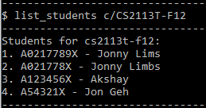
 

#### Adding a student to a class: `add_student`
Adds a student to a particular class.

Format: `add_student c/<CLASS_ID> i/<STUDENT_ID> n/<STUDENT_NAME>`
* `CLASS_ID` refers to the id of the class (e.g. CS2113T-F11).
  * Case-insensitive
* `STUDENT_ID` refers to the ID of the student (e.g. A0217978J).
* `STUDENT_NAME` refers to the name of the student (e.g. Jon Lim).

Examples:
* `add_student c/CS2113T-F11 i/a0212345x n/Jon Lim`
* `add_student c/CS2101-C04 n/Jonny Lims i/a1234567i`

Expected output  
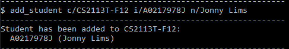
> 💡 **Note:** 
> The `STUDENT_ID` will be converted to UPPERCASE.

 

#### Editing a student's information in a class: `edit_student`
Edits student information from a particular class

Format: `edit_student c/<CLASS_ID> s/<STUDENT_INDEX> i/<STUDENT_ID> n/<STUDENT_NAME>`
* `CLASS_ID` refers to the id of the class (e.g. CS2113T-F11).
* `STUDENT_INDEX` refers to the index of the student in the student list of the class.
* `STUDENT_ID` refers to the updated ID of the student (e.g. A0217978J).
* `STUDENT_NAME` refers to the updated name of the student (e.g. Jon Limbs).

Examples:
* `edit_student c/CS2113T-F11 s/1 i/a03452345x n/Jon Lim`
* `edit_student c/CS2101-D03 s/5 n/Jonny Lims i/a120067i`

Expected output  
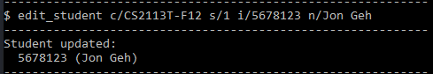

> 💡 **Note:** 
> The `STUDENT_ID` will be converted to UPPERCASE.

 

#### Deleting a student from a class: `delete_student`
Deletes student information from a particular class.

Format: `delete_student c/<CLASS_ID> s/<STUDENT_INDEX>`
* `CLASS_ID` refers to the id of the class (e.g. CS2113T-F11).
* `STUDENT_INDEX` refers to the index of the student in the student list of the class.

Examples:
* `delete_student c/CS2113T-F11 s/1`

Expected output  
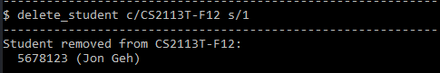
 

#### Finding students in a class given a keyword: `find_student`
Displays all students in the class matching the keyword along with their index.

Format: `find_student c/<CLASS_ID> k/<KEYWORD>`
* `CLASS_ID` refers to the id of the class (e.g. CS2113T-F11).
* `KEYWORD` refers to the keyword used to search the student list of the class.

Examples:
* `find_student c/CS2113T-F11 k/123`
* `find_student c/CS2101-D03 k/Jon`

Expected output  
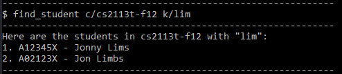
 

### Assessment
#### Listing all assessments in a class: `list_assessments`
List all assessments in a class.

Format: `list_assessments c/<CLASS_ID>`
* `CLASS_ID` refers to the id of the class (e.g. CS2113T-F12).

Examples:
* `list_assessments c/CS2113T-F12`
* `list_assessments c/CS2101-C03`

 

#### Adding an assessment to a class: `add_assessment`
Adds an assessment to a class.

Format: `add_assessment c/<CLASS_ID> n/<ASSESSMENT_NAME> m/<MAXIMUM_MARKS> w/<WEIGHTAGE>`
* `CLASS_ID` refers to the id of the class (e.g. CS2113T-F12).
* `ASSESSMENT_NAME` refers to the name of the assessment (e.g. Midterm, Assignment 1, etc.).
* `MAXIMUM_MARKS` refers to the maximum marks of the assessment (e.g. 100).
* `WEIGHTAGE` refers to the weightage of the assessment (e.g. 10%).

Examples:
* `add_assessment c/CS2101-C03 n/OP1 m/20 w/10`
* `add_assessment c/CS2101-C03 n/OP2 m/25 w/15`

 

#### Editing an assessment in a class: `edit_assessment`
Edits an assessment of a class.

Format: `edit_assessment c/<CLASS_ID> a/<ASSESSMENT_NAME> [n/<NEW_ASSESSMENT_NAME> | m/<NEW_MAXIMUM_MARKS> | w/<NEW_WEIGHTAGE>]`
* `CLASS_ID` refers to the id of the class (e.g. CS2113T-F12).
* `ASSESSMENT_NAME` refers to the name of the assessment (e.g. Midterm, Assignment 1, etc.).
* `NEW_ASSESSMENT_NAME` [Optional] refers to the new name of the assessment (e.g. Finals, Assignment 2, etc.).
* `NEW_MAXIMUM_MARKS` [Optional] refers to the new maximum marks of the assessment (e.g. 50).
* `NEW_WEIGHTAGE` [Optional] refers to the new weightage of the assessment (e.g. 20%).
> 💡 **Note:** 
> At least one optional field must be provided:
> * `NEW_ASSESSMENT_NAME`
> * `NEW_MAXIMUM_MARKS`
> * `NEW_WEIGHTAGE`

Examples:
* `edit_assessment c/CS2101-C03 n/OP1 m/20 w/10`
* `edit_assessment c/CS2101-C03 n/OP2 nn/UGDG`

 

#### Deleting an assessment from a class: `delete_assessment`
Deletes an assessment of a class.

Format: `delete_assessment c/<CLASS_ID> a/<ASSESSMENT_NAME>`
* `CLASS_ID` refers to the id of the class (e.g. CS2113T-F12).
* `ASSESSMENT_NAME` refers to the name of the assessment (e.g. Midterm, Assignment 1, etc.).

Examples:
* `delete_assessment c/CS2101-C03 n/OP1`
* `delete_assessment c/CS2101-C03 n/OP2`

 

### Mark
#### Listing marks for an assessment: `list_marks`
Lists all students and their marks for an assessment.

Format: `list_marks c/<CLASS_ID> a/<ASSESSMENT_NAME>`
* `CLASS_ID` refers to the id of the class (e.g. CS2113T-F12).
* `ASSESSMENT_NAME` refers to the name of the assessment whose marks are to be listed.

Examples:
* `list_marks c/CS2113T-F12 a/Midterms`
* `list_marks c/CS2101-C03 a/Oral Presentation`

Expected Output:  
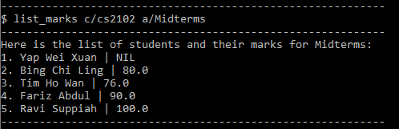

 

#### Setting mark for a student's assessment: `set_mark`
Adds a student's marks for an assessment.

Format: `set_mark c/<CLASS_ID> s/<STUDENT_INDEX> a/<ASSESSMENT_NAME> m/<MARKS>`
* `CLASS_ID` refers to the id of the class (e.g. CS2113T-F12).
* `STUDENT_INDEX` refers to the index of the student in the student list of the class.
* `ASSESSMENT_NAME` refers to the name of the particular assessment.
* `MARKS` refers to the marks given for the assessment.

Examples:
* `set_mark c/CS2113T s/1 a/Midterms m/70.6`
* `set_mark c/CS2101 s/3 a/Oral Presentation m/80`

Expected Output:  
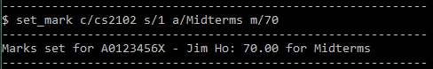

 

#### Editing mark for a student's assessment: `edit_mark`
Edits a student's mark for an assessment.

Format: `edit_mark c/<CLASS_ID> s/<STUDENT_INDEX> a/<ASSESSMENT_NAME> m/<NEW_MARKS>`
* `CLASS_ID` refers to the id of the class (e.g. CS2113T-F12).
* `STUDENT_INDEX` refers to the index of the student in the student list of the class.
* `ASSESSMENT_NAME` refers to the name of the particular assessment.
* `NEW_MARKS` refers to the new marks to be given for the assessment.

Examples:
* `edit_mark c/CS2113T-F12 s/1 a/Midterms m/80.6`
* `edit_mark c/CS2101-C03 s/3 a/Oral Presentation m/90`

Expected Output:  
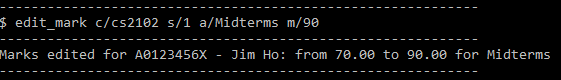

 

#### Deleting mark for a student's assessment: `delete_mark`
Deletes a student's marks for an assessment.

Format: `delete_mark c/<CLASS_ID> s/<STUDENT_INDEX> a/<ASSESSMENT_NAME>`
* `CLASS_ID` refers to the id of the class (e.g. CS2113T-F12).
* `STUDENT_INDEX` refers to the index of the student in student list of the class.
* `ASSESSMENT_NAME` refers to the name of the particular assessment.

Examples:
* `delete_mark c/CS2113T s/1 a/Midterms`
* `delete_mark c/CS2101 s/3 a/Oral Presentation`

Expected Output:  
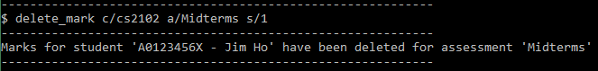

 

#### Viewing average mark for an assessment: `average_mark`
Computes and prints the average mark for an assessment. If there are unmarked students, the average will be computed
within the marked students only.

Format: `average_mark c/<CLASS_ID> a/<ASSESSMENT_NAME>`
* `CLASS_ID` refers to the id of the class (e.g. CS2113T-F12).
* `ASSESSMENT_NAME` refers to the name of the particular assessment.

Examples:
* `average_mark c/CS2113T a/Midterms`
* `average_mark c/CS2101 a/Oral Presentation`

Expected Output:  
(Some students unmarked)  
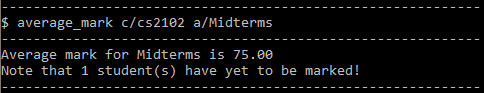

(All students marked)  
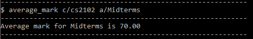

 

#### Viewing median mark for an assessment: `median_mark`
Computes and prints the median mark for an assessment. If there are unmarked students, the median will be computed 
within the marked students only.

Format: `median_mark c/<CLASS_ID> a/<ASSESSMENT_NAME>`
* `CLASS_ID` refers to the id of the class (e.g. CS2113T-F12).
* `ASSESSMENT_NAME` refers to the name of the particular assessment.

Examples:
* `median_mark c/CS2113T a/Midterms`
* `median_mark c/CS2101 a/Oral Presentation`

Expected Output:  
(Some students unmarked)  
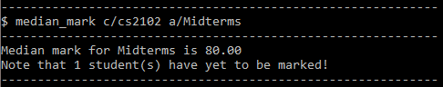

(All students marked)  
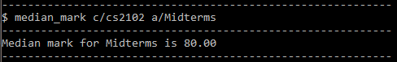

 

#### Sorting and listing students in a class by their overall score: `sort_by_scores`
Sorts and lists students in a class by their overall score according to the desired format. 
Only marks currently added to students will be taken into consideration for their scores.

Format: `sort_by_scores c/<CLASS_ID> o/<ORDER>`
* `CLASS_ID` refers to the id of the class (e.g. CS2113T-F12).
* `ORDER` refers to the sorting order. `asc` for ascending and `desc` for descending.

Examples:
* `sort_by_scores c/CS2113T-F12 o/asc`
* `sort_by_scores c/CS2113T-F12 o/desc`

Expected Output:  
(Ascending)  
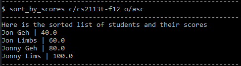

(Descending)  
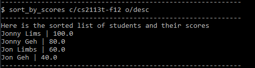

### Attendance
#### Listing attendance for a particular student: `list_attendance`
Lists a student's attendance.

Format: `list_attendance c/<CLASS_ID> s/<STUDENT_INDEX`
* `CLASS_ID` refers to the id of the class (e.g. CS2113T-F12).
* `STUDENT_INDEX` refers to the index of the student in the student list of the class.

 

#### Setting attendance for a particular lesson for a student: `set_attendance`
Sets a student's attendance for a lesson.

Format: `set_attendance c/<CLASS_ID> s/<STUDENT_INDEX> l/<LESSON_NUMBER> p/<PRESENT>`
* `CLASS_ID` refers to the id of the class (e.g. CS2113T-F12).
* `STUDENT_INDEX` refers to the index of the student in the student list of the class.
* `LESSON_NUMBER` refers to the lesson number.
* `PRESENT` refers to the whether a student is present. (`1` for present, `0` for not present)

 

#### Deleting attendance for a particular lesson for a student: `delete_attendance`
Deletes a student's attendance for a lesson.

Format: `delete_attendance c/<CLASS_ID> s/<STUDENT_INDEX> l/<LESSON_NUMBER>`
* `CLASS_ID` refers to the id of the class (e.g. CS2113T-F12).
* `STUDENT_INDEX` refers to the index of the student in the student list of the class.
* `LESSON_NUMBER` refers to the lesson number.

 

### Comment
#### Listing comments for all students in a class: `list_comment`
List comments for all students in a class

Format: `list_comment c/<CLASS_ID>`
* `CLASS_ID` refers to the id of the class (e.g. CS2113T-F12).

Examples:
* `list_comments c/CS2113T-F12`
* `list_comments c/CS2101-D03`

Expected Output:  
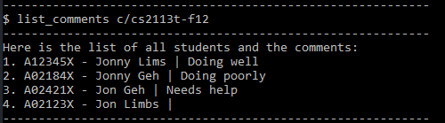
 

#### Setting comment for a particular student: `set_comment`
Sets a comment for a student.

Format: `set_comment c/<CLASS_ID> s/<STUDENT_INDEX> t/<COMMENT>`
* `CLASS_ID` refers to the id of the class (e.g. CS2113T-F12).
* `STUDENT_INDEX` refers to the index of the student in the student list of the class.
* `COMMENT` refers to the comment to be set.

Examples:
* `set_comment c/CS2113T-F12 s/1 t/Doing well in class`
* `set_comment c/CS2113T-F12 s/1 t/Needs help understanding java`

Expected Output:  
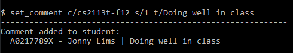
> 💡 **Note:** 
> The new comment will overwrite any previous comment set

 

#### Deleting comment for a particular student: `delete_comment`
Deletes the comment for a student.

Format: `delete_comment c/<CLASS_ID> s/<STUDENT_INDEX>`
* `CLASS_ID` refers to the id of the class (e.g. CS2113T-F12).
* `STUDENT_INDEX` refers to the index of the student in the student list of the class.

Examples:
* `delete_comment c/CS2113T-F12 s/1`
* `delete_comment c/CS2113T-F12 s/5`

Expected Output:  
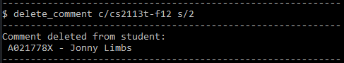
 

### Other
#### Viewing help: `help`
Displays the list of available commands and how to use them.

Format: `help`

 

#### Exiting the program: `exit`
Exits the program.

Format: `exit`

 

### Archiving data: `archive`
Saves the current program data to an archive.

By default, archive file is stored in the `<TAA Root>/data/archive` folder.

Format: `archive [f/<FILENAME>]`
* `FILENAME` [Optional] refers to the name of the file to save the archive as.

 

### Resetting/Removing all data: `reset`
Removes all saved data from the current program.

Format: `reset`

 

## FAQ

**Q**: How do I transfer my data to another computer? 

**A**: Simply transfer the `data` folder to your new computer and ensure that it is in the same folder as the jar file.

## Command Summary

Category | Action | Format |
 ----- | ------ | --------------- |
Class | Listing all classes | `list_classes`
Class | Adding a class | `add_class i/<CLASS_ID> [n/<CLASS_NAME>]`
Class | Editing a class | `edit_class c/<CLASS_ID> [i/<NEW_CLASS_ID> \| n/<NEW_CLASS_NAME>]`
Class | Deleting a class | `delete_class c/<CLASS_ID>`
Student | Listing all students in a class | `list_students c/<CLASS_ID>`
Student | Adding a student to a class | `add_student c/<CLASS_ID> i/<STUDENT_ID> n/<STUDENT_NAME>`
Student | Editing a student's information in a class | `edit_student c/<CLASS_ID> s/<STUDENT_INDEX> i/<NEW_ID> n/<NEW_NAME>`
Student | Deleting a student from a class | `delete_student c/<CLASS_ID> s/<STUDENT_INDEX>`
Student | Finding students in a class given a keyword | `find_student c/<CLASS_ID> k/<KEYWORD>`
Assessment | Listing all assessments in a class | `list_assessments c/<CLASS_ID>`
Assessment | Adding an assessment to a class | `add_assessment c/<CLASS_ID> n/<ASSESSMENT_NAME> m/<MAXIMUM_MARKS> w/<WEIGHTAGE>`
Assessment | Editing an assessment in a class | `edit_assessment c/<CLASS_ID> a/<ASSESSMENT_NAME> [n/<NEW_ASSESSMENT_NAME> \| m/<NEW_MAXIMUM_MARKS> \| w/<NEW_WEIGHTAGE>]`
Assessment | Deleting an assessment from a class | `delete_assessment c/<CLASS_ID> a/<ASSESSMENT_NAME>`
Mark | Listing marks for an assessment: | `list_marks c/<CLASS_ID> a/<ASSESSMENT_NAME>`
Mark | Setting mark for a student's assessment | `set_mark c/<CLASS_ID> s/<STUDENT_INDEX> a/<ASSESSMENT_NAME> m/<MARKS>`
Mark | Editing mark for a student's assessment | `edit_mark c/<CLASS_ID> s/<STUDENT_INDEX> a/<ASSESSMENT_NAME> m/<NEW_MARKS>`
Mark | Deleting mark for a student's assessment | `delete_mark c/<CLASS_ID> s/<STUDENT_INDEX> a/<ASSESSMENT_NAME>`
Mark | Viewing average mark for an assessment | `average_mark c/<CLASS_ID> a/<ASSESSMENT_NAME>`
Mark | Viewing the median mark for an assessment | `median_mark c/<CLASS_ID> a/<ASSESSMENT_NAME>`
Mark | Sorting and listing students in a class by their overall score | `sort_by_scores c/<CLASS_ID> o/<ORDER>`
Attendance | Listing attendance for a particular student | `list_attendance c/<CLASS_ID> s/<STUDENT_INDEX>`
Attendance | Setting attendance for a particular lesson for a student | `set_attendance c/<CLASS_ID> s/<STUDENT_INDEX> l/<LESSON_NUMBER> p/<PRESENT>`
Attendance | Deleting attendance for a particular lesson for a student | `delete_attendance c/<CLASS_ID> s/<STUDENT_INDEX> l/<LESSON_NUMBER>`
Comment | Listing comments for all students in a class | `list_comment c/<CLASS_ID>`
Comment | Setting comment for a particular student | `set_comment c/<CLASS_ID> s/<STUDENT_INDEX> t/<COMMENT>`
Comment | Deleting comment for a particular student | `delete_comment c/<CLASS_ID> s/<STUDENT_INDEX>`
Other | Viewing help | `help`
Other | Exiting the program | `exit`
Other | Archiving data | `archive`
Other | Resetting/Removing all data | `reset`
