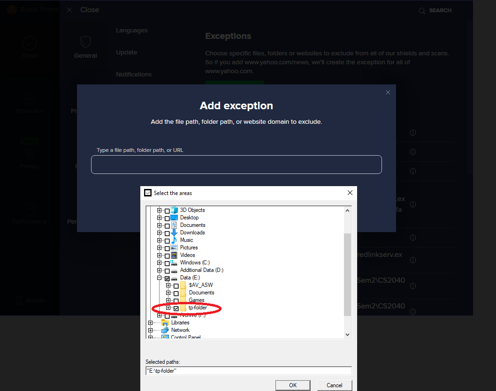
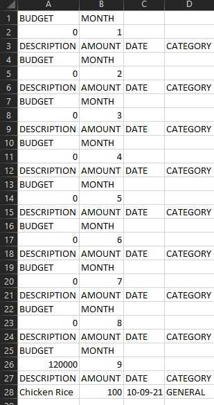

# Budget Tracker User Guide

## Product Overview
Budget Tracker is a free, easy-to-use desktop app for managing finances, optimized for use via a Command Line Interface (CLI)
for tech-savvy students who have trouble keeping track of their expenses. 
You can use Budget Tracker to manage your budget, expenditures and loans lent out to other parties for the month, and 
easily access and retrieve this information with a single command. 
To improve your spending habits, Budget Tracker also displays useful data and statistics about it for the month.

## <a id="top"></a> Table of Content
* [Intro](#introduction)
* [Getting Started](#getting-started)
* [Features](#features)
* [Commands](#commands)
  * [Add](#add)
    * [Budget: `-b`](#add-budget)
    * [Expenditure: `-e`](#add-expenditure)
    * [Loan: `-l`](#add-loan)
  * [Edit](#edit)
    * [Budget: `-b`](#edit-budget)
    * [Expenditure: `-e`](#edit-expenditure)
    * [Loan: `-l`](#edit-loan)
  * [Database Selector](#dbselect)
    * [year](#year)
  * [Find & Filter](#find&filter)
    * [Find](#find)
  * [List](#list)
    * [Listing](#listing)
  * [Delete](#delete)
    * [Budget: `-b`](#delete-budget)
    * [Expenditure: `-e`](#delete-expenditure)
    * [Loan: `-l`](#delete-loan)
  * [Stat](#stat) 
    * [Month: `-c`](#stat-budget)
    * [Year: `-l`](#stat-year)
  * [Guides](#guides)
  * [CSV](#csv)
  * [DB](#db)
  * [Exit](#exit)
* [FAQ](#faq)
* [Command summary](#command-summary)
* [Glossary](#glossary)

## <a id="introduction"></a> Introduction

Welcome to the Budget Tracker's User Guide! This Guide provides important information on the setting-up process, 
overview of the features we have, and a deeper dive into each of them to get you familiarised with our app.
In addition, we include a Frequently Asked Questions (FAQ) and a summary section at the end of the guide, should you have any doubts.

Our Table of Contents serve as a good way to navigate through this guide. We designed each section such that
you will be able to understand them on their own without the need to refer to other sections. Do use the 
#### [↑ Back to top](#top) 
link at the bottom 
of each section to quickly access the Table of Contents.

Along the way, you may be confused or require more information on each section. Just follow this box below with a smiley as _Budgie_,
your Budget Tracking guide will bring you on a journey through this User Guide as well!

> 😃 Hello! I'm <i> Budgie</i>, your personalised guide. My job will be to take you
through this User Guide and give you a pleasant experience using our app! Follow along!

#### [↑ Back to top](#top)

## <a id="getting-started"></a> Quick Start

1. Ensure that you have Java 11 or above installed. Otherwise, you can download it from [here](https://docs.aws.amazon.com/corretto/latest/corretto-11-ug/downloads-list.html).
   Select the respective download for your operating system.
2. Check your java version by entering "java -version" command to your terminal.

   

3. Download the latest version of `Budget Tracker` from [here](https://github.com/AY2122S1-CS2113T-F11-2/tp/releases/download/v2.1/tp.jar).
4. If you have anti-virus, please add an exception on the directory you have downloaded the `Budget Tracker`.
   For example, if your Tp.jar file is in the "tp-folder", then you can create an exception in that folder 
   in your anti-virus.
   
   

> 😃 Great! Now that everything is all set up, let's take a look at what features we have in store!

#### [↑ Back to top](#top)

## <a id="features"></a> Features

> 😃 Here's a list of features that our Budget Tracker app has. We'll be diving deeper into each feature along the way.

1. Budget Tracker

2. Expenditure Tracker

3. Loan Tracker

4. Storage
   * Allows saving of budget, expenditure and loan data so that you can load them up during your next session.
	
5. Statistical analysis on data
   * Provides further insight on data recorded.

6. Loan Reminder
<br/>  Every time when user starts the app, it reminds user of the loans that are due under the welcome screen.


> ❗ Notes about the command format:
> * Words encased in `<>` brackets are _optional_ parameters.
> * Command words (i.e. `add`, `edit`, etc.) must strictly be in **lower case**.
> * Words in UPPER_CASE are the parameters to be supplied by the user.
>   * e.g. in `add -b a/AMOUNT m/MONTH`, `AMOUNT` and `MONTH` are parameters which can be used as `add -b a/500 m/12`.
>   * NOTE: **These parameters cannot be left empty.**
#### [↑ Back to top](#top)
<br />

# <a id="commands"></a> Commands


# <a id="add"></a> &nbsp; &nbsp;Add: `add`

> 😃 To start off your Budget Tracking journey, we first need to add some records into the list.
> This will let you keep track of where your money is going!

The command word `add` adds a record of either _Budget, Expenditure, or Loan_ to the record list. 
The type of record is determined by the identifier tag after the `add` command word.

______________
<br />

### <a id="add-budget"></a> `-b` : Adds a Budget
> 😃 Setting a budget for the month serves as a goal and keeps you from spending money you do not have.

Format: `add -b a/AMOUNT <m/MONTH>`

* The `AMOUNT` can be entered with 2 decimal places or without decimal places.
  * Note: `Amount` will be rounded up to 2dp (for budget, expenditure, and loan).
  * E.g. $1.006 will be rounded up to $1.01.
* The `MONTH` must strictly be within the range of 1 to 12.

Example of usage:

`add -b a/500 m/12`

Expected outcome:

```
========================================================
Your budget of $500.00 for December is successfully set!
========================================================
```
#### [↑ Back to top](#top)
<br />

________________________

### <a id="add-expenditure"></a> `-e` : Adds an expenditure
> 😃 Recording down your expenditures will allow you to keep track of where your money is going and determine
> whether they were essentials or wants. This will help you cut out unnecessary expenditures.

Records the details of a new expenditure including the _description_, the _amount spent_, the _date on which expenditure was made_ and the _category which the expenditure falls under_ .

Format: `add -e n/DESCRIPTION a/AMOUNT <d/DATE_OF_EXPENDITURE> <c/CATEGORY>`

* The `DESCRIPTION` can be in a natural language format.
  * NOTE: **If Description column exceeds 30characters limit, it will be truncated during list view**
* The `AMOUNT` entered can be specified up to 2 decimal places.
  * NOTE: `Amount` **cannot exceed 1billion (1000000000)**
* The `<DATE_OF_EXPENDITURE>` must strictly be in the form of _YYYY-MM-DD_. 
  * If left empty, the current date according to the
  system will be entered by default.
  * NOTE: **YYYY value should correspond to the current storage file year**
* The `<CATEGORY>` must be one of the following values:
  * _GENERAL, CLOTHES, FOOD, ENTERTAINMENT, GIFTS, HEALTH_
  * If left empty, the default value will be _GENERAL_

Example of usage:

`add -e n/CS2113T Textbooks a/60 d/2021-08-20 c/GENERAL`

Expected outcome: The buying of CS2113T textbooks, costing $60.00, on the 20th of August 2021 has been successfully added.

```
========================================================
Expenditure successfully added!
Description: CS2113T Textbooks
Amount: $60.00
Date: 2021-08-20
Category: GENERAL
========================================================
```
#### [↑ Back to top](#top)
<br />

_________________________________________________________


### <a id="add-loan"></a> `-l` : Adds a Loan
> 😃 Losing track of whom you've lent money out to? Friends not paying you back? Fret not! Budget Tracker is here to
> remind you of these loans. It's time to get your money back! 🤑

Records down a loan record specifying when and who the money was lent out to.

Format: `add -e n/BORROWER_NAME a/AMOUNT <d/DATE_OF_EXPENDITURE>`

<div class="alert alert-success">
<ul>
<li> <code>AMOUNT</code> entered will be rounded to the nearest 2 decimal places and cannot exceed 1 billion dollars. </li>
<li> <code>DATE_OF_EXPENDITURE</code> must strictly be in the form of _YYYY-MM-DD_. </li>
    <ul>
        <li>If left empty, the current date according to the system will be entered by default. </li>
        <li> Note: YYYY value should correspond to the current storage file year, please use `year`
        command to switch to the correct year before entering an expenditure of another year </li> 
    </ul> 
</ul>
</div>
Example of usage:

`add -l n/Yap Wei Xuan a/500 d/2021-08-20`

Expected outcome:

```
========================================================
Loan successfully added!
Yap Wei Xuan owes you: $500.00
Date of loan: 2021-08-20
========================================================
```
#### [↑ Back to top](#top)
<br />

_________________________________________________________

<br/>

# <a id="edit"></a> &nbsp;&nbsp; Edit: `edit`

> 😃 Oh no! You just added an entry, but you realised that there were some incorrect information...
If only there was a way to fix what was mistyped... well lucky for you!


This feature allows you to edit any information in a budget, expenditure or loan entry you have previously added.
<br />

_________________________________________________________


### <a id="edit-budget"></a> `-b` : Edit a Budget
> 😃 Editing the budget's amount is easy as can be. This is also useful in situations where you feel like spending more for the month, or are having sudden financial constraints, and a change to your budget is required.

Edits the _amount_ of budget allowance for a particular month.

Format: `edit -b m/MONTH a/AMOUNT`


* `<AMOUNT>` will be rounded to the nearest 2 decimal places and must be above 0 but cannot exceed 1 billion dollars.
* The `MONTH` must strictly be within the range of 1 to 12 and cannot be empty.


Example of usage:

`edit -b m/10 a/100020`

Expected outcome: A message will be shown to alert the user that the budget for october have been changed 
to $100020.00.

```
========================================================
Budget has been successfully edited!
New values: 
Amount: $100020.00
Month: 10
========================================================
```
#### [↑ Back to top](#top)
<br />

_________________________________________________________


### <a id="edit-expenditure"></a> `-e` : Edit an Expenditure 

> 😃 An expenditure record has many values, and editing all of them is a hassle for just one mistake. 
> Luckily, this feature allows you to edit any of the values in your expenditures as long as you specify them!

Edits any of the values of an expenditure, including its _description_, _amount_, _date of expenditure_ and _category_.

Format: `edit -e m/MONTH i/INDEX <n/DESCRIPTION> <a/AMOUNT> <d/DATE_OF_EXPENDITURE> <c/CATEGORY>`
* `<AMOUNT>`,`<DATE_OF_EXPENDITURE>`,`<DESCRIPTION>` and `<CATEGORY>` are optional. Any parameters entered will be edited, while those not entered will remain the same. At least **one** of these 
    parameters must exist.


* `<DESCRIPTION>` can be in a natural language format.
    * Note: **If `<DESCRIPTION>` exceeds 30 characters limit, it will be truncated during list view.**
* `<AMOUNT>` will be rounded to the nearest 2 decimal places and must be above 0 but cannot exceed 1 billion dollars.
* `<DATE_OF_EXPENDITURE>` must strictly be in the form of _YYYY-MM-DD_.
    * Note: **YYYY value should correspond to the current storage file year, please use `year`
      command to switch to the correct year before entering an expenditure of another year**
* `<CATEGORY>` must be one of the following values:
    * _GENERAL, CLOTHES, FOOD, ENTERTAINMENT, GIFTS, HEALTH, TECH_

Example expenditure:

`DESCRIPTION` as _Fish n Chips_, `AMOUNT` as _$5.00_, `DATE_OF_EXPENDITURE` as _2021-10-13_ and `CATEGORY` as _Food_ with _$500_ budget.

Example usage on example expenditure:

`edit -e m/10 i/1 n/Chicken Rice a/4 d/2021-10-12`

Expected outcome:

The previously set `CATEGORY` is unchanged, while the rest of the values are set to the provided values accordingly.

```
========================================================
edit -e m/10 i/1 n/Chicken Rice a/4 d/2021-10-12
========================================================
Expenditure has been successfully edited!
New values: 
Description: Chicken Rice
Amount: $4.00
Date: 2021-10-12
Category: FOOD
Total Amount Spent in October: $4.00
Percentage of Budget Left: 99.20%
========================================================
```
#### [↑ Back to top](#top)
<br />

_________________________________________________________


### <a id="edit-loan"></a> `-e` : Edit a Loan

> 😃 Similar to editing expenditures, this feature allows you to edit any of the values in your loan record.

Edits the loan for a particular month.

Format: `edit -l m/MONTH i/INDEX <a/AMOUNT> <d/DATE_OF_LOAN> <n/BORROWER_NAME>`

* `<AMOUNT>`,`<DATE_OF_LOAN>` and `<BORROWER_NAME>` are optional. Any parameters entered will be edited, while those not entered will remain the same. At least **one** of these
  parameters must exist.


* `<BORROWER_NAME>` can be in a natural language format.
    * Note: **If `<BORROWER_NAME>` exceeds 30 characters limit, it will be truncated during list view.**
* `<AMOUNT>` will be rounded to the nearest 2 decimal places and must be above 0 but cannot exceed 1 billion dollars.
* `<DATE_OF_LOAN>` must strictly be in the form of _YYYY-MM-DD_.
    * Note: **YYYY value should correspond to the current storage file year, please use `year`
      command to switch to the correct year before entering an expenditure of another year**

Example Loan:

`BORROWER_NAME` as _Jon_, `AMOUNT` as _$4000_ and `DATE_OF_LOAN` as _2021-11-05_

Example usage on example loan:

`edit -l m/11 i/1 a/5000`

Expected outcome:
The previously set `BORROWER_NAME` and `DATE_OF_LOAN` is unchanged, while `AMOUNT` is set to the provided value accordingly.

```
========================================================
Loan has been successfully edited!
New values: 
Debtor: Jon
Amount: $5000.00
Date: 2021-11-05
========================================================
```
#### [↑ Back to top](#top)
<br />

_________________________________________________________

<br />

# <a id="dbselect"></a> &nbsp;&nbsp; Year: `year`

### <a id="year"></a> Switching Database Year: `year`

Selection of the database year.

Format: `year <year>`

* The <year> must strictly be 4 characters long and must only be numeric.

Example of usage:

`year 2020`

Expected outcome: A message will be shown to alert the user that the database have been switched to 2020.

```
========================================================
You are currently working on year 2020 database!
========================================================
```
#### [↑ Back to top](#top)
<br />

_________________________________________________________


#  <a id="find&filter"></a> &nbsp;&nbsp; Find: `find`

### <a id="find"></a> Finding a Particular Expenditure, Loan and Budget: `find`

Find all the records of Expenditure, loan and Budget that have a matching key word on the search term. 
The search term is the keyword.

Format: `find KEYWORD`

* The needs to be a white space between find and the KEYWORD.

Example of usage:

`find Chicken`

Expected outcome: All records that contains the "Chicken" keyword will be returned.
#### [↑ Back to top](#top)
<br />

_________________________________________________________

<br />

# <a id="list"></a> &nbsp;&nbsp;List: `list`

<br />

_________________________________________________________

### Listing Budget & Expenditure for a Particular Month: `list`

Adds a new expenditure to a specific budget of a month.

Format: `list m/MONTH [c/CATEGORY]`

* The 'month' must strictly be within the range of 1 to 12.

Example of usage:

`list m/10`

Expected outcome: Listing the budget and all expenditures for that particular month.

```
========================================================
You are spending too much for October !
Your budget for October: $330.0
Your expenditures:
  Description            | Amount             | Date           
1.Chicken Rice1          | $500.0             | 2021-10-13       
========================================================
```
#### [↑ Back to top](#top)
<br />

_________________________________________________________

### <a id="listing"></a> Listing all Budget & Expenditure

List all the Budget and expenditure for that particular year.

Format: `list m/all [c/CATEGORY]`
* `CATEGORY` filters out the expenditures to show only those falling under the specified category.
  * Note: If `CATEGORY` is left empty, expenditures of all categories will be shown

Example of usage:

`list m/all`

Expected outcome: Listing all the budget and expenditure for the particular year.
#### [↑ Back to top](#top)
<br />
_________________________________________________________


<br />

# <a id="delete"></a> &nbsp;&nbsp;  Delete: `delete`

Deletes an entry / entries (maybe user wants to cut off the expenses) from the budget tracker data set.
<br />

_________________________________________________________

### <a id="delete-budget"></a> `-b` - Delete a budget

Deletes the budget of a specific month

Format: `delete -b m/MONTH`

* The `MONTH` represents the month of the budget will be deleted and cannot be empty.

Example of usage:

`delete -b m/10`

Expected outcome:
```
========================================================
Successfully deleted the Budget for this month!
Now the budget amount is 0.00!      
========================================================
```
#### [↑ Back to top](#top)
<br />

_________________________________________________________


### <a id="delete-expenditure"></a> `-e` - Delete (an) expenditure(s)

Deletes (an) expenditure(s) of a specific month.

Format:`delete -e m/MONTH` 
<br/> `delete -e  m/MONTH i/INDEX`
<br/> `delete -e m/MONTH/ i/INDEX_FROM-INDEX_TO `

* The `MONTH` represents the month of the expenditure(s) will be deleted and cannot be empty.
* The `INDEX` refers to the index number or a range of index numbers shown in the displayed entry list.
* The `INDEX` must be within the range of the list.

Examples of usage:

 `delete -e m/10 i/3-5`

Expected outcome:
```
========================================================
Successfully deleted Expenditure 3:
Description: breakfast
Amount: $100.00
Date: 2021-10-10
Category: GENERAL
========================================================
Successfully deleted Expenditure 4:
Description: lunch
Amount: $100.00
Date: 2021-10-10
Category: GENERAL
========================================================
Successfully deleted Expenditure 5:
Description: dinner
Amount: $100.00
Date: 2021-10-10
Category: GENERAL
========================================================
Total Amount Spent in October: $100.00
Percentage of Budget Left: 99.00%
========================================================
```
#### [↑ Back to top](#top)
<br />

_________________________________________________________


### <a id="delete-loan"></a> `-l` - Delete (a) loan record(s)

Deletes (a) loan record(s) of a specific month

Format:`delete -l m/MONTH` 
<br/> `delete -l m/MONTH i/INDEX`
<br/> `delete -l m/MONTH i/INDEX_FROM-INDEX_TO`

* The `MONTH` represents the month of the loan record(s) will be deleted and cannot be empty.
* The `INDEX` refers to the index number or a range of index numbers shown in the displayed entry list.
* The `INDEX` must be within the range of the list.

Examples of usage:

 `delete -l m/10 i/1-2`

Expected outcome:
```
========================================================
Successfully deleted Loan 1:
Debtor: xinghan
Amount: $100.00
Date: 2021-10-10
========================================================
Successfully deleted Loan 2:
Debtor: kobe
Amount: $200.00
Date: 2021-10-03
========================================================
```
#### [↑ Back to top](#top)
<br />

_________________________________________________________

<br />

# <a id="stat"></a> &nbsp;&nbsp; Stat: `stat`

> 😃 It can be hard to make sense of the expenditures you have recorded down and figure out where exactly you are
> overspending. This is especially so if you've been diligently recording down your spendings! Well, `stat` will help you
> do the thinking. So try it out!

The command word `stat` display some statistics graphs and information about the expenditure for 
the year or particular month.

_________________________________________________________
<br />

### <a id="stat-budget"></a> `-c` : View Statistics for the Month by categories
> 😃 Knowing which category you're spending the most on allows a more targeted approach to cutting back on spendings.
> Use this feature to determine which category and how much you have spent on it in a specific month!

Display the statistics for a particular month's budget and expenditure by categories. 

How it works:
 * The graph shows the percentage spent on each category relative to the overall spending that month.
 * The accuracy of the graph is represented by **3bars for every 5%** and is rounded up (e.g. 3% is rounded up to 5%).

Format: `stat -c m/MONTH`

* The `MONTH` must strictly be within the range of 1 to 12 and cannot be empty.

Example of usage:

`stat -c m/10`

Expected outcome: A graph showing the percentages which each category contributes to the overall monthly
expenditures.

```
========================================================
Here are the statistics for the month of October:
              0%    10%   20%   30%   40%   50%   60%   70%   80%   90%   100%  
GENERAL                                                                       0.85%
CLOTHES       ###                                                             3.1%
FOOD          ################################################                79.51%
ENTERTAINMENT                                                                 0%
GIFTS         ###                                                             4.64%
HEALTH                                                                        0%
TECH          ######                                                          11.9%
ALL                                                                           0%
Your budget: $500
The category you spent the most on: FOOD
The amount you spent on this category: $5136.50
========================================================
```
#### [↑ Back to top](#top)
<br />

_________________________________________________________


### <a id="stat-year"></a> `-y` : View Statistics for the Year

Surely things get messy after you have many expenditures, loan and budget entries. Is there
an easy way to visualize the amount of budget used or left? Yes! `stat -y` 
display the statistics for the current database year which the user is working on. 

Format: `stat -y t/TYPE_OF_GRAPHICAL_VIEW`

* The `TYPE_OF_GRAPHICAL_VIEW` can only be a value of 1 or 2. Type 1 is a bar graph of monthly percentage
  (12 bar graph) of budget used. Type 2 is overall yearly percentage (single bar graph) of budget used. 

Example of usage:

`stat -y t/1`

Expected outcome: A histogram of the percentage of money spend for each month of the year will be shown
with vertical axis showing percentage ranging from 0 to 100%.

```
========================================================
Percentage of Money Spent in 2021
     JAN FEB MAR APR MAY JUN JUL AUG SEP OCT NOV DEC 
100%                          #                      
90%                       #   #                      
80%                       #   #               #      
70%                       #   #               #      
60%                       #   #           #   #      
50%                       #   #       #   #   #      
40%                       #   #       #   #   #      
30%                       #   #       #   #   #      
20%           #   #       #   #       #   #   #      
10%           #   #       #   #       #   #   #     
========================================================
```

`stat -y t/2`

Expected outcome: If you feel that type 1 have too much detail. Then feel free to use Type 2! 
It is a single overall percentage bar graph showing the amount of money spent in that particular year 
and if the overall expenditure exceeds the budget available, an explosion :boom: will be shown on the graph. 

```
========================================================
Percentage of Money Spent throughout the year

Percentage: 56.00%
100%                  .....
95%                   .....
90%                   .....
85%                   .....
80%                   .....
75%                   .....
70%                   .....
65%                   .....
60%                   .....
55%                   #####
50%                   #####
45%                   #####
40%                   #####
35%                   #####
30%                   #####
25%                   #####
20%                   #####
15%                   #####
10%                   #####
5%                    #####
========================================================
```

```
Percentage: 143.03%
               _.-^^---....,,---_
            _--                  --_
           <          Overspent!       >)
            \._                   _./
               ```--. . , ; .--'''
                     | |   |
                  .-=||  | |=-.
                  `-=#$%&%$#=-'
                     | ;  :|
            _____.,-#%&$@%#&#~,._____
100%                  #####
95%                   #####
90%                   #####
85%                   #####
80%                   #####
75%                   #####
70%                   #####
65%                   #####
60%                   #####
55%                   #####
50%                   #####
45%                   #####
40%                   #####
35%                   #####
30%                   #####
25%                   #####
20%                   #####
15%                   #####
10%                   #####
5%                    #####
========================================================
```
#### [↑ Back to top](#top)
<br />

_________________________________________________________

<br />

# <a id="guides"></a> &nbsp;&nbsp; Command Guides: `help`

Command description and format.

Format: `help`

* The format must be strictly as stated above.

Example of usage:

`help`

Expected outcome: Lists all available commands and their parameters.
#### [↑ Back to top](#top)
<br />

_________________________________________________________

<br />

# <a id="csv"></a> &nbsp;&nbsp; CSV: `csv`

If our statistical analysis feature is not good enough for you, you may convert the database records
into a csv file by simple keying in the `csv` command. You will then be able to use Excel to do advanced
statistical analysis.

Format: `csv`

* The format must be strictly as stated above.

Example of usage:

`csv`

Expected outcome: A notification will tell you that the csv file have been successfully created first.
The csv file will be in the data folder, opening it up you should see all the current year's records.

```
========================================================
Your csv file have been successfully created in the data folder!

Please have a look!
========================================================
```



#### [↑ Back to top](#top)
<br />

_________________________________________________________

<br />

# <a id="db"></a> &nbsp;&nbsp; DB: `db`

😃 What if you have forgotten all the database years that you have been using? Fear not! `db` command 
is here to help! `db` command basically list out all the available database text file you currently
have. 

Format: `db`

* The format must be strictly as stated above.

Example of usage:

`db`

Expected outcome: Available databases will be shown.

```
========================================================
These are the data base you currently have!

2019.txt
2020.txt
2021.txt
========================================================
```
#### [↑ Back to top](#top)
<br />

_________________________________________________________

<br />

# <a id="exit"></a> &nbsp;&nbsp; Exit the program: `bye`
 
When you are done with using the app and wish to exit the app. Enter the command `bye` to 
say goodbye with our app 👋

Format: `bye`

* The format must be strictly as stated above.

Example of usage:

`bye`

Expected outcome: Goodbye message shown.

```
========================================================
Bye, see you again soon!
========================================================
```
#### [↑ Back to top](#top)

<br />


# <a id="faq"></a> FAQ

* How do I transfer my data to another computer?
  * Step 1: Locate the folder containing the **tp.jar** file.
  * Step 2: Copy the **data** folder.

    
  * Step 3: Via email, thumb-drive or a messaging app which supports file sharing, transfer the folder onto your **target computer**.
  * Step 4: Copy and paste the **data** folder into the folder containing the **tp.jar** file.
  
<br />
  
* Why are users able to delete the expenditures they have already recorded?
  * Some users like to record expenditures in advance if they know they are going to spend it.
  This feature allows them to change their plans after finding out that they might exceed their budget.
  * Users might have made a refund after spending money on some returnable products such as clothes, shoes, and so on.
  
  <br />

* What is the recommended way of using the app?
  1. Record down the budget you have set for yourself at the start of every month.
  We advise you to stick to the 50/30/20 rule — 50% for your needs, 30% for your wants and the last 20% for your savings and debt repayments.
  Hence, your budget should be **80% of your monthly disposable income**. <br />
  Click [here](https://www.nerdwallet.com/article/finance/how-to-budget) for more information.
  2. Key in your daily expenditures at the end of the day. You can be as detailed as possible or simply provide a rough
  estimate. Focus should be placed on **consistency**, as you want to make it a habit to take note of your spendings.
  3. We recommend using our `stats` feature to analyse your spending habits every quarter / half a year so that you can
  gain an understanding of which areas to cut down on spending

    <br />

* **Advanced**: How can I use Java 11 if I do not want my main JDK to change to Java 11?
  * Download a zipped version instead of an executable [here](https://docs.aws.amazon.com/corretto/latest/corretto-11-ug/downloads-list.html).
  * Extract the .zip JDK to a desired directory.
  * Create a .bat file with the following content:
    > @ECHO OFF <br />
     SET JAVA_HOME=**[Directory of JDK]** <br />
     SET Path=%JAVA_HOME%\bin;%Path% <br />
     echo Java home set to: %JAVA_HOME% <br />
     echo Java 11 activated <br />
     java -version <br />

  💡 Note: **[Directory of JDK]** should be replaced with the directory where your JDK has been unzipped into.

#### [↑ Back to top](#top)

<br />

# <a id="command-summary"></a> Command Summary

`<PARAM>` - Optional parameters that can be omitted. And it will be defaulted to the value 
stated in the above command description. 

 |no. | Command | Description |
 |--- | --------- | --------------------------------------- |
 |1.  | `add -b a/AMOUNT m/MONTH` | `add budget of $AMOUNT to MONTH of the year` |
 |2.  | `add -e c/DESCRIPTION a/AMOUNT d/DATE_OF_EXPENDITURE <c/CATEGORY>` | `add expenditure with DESCRIPTION of CATEGORY which cost $AMOUNT on DATE` |
 |3.  | `add -l n/NAME_OF_LOAN_BORROWER a/AMOUNT d/DUE_DATE_OF_LOAN` | `add a loan of $AMOUNT borrowed by NAME_OF_LOAN_BORROWER due on DUE_DATE_OF_LOAN` |
 |4.  | `edit -b m/MONTH a/AMOUNT` | `edit the MONTH budget to AMOUNT` |
 |5.  | `edit -e m/MONTH i/INDEX a/AMOUNT d/DATE_OF_EXPENDITURE n/DESCRIPTION` | `edit exependiture of MONTH and INDEX to AMOUNT, DATE_OF_EXPENDITURE and DESCRIPTION` |
 |6.  | `edit -l m/MONTH i/INDEX a/AMOUNT d/DUE_DATE_OF_LOAN n/BORROWER_NAME` | `edit the loan of MONTH and INDEX to AMOUNT, DUE_DATE_OF_LOAN and BORROWER_NAME ` |
 |7.  | `year year` | `switch database to YEAR` |
 |8.  | `find keyword` | `find a particular KEYWORD in the database` |
 |9.  | `list m/all <c/CATEGORY>` | `list all budget, expenditure and loan entries of the year of CATEGORY` |
 |10. | `list m/MONTH <c/CATEGORY>` | `list MONTH budget, expenditure and loan entries of CATEGORY` |
 |11. | `delete -b m/MONTH` | `delete the budget entry of MONTH` |
 |12. | `delete -e  m/MONTH i/INDEX` | `delete a particular expenditure of INDEX from MONTH` |
 |13. | `delete -e m/MONTH i/INDEX_FROM-INDEX_TO` | `delete all the expenditure of MONTH of INDEX_FROM-INDEX_TO` |
 |14. | `delete -l m/MONTH i/INDEX` | `delete a particular loan of INDEX from MONTH` |
 |15. | `delete -l m/MONTH i/INDEX_FROM-INDEX_TO` | `delete all the loan of MONTH of INDEX_FROM-INDEX_TO` |
 |16. | `stat -e m/MONTH` | `show a particualr MONTH statistics breakdown` |
 |17. | `stat -e m/MONTH` | `show a particualr MONTH statistics breakdown` |
 |18. | `stat -y t/TYPE` | `show overall statistics of TYPE for the entire year` | 
 |19. | `csv` | `save the current database into text file` | 
 |20. | `db` | `show all the available database in the user's device` | 
 |21. | `help` | `shows a list of command guides` |
 |22. | `bye` | `terminates the app` |

#### [↑ Back to top](#top)

<br />

# <a id="glossary"></a> Glossary

|no. | Command | Description |
 |--- | --------- | --------------------------------------- |
|1.  | `Java` | `Java is a high-level, class-based, object-oriented programming language that is designed to have as few implementation dependencies as possible.` |
|2.  | `JDK` | `The Java Development Kit (JDK) is a distribution of Java Technology by Oracle Corporation.` |
|3.  | `.zip` | `.zip is the file format for ZIP. ZIP is an archive file format that supports lossless data compression.` |
|4.  | `.bat` | `.bat is the file format for batch file. A batch file is a script file in DOS, OS/2 and Microsoft Windows. It consists of a series of commands to be executed by the command-line interpreter, stored in a plain text file.` |
|5.  | `.jar` | `.jar is the file format for JAR. A JAR (Java ARchive) is a package file format typically used to aggregate many Java class files and associated metadata and resources (text, images, etc.) into one file for distribution.` |

#### [↑ Back to top](#top)
