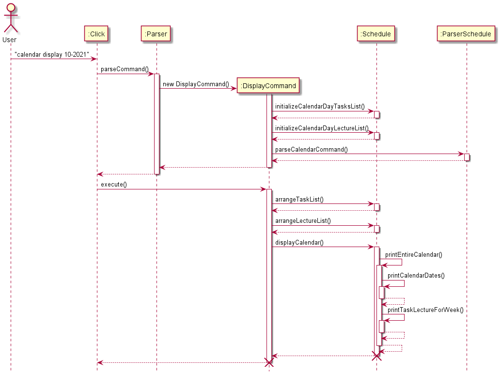

## Calendar display feature 

### Implementation

The command for displaying the calendar for a specific month is implemented by the `DisplayCommand` class that extends `Command`.

Given below is an example usage scenario and how the display calendar mechanism behaves at each step.

*Step 1:* The user enters the command `calendar 10-2021`. This command is then sent for parsing in the `Click` class to `parseCommand` method in the `Parser` class. The `parseCommand` method first splits the entire command into an array `todoArguments` containing `calendar` and `10-2021`.

*Step 2:* The string `calendar` from the first index of todoArguments is checked against switch cases and is found to match `COMMAND_CALENDAR` which is the constant string "calendar". Upon finding this match, the string from the second index `todoArguments`is further split based on the delimiter of a single white space. This is then checked against possible suffixes for `calendar` that indicate a particular command and the `Command` object `DisplayCommand` is returned to the `Click` class. 

*Step 3:* `Click` class then calls the method `execute` of `DisplayCommand` class. `DisplayCommand` extends `Command` class and has three steps in its `execute` method.
- The `parseCalendarCommand` is first called, and it returns the year and month values after splitting `10-2021` into `10` and `2021`. This is put together into an YearMonth object `inputYearMonth`.
  >  **NOTE:** The input is validated first and if the input date given is invalid, i.e., the month not between 1-12, then the calendar for the current month is displayed.
- The `inputYearMonth` is passed into `Ui` class method `printCalenderTitle` and this prints out the title of that month with the month name and the year. In this example, it will display,
  
- Then, the method `arrangeTaskList` in `Schedule` class is called, and it takes in `storage.tasksList` (the TaskList object with all the currently stored tasks drawn from storage), `calendarTasks` (an ArrayList<ArrayList<String>> object initialized with empty ArrayLists of type String), `month` (the month input by the user, which in this example is the integer `10`) and year `month` (the year input by the user, which in this example is the integer `2021`), and adds the tasks to the days in the empty String ArrayLists initialized before in `calendarTasks`. 
The method `arrangeLectureList` is also called and the process is same, except with `storage.lectureList` and `calendarLecture` replacing the first two input parameters of `arrangeTaskList`.
- Then, the method `displayCalendar` in `Schedule` class is called, and it takes in `inputYearMonth` (the YearMonth object created from the month and year parsed from the user input), and `calendarTasks` (that was filled with the tasks for each day in the previous step). The method `displayCalendar` performs the necessary logic to print out a calendar with tasks as below.
    >  **NOTE:** Two tasks and two lectures are displayed for each day based on the order in which the user added them, and if there are more, they will show as and when the user deletes the tasks/lectures that are currently displayed.

The below sequence diagram shows the execution process of the calendar display feature.

### Design Considerations
The following design considerations were kept in mind while implementing the calendar display feature,
- Aspect: Calendar visual display
   - Alternative 1: Display two tasks and two lectures at any time. 
     - Pros : The calendar displayed would appear even and solution is easier to implement.
     - Cons: All the tasks and lectures not displayed.
   - Alternative 2: Set the size of the calendar to accommodate the largest number of tasks and lectures for a particular day. For example, if a day has 8 tasks and lectures and that is the highest amongst all the days, then the calendar would change to show all 8 for this day and the remaining days would have filled display up till how many tasks and lectures they have and the remaining spots empty.
     - Pros : The calendar displayed would show all the tasks and lectures.
     - Cons: Difficult to implement.

### Add `todo` tasks feature [draft]

### Implementation

The command for adding a `todo` task to a specific day is implemented by the `AddTodoCommand` class that extends `Command`.

Given below is an example usage scenario and how the add todo task mechanism behaves at each step.

*Step 1:* take from user send to parser

*Step 2:* parser to command and execute command

*Step 3:* steps for command

Diagrams(3): Class, Sequence, Activity

Design Considerations
---> point + rationale + alternatives considered
