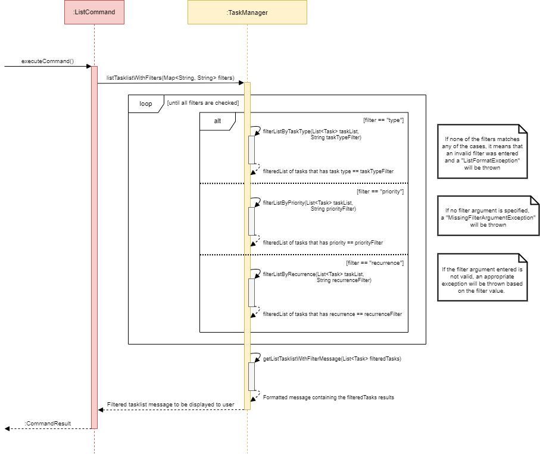

# Peh Zhenhao, Amos - Project Portfolio Page

## Overview 
**SchedUrMods** is a desktop application for NUS students who wish to manage their assignments 
and semester-related information via CLI (command-line interface). If you can type fast, SchedUrMods 
can help you manage your daily tasks faster than traditional GUI application.

Given below are the contributions I have made to this project.

### Summary of Contributions

---

- **Code contributed:** [RepoSense Link](https://nus-cs2113-ay2122s1.github.io/tp-dashboard/?search=apzh&sort=groupTitle&sortWithin=title&timeframe=commit&mergegroup=&groupSelect=groupByRepos&breakdown=true&checkedFileTypes=docs~functional-code~test-code~other&since=2021-09-25&tabOpen=true&tabType=authorship&tabAuthor=APZH&tabRepo=AY2122S1-CS2113T-W13-3%2Ftp%5Bmaster%5D&authorshipIsMergeGroup=false&authorshipFileTypes=docs~functional-code~test-code&authorshipIsBinaryFileTypeChecked=false)

---

- **Features implemented:**
  - **Feature 1:** Added the `Ui.java` class. 
    - **What it does:** Handles the reading of user inputs into the terminal and the displaying of 
    application related messages such as the result of a command execution based on the user's input.
    - **Justification:** Ensures a standardised reading and printing of application related messages to ensure
    consistency in the user's experience when using the application. All display related formatting can be done
    in this single class, allowing it to be easier to modify the UI design further down the developmental path.
  - **Feature 2:** Added the `CommandParser.java` class.
    - **What it does:** Parses and sanitises user input into the correct `Command` object.
    - **Highlights:** Implemented feature to allow flags to be extracted out of the user's input/command as a `Map<String, String>` 
    to be universally used across all `Command` objects. 
    - **Justification:** To allow flexibility/modularity for each `Command` object to allow additional command arguments to be added subsequently.
  - **Feature 3:** Added the `list` command. 
    - **What it does:** Allows users to "filter the tasklist based on the filter arguments entered by the user" & "view the recurrences of specific tasks in the tasklist".
    - **Additional Information:** Added the relevant command class `ListCommand.java` and the relevant exceptions associated with the `list` command.
    - **Highlights:** Constitutes a majority of the methods in `TaskManager.java` class (around 80%) that are used to implement such functionality.
    - **Justification 1 (filtering):** Improves the user experience by allowing users to quickly search for a task that matches certain filtering criteria
    as opposed to eye-balling the task, especially when the tasklist grows in size.
    - **Justification 2 (viewing recurrence):** Improves the user experience by allowing users to view the next 4 recurrences of a task,
    such that they can plan their schedule ahead of time.
  - **Feature 4:** Added the `sort` command. 
    - **What it does:** Allows users to sort the tasklist by various descriptors associated each task, 
    such as by **task type**, **priority**, or **description**. Methods are implemented in `TaskManager.java` class.
    - **Additional Information:** Added the relevant command class `SortCommand.java` and the relevant exceptions associated with the `sort` command.
    - **Highlights:** Implemented custom comparators catered to the attributes of the Task object, and its relevant subclasses as opposed
    to using the standardised comparator methods.
    - **Justification:** Improves the user experience by allowing users to sort their tasklist in a certain order to maintain the
    neatness of the tasklist. Without this command, the ordering of the tasklist will be based on the order in which the tasks are added,
    which reduces the logical grouping of tasks in the user's tasklist.
  - **Feature 5:** Added general skeleton of the TP code based on my IP program structure.
  
---

- **Contributions to the UG**: 
[#159](https://github.com/AY2122S1-CS2113T-W13-3/tp/pull/159) (C1-C5)
  - **Contribution 1:** Created and maintained the skeleton/overview for the User Guide to help the team be consistent when adding information.
  - **Contribution 2:** Added the documentation in "1. Quick Start".
  - **Contribution 3:** Added the documentation in "2.3 Listing your tasks: `list`" + all it's sub-sections.
  - **Contribution 4:** Added the documentation in "2.4 Sorting your tasklist: `sort`".
  - **Contribution 5:** Updated "4. Command Summary" table with changes made to the `list` and `sort` command.

---

- **Contributions to the DG**: 
[#149](https://github.com/AY2122S1-CS2113T-W13-3/tp/pull/149) (C1-C4), 
[#155](https://github.com/AY2122S1-CS2113T-W13-3/tp/pull/155) (C5-C6),
[#160](https://github.com/AY2122S1-CS2113T-W13-3/tp/pull/160) +
[#174](https://github.com/AY2122S1-CS2113T-W13-3/tp/pull/174) (C7-C8)
  - **Contribution 1:** Created and maintained the skeleton/overview for the Developer Guide to help the team be consistent when adding information.
  - **Contribution 2:** Added the documentation in "1. Introduction".
    - Including all it's sub-sections: "1.1 Purpose" and "1.2 Acknowledgments".
  - **Contribution 3:** Added the documentation in "2. Setting up, getting started".
    - Including all it's sub-sections: "2.1 Pre-requisites", "2.2 Download the project on your computer", and "2.3 Setting up the project in IntelliJ".
  - **Contribution 4:** Added the documentation in "3.1 Architecture".
    -  **Architecture Diagram** [Image] - Showing the main components and flow of the general program
    -  **Sequence Diagram** [Image] - Showing how the components interact with each other for the scenario 
    where the user inputs any valid command in to the application. 
  - **Contribution 5:** Added the information in "3.2 UI Component".
    - **Class Diagram** [Image] of the Ui component.
  - **Contribution 6:** Added the information in "3.3 Parser Component".
    - **Class Diagram** [Image] of the Parser component.
  - **Contribution 7:** Added the information in "4.2 Filtering the tasklist".
    - **Sequence Diagram** [Image] - Showing how the process of filtering the user's tasklist that is managed 
    by the TaskManager class.
  - **Contribution 8:** Added instructions for manual testing for "Launch and Exit", "Listing the Tasklist", "Filtering the Tasklist", "Sorting the Tasklist",
        and "Viewing the recurrence of a task".

---

- **Contributions to team-based tasks**:
  - **Contribution 1:** Maintained the issue tracker and milestones for our team.
  - **Contribution 2:** Handled the releases of versions `1.0` and `2.0` of our application.
  - **Contribution 3:** General format update to both the User Guide and Developer Guide to ensure consistency and allow others to easily
  add their assignment parts without affecting the general structure of the guide.
  - **Contribution 4:** Added FAQs, Target Users, and tidied up sections in both the User Guide and Developer Guide.
  - **Contribution 5:** Added user stories and formatted the table.

---

- **Review/mentoring contributions**:
  - **Contribution 1:** Help team members to test their features to ensure they work prior to releases each version of our application on GitHub.
  - **Contribution 2:** Help review PRs made by team members in general and offer advice and feedback prior to merging the PRs.

---

### Contributions to the Developer Guide (Extracts):

These are the diagrams (General, Class, Sequence...) I have added into the Developer Guide:

#### For "3.1 Architecture"...

    

    

#### For "3.2 UI Component"...

    

#### For "3.3 Parser Component"...

    

#### For"4.2 Filtering the tasklist"...

    

---
