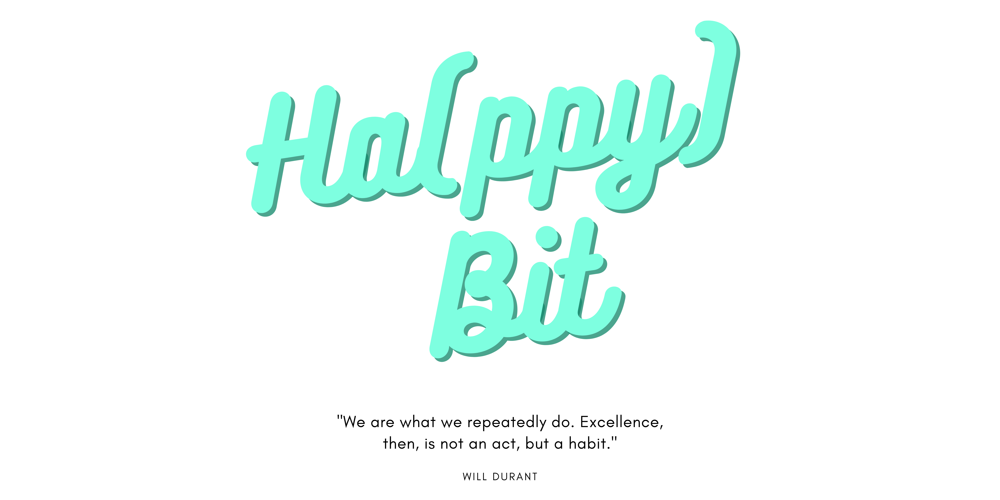

# Kah Heng - Project Portfolio Page

## Overview
Ha(ppy)Bit is a desktop app aimed to empower students to achieve 
their goals—whether personal, academical, or health—amidst the 
hectic and stressful university life, through cultivating good habits. 
Users can only run the app on a Command Line Interface (CLI).

## Summary of Contributions
Below are contributions I've made to the team and Ha(ppy)Bit. Organised for you and because I like it that way.

### Code Contributed: [RepoSense Link](https://nus-cs2113-ay2122s1.github.io/tp-dashboard/?search=f14&breakdown=true&sort=groupTitle&sortWithin=title&since=2021-09-25&timeframe=commit&mergegroup=&groupSelect=groupByRepos&checkedFileTypes=docs~functional-code~test-code~other&tabOpen=true&tabType=authorship&tabAuthor=kahhe&tabRepo=AY2122S1-CS2113T-F14-1%2Ftp%5Bmaster%5D&authorshipIsMergeGroup=false&authorshipFileTypes=docs~functional-code~test-code~other&authorshipIsBinaryFileTypeChecked=false)

### Features

#### v1.0

"Delete" feature for goals and habit:
- Added the `Command` class `DeleteCommand` and its inheritance classes `DeleteGoalCommand` and `DeleteHabitCommand`
- Added the `Parser` class `DeleteParser`

#### v2.0

"Update" feature for goal name and habit name:
- Added the `Command` class `UpdateCommand` and its inheritance classes `UpdateGoalNameCommand` 
  and `UpdateHabitNameCommand`
- Contributed to `Parser` class `UpdateParser` for parsing input for updating goal name and updating habit name

#### v2.1

- 
- Added additional Junit tests in `UpdateParserTest` to improve test coverage
- 

### Documentation

#### [User Guide (UG)](/docs/UserGuide.md)

- Contributed to UG introduction 
- Wrote most of "Using this Guide", "Using _Ha(ppy)Bit_", and "Useful Links" section
- Attempted to make the UG user-centric/reader-friendly overall with signposting and explanations
- Fixed documentation flaws brought up by peers in PE Dry Run

#### [Developer Guide (DG)](/docs/DeveloperGuide.md)

- Wrote `DeleteGoalCommand` and `DeleteHabitCommand` subsections of "Command Component" of "Design and Implementation"
- Wrote "Target User Profile" and "Value Proposition" under "Appendix A"
- Contributed to "Appendix C: Non-Functional Requirements"
- Contributed to "Appendix D: Glossary"

### Community

- 

### Tools

- PlantUML diagrams for `DeleteGoalCommand` and `DeleteHabitCommand` in DG

### Extra

- Came up with the logo for Ha(ppy)Bit:

Used on the team's [Main Page](https://ay2122s1-cs2113t-f14-1.github.io/tp/) and in CS2101 Demo and Pitch.