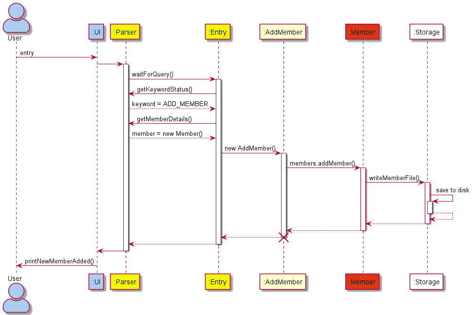
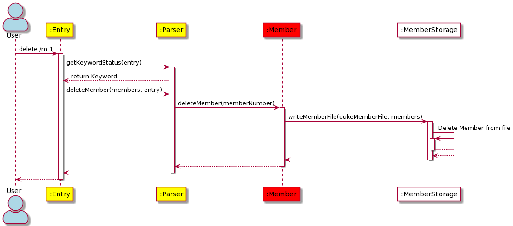
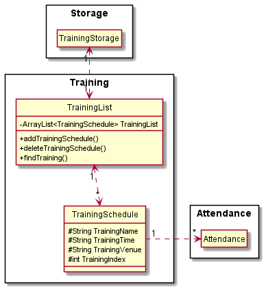

# Tan Choon Kai Glenn - Project Portfolio Page

## Overview

**CCA Manager** is a simple and easy to use command-line based application aimed to assist you, a CCA manager, to easily add, delete or alter information about your
CCA members. Moreover, **CCA Manager** also allows you to perform its functions on any training-related activities
you may have in order to help you organise your CCA's timetable.

## Summary of Contributions

[Code Contributed](https://nus-cs2113-ay2122s1.github.io/tp-dashboard/?search=poppolette&sort=groupTitle&sortWithin=title&timeframe=commit&mergegroup=&groupSelect=groupByRepos&breakdown=true&checkedFileTypes=docs~functional-code~test-code~other&since=2021-09-25&tabOpen=true&tabType=authorship&tabAuthor=poppolette&tabRepo=AY2122S1-CS2113T-F12-4%2Ftp%5Bmaster%5D&authorshipIsMergeGroup=false&authorshipFileTypes=docs~functional-code~test-code&authorshipIsBinaryFileTypeChecked=false
)

## Features Implemented
* Set up `training` package
  * Implemented `TrainingSchedule` class
    * `TrainingSchedule` is a class that stores `TrainingName`, `TrainingVenue` and `TrainingTime`, used to identify a specific training
    * `TrainingSchedules` have _unique_ `TrainingName`, multiple `TrainingSchedule` entries cannot have the same name
    * Implemented getters and setters for `TrainingName`, `TrainingVenue` and `TrainingTime`
    * Implemented constructor for `TrainingSchedule`
    * Formatted `toString()` to be more readable
    * Continued updating class throughout implementation to keep it up-to-date
  * Implemented `TrainingList` class
    * Contains an ArrayList of `TrainingSchedules`
    * Stores all recorded `TrainingSchedules` input by user
    * Implemented method to get a specific `TrainingSchedule` from ArrayList
    * Implemented method to delete a specific `TrainingSchedule` from ArrayList via index
    * Implemented method to find for `TrainingSchedule` using a String `name` keyword
    * Implemented method to update index of `TrainingList`. Called whenever a `TrainingSchedule` is deleted
  * Implemented `AddTraining` command; allows users to add a TrainingSchedule to TrainingList
    * Checks if entry to be added has a `TrainingName` that already exists. If it does, the command will not succeed
    * Checks that all fields are filled
  * Implemented `EditTraining` command; allows users to edit an existing TrainingSchedule
    * If user is editing `TrainingName`, check if the name to edit to already exists. If it does, the command will not succeed
  * Implemented `DeleteTraining` command; allows users to delete an existing TrainingSchedule
  * Implemented `FindTraining` command; allows users to filter and display TrainingSchedules based on Training Name
  * Handled exceptions for the above commands
  * Set up file read/write operations, training schedule details are stored in "CCATrainings.csv"


## UG Contributions
  * Due to last minute changes to UserGuide.md, most of my team member's code might be attributed to me in the above link. This leads to inaccuracy, and you should view my team members' Project Portfolio Pages to get a better overview of everyones' contribution to the User Guide and Developer Guide
  * Set up Table of Contents for UserGuide.md
  * Set up `Training` section of UserGuide.md
  * Set up `Pre-requisites` section of UserGuide.md
  * Set up `Command Summary` section of UserGuide.md
    * This section was then meticulously updated by other team members whenever changes were made

## UG Extract

## Training Commands
### Add Training
**CCA Manager** can help add trainings to your training list with the help of the `add /t` command.

* `add /t` This adds entries to the Training List stored in CCA Manager.
  * The `add /t` keyword requires 3 different arguments:
    * use `/n` to input _name_ of your training schedule.
      * ⚠️ Training Schedules must have _unique_ names. Different training entries with the same training name is not allowed.
    * use `/a` to input _date and time_ of your training schedule.
      * _Date and time_ is stored as a _String_ to allow the CCA admin to use relative timing. E.g. _After training_, _Recess Week_, etc.
    * use `/v` to input _venue_ of training schedule.
    * ⚠️ In your command input, there should only be ONE of each fields. Additional instances of the field will be treated as a wrong command, thus printing an error.
      * For example, `add /t /n Friday /n Training /a 5 Nov 2021 /v MPSH1` will produce an error, because `/n` is used twice.

  * **Format:**
    * `add /t [/n TRAINING_NAME] [/a TRAINING_TIME] [/v TRAINING_VENUE]`

  * **Examples:**
    * `add /t /n Weekly Friday Training 1 /a 5 Nov 2021 /v MPSH 1`
    * `add /t /n Weekly Friday Meeting /a After Training /v CCA Clubroom`
    * `add /t /n Weekly Friday Training 2 /a 12 Nov 2021 /v MPSH1`

  * **Expected Output:**

   ```
   Added a Training entry:
   [1] Training Name: WEEKLY FRIDAY TRAINING 1 | Venue: MPSH 1 | Time: 5 NOV 2021
   
   Added a Training entry:
   [2] Training Name: WEEKLY FRIDAY MEETING | Venue: CCA CLUBROOM | Time: AFTER TRAINING
   
   Added a Training entry:
   [3] Training Name: WEEKLY FRIDAY TRAINING 2 | Venue: MPSH 1 | Time: 12 NOV 2021
   ```

### Delete Training
You can delete any existing training schedules with the help of the `delete` command.

* `delete /t` This delete entries from the training list in **CCA Manager**.
  * The `delete /t` keyword can delete entries using either of two different prompts: index or name
    * You can delete training entries by inputting the `index` of the training.
    * You can also delete training entries by inputting the `name` of the training.
      * If there are *two or more* trainings with the same name, **CCA Manager** will display these trainings and their indexes and prompt you to delete the training you want using his/her index.
  * **Format:**
    * `delete [/t TRAINING_INDEX_NUMBER]`
    * `delete [/t TRAINING_NAME]`
  * **Examples:**
    * `delete /t 1` Deletes the first training on the training list.
    * `delete /t Friday` Deletes a training with the name 'John'.
      * If there is more than 1 Friday in the training list, a prompt will show up, and you will need to delete the 'Friday' based on its index number.
  * **Expected Output:**
   ```
   You have removed training entry:
   [1] Training Name: WEEKLY FRIDAY TRAINING 1 | Venue: MPSH 1 | Time: 5 NOV 2021
   
   Below are the possible matches. Please key in the INDEX NUMBER ONLY to delete
   [1] Training Name: WEEKLY FRIDAY MEETING | Venue: CCA CLUBROOM | Time: AFTER TRAINING
   [2] Training Name: WEEKLY FRIDAY TRAINING 2 | Venue: MPSH 1 | Time: 12 NOV 2021
   => 1
   Trying to delete index 1
   You have removed training entry:
   [1] Training Name: WEEKLY FRIDAY MEETING | Venue: CCA CLUBROOM | Time: AFTER TRAINING
   ```

### List Training
**CCA Manager** allows you to list out all the recorded trainings.

* `list /t` This lists out entries in CCA Manager's Training List.
  * The `list /t` keyword is strict, meaning that it must follow the above format. E.g. `list /t TRAININGABC` will not be a valid command.
  * `list /t` will also show you the `index` of the trainings that will be helpful for other commands.
  * **Format:**
    * `list /t`
  * **Examples:**
    * `list /t`
  * **Expected Output:**
    ```
    [1] Training Name: WEEKLY FRIDAY TRAINING 2 | Venue: MPSH 1 | Time: 12 NOV 2021
    ```

### Edit Training
Had a sudden change in venue for your trainings? No worries! You can edit your training schedules with the help of the `edit /t` feature.

* `edit /t` This edits an existing entry from the training list
  * Entries are referenced using their index
  * `/t <TRAINING_INDEX_NUMBER>` edits the training detail stored at the given index. The index is a **compulsory** field.
    * The below fields are on a fill-per-case basis. Only fill in the fields that need changing.
    * `/n <NEW_TRAINING_NAME>` edits the current _training name_
    * `/a <NEW_TRAINING_TIME>` edits the current _date and time_
    * `/v <NEW_TRAINING_VENUE>` edits the current _venue_
    * ⚠️ Similar to [Add Member](#add-member), the edit field should only have **one** of each field (`/n`, `/a` or `/v`). Otherwise, the command will be treated as invalid.

  * **Format:**
    * `edit [/t TRAINING_INDEX_NUMBER] [/n NEW_TRAINING_NAME] [/a NEW_TRAINING_TIME] [/v NEW_TRAINING_VENUE]`
  * **Examples:**
    * `edit /t 1 /v MPSH2` Updates the venue of Index 1 to MPSH2
    * `edit /t 1 /n Weekly Friday Training 2 (Updated)` Updates the name of Index 1

  * **Expected Output:**

   ```
   Edited Training:
   [1] Training Name: WEEKLY FRIDAY TRAINING 2 | Venue: MPSH 1 | Time: 12 NOV 2021
   To become:
   [1] Training Name: WEEKLY FRIDAY TRAINING 2 | Venue: MPSH2 | Time: 12 NOV 2021

   Edited Training:
   [1] Training Name: WEEKLY FRIDAY TRAINING 2 | Venue: MPSH2 | Time: 12 NOV 2021
   To become:
   [1] Training Name: WEEKLY FRIDAY TRAINING 2 (UPDATED) | Venue: MPSH2 | Time: 12 NOV 2021
   ```
### Find Training
Have too many training schedules, and can't find the one you want? Just use the `find /t` feature to list out all candidates, helping you find it easier!
* `find` Searches for training schedules based on the keyword given.
  * The keyword should be related to the name of the training
  * `/t <TRAINING_NAME_KEYWORD>` finds ALL entries with the TRAINING_NAME_KEYWORD in it.
    * For example, if you type `find /t friday`, `FRIDAY TRAINING 1` and `FRIDAY TRAINING 2` will be found, but `FIDAY TRAINING` will not be matched
  * The keyword is not case-sensitive
  * **Format:**
    * `find [/t TRAINING_NAME_KEYWORD]`
  * **Examples:**
    * `find /t friday`
  * **Expected Output:**
   ```
   The following trainings matches your search "friday"
   [1] Training Name: WEEKLY FRIDAY TRAINING 2 (UPDATED) | Venue: MPSH2 | Time: 12 NOV 2021
   [2] Training Name: WEEKLY FRIDAY TRAINING 3 | Venue: MPSH1 | Time: 19 NOV 2021
   ```


## DG Contributions
* Set up Table of Contents for DeveloperGuide.md
* Set up skeletal framework for DeveloperGuide.md
* Set up `Architecture` section of DeveloperGuide.md
  * Designed architecture diagrams and architecture sequence diagrams for DeveloperGuide.md
* Set up `Training Component` section of DeveloperGuide.md
* Set up `Non-Functional Requirements` section
* Set up `Manual Testing` section

## DG Extract

## Design

### Architecture


The **architecture diagram** above presents a high-level overview of CCA Manager.

**Components of the architecture**

* [`UI`: UI of CCA Manager](#ui-component)
* [`Parser`: Parses user inputs into `keywords`](#parser-component)
* [`Entry`: Converts `keywords` from `Parser` into `commands` to run](#entry-component)
* [`Command`: Executes a command based on `keyword` given](#command-component)
* [`Members`: Stores member details as `Member` objects in `MemberList`](#member-component)
* [`Training`: Stores training details as `TrainingSchedule` objects in `TrainingList`](#training-component)
* [`Attendance`: Object that links a `Member` to a `TrainingSchedule`](#attendance-component)
* [`Storage`: Stores details of `Members`, `Training` and `Attendance` in hard disk space](#storage-component)

**Components Interaction**

The *sequence diagram* below shows how various components of the architecture interact with one another when a user inputs a **valid** command `"add /m Bob /s A01231234B /p 98765432"`



### **Note:**
* Examples below have their arguments removed for the sake of brevity
* `waitForQuery()`: Blocks until a user input is received.
* `getKeywordStatus()`: Given user input, return the `keyword`.
* `getMemberDetails()`: Given user input, return a `Member` object with all information from user input.
* `addMember()`: Calling a class that creates a new `Member` object and adds it to the MemberList `members`.
* `members.addMember()`: Adds a Member `member` to MemberList `members`.
* `writeMemberFile()`: Writes the content of MemberList `members` to the File `memberFiles`, which should be a `.csv` file in hard drive.

The *sequence diagram* below shows how various components of the architecture interact with one another when a user inputs a **valid** command `"delete /m 1"`


### **Note:**
* `getKeywordStatus()`: Gets the keyword value from the Keyword enum class.
* `deleteMember(members, entry)`: Deletes the member from the memberList.
* `deleteMemeber(memberNumber)`: Deletes the member using the index number provided by the user.
* `writeMemberFile()`: Writes the data to the csv file.

The sections below give more details of each component.

### Training Component



**API** : [Training](https://github.com/AY2122S1-CS2113T-F12-4/tp/tree/master/src/main/java/seedu/duke/training)

The `Training` component consists of `TrainingList` and `TrainingSchedule`. Information regarding Trainings, such as `name`, `date/time` and `venue` are handled by the `Training` component.


**Current Functionalities**

The `Training` component,
* instantiates a `TrainingList` object of 0 `TrainingSchedule` objects
  * `TrainingSchedules` in a `TrainingList` hold an `Index` that **CCA Manager** uses in relevant commands, such as `delete by index` or `find by index`
* `TrainingSchedule` is an object that holds the information of CCA information, such  as:
  * Training Name
  * Training Date
  * Training Venue
* stores `TrainingSchedule` in `TrainingList` whenever `addTrainingSchedule()` is called
* edits `TrainingSchedule` in `TrainingList` whenever `EditTraining()` is called
* removes `TrainingSchedule` from `TrainingList` whenever `deleteTrainingSchedule()` is called
* returns a list of matching `TrainingSchedule` whenever `findTraining()` is called
* stores `TrainingList` entries on disk in `CCATrainings.csv`