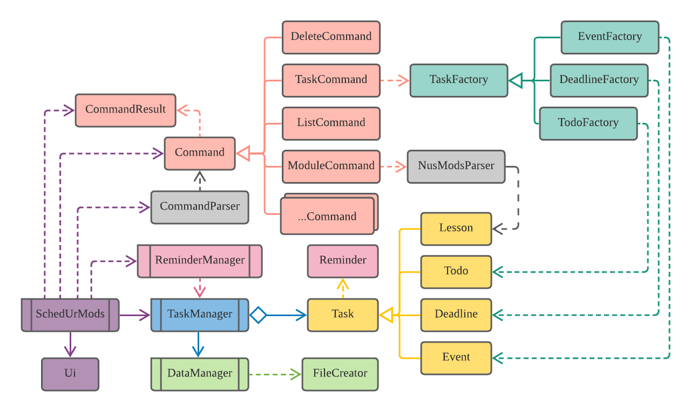
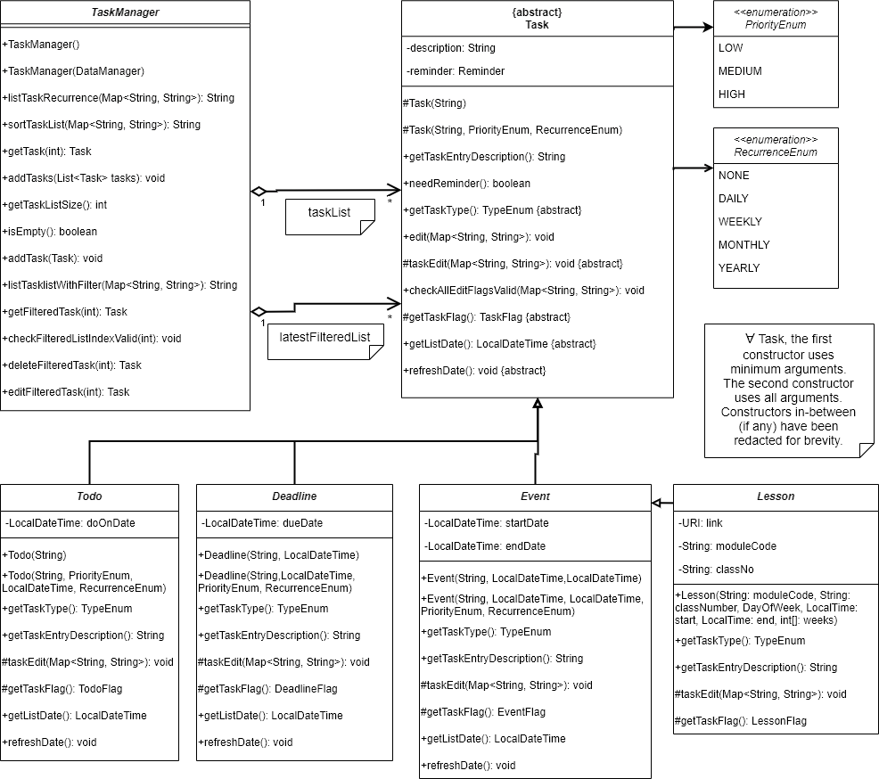
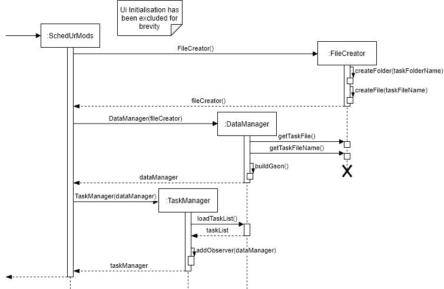
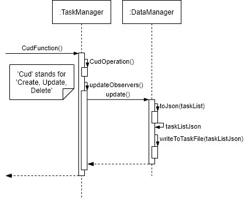
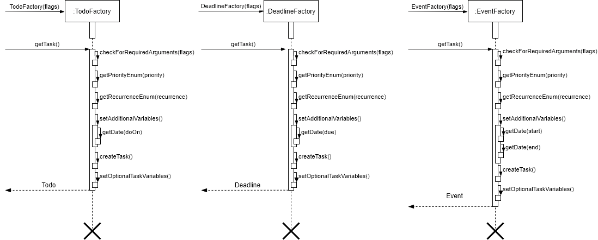
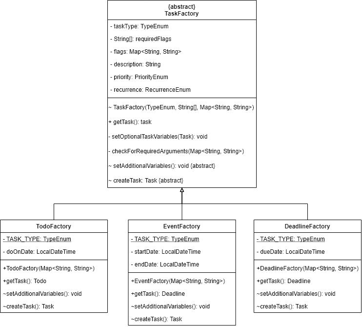

# Sean Robert den Hartog - Project Portfolio Page

## Overview 
**SchedUrMods** is a desktop application for NUS students who wish to manage their assignments
and semester-related information via CLI (command-line interface). If you can type fast, SchedUrMods
can help you manage your daily tasks faster than traditional GUI application.

Given below are the contributions I have made to this project.

### Summary of Contributions

---

- **Code contributed:** [RepoSense Link](https://nus-cs2113-ay2122s1.github.io/tp-dashboard/?search=&sort=groupTitle&sortWithin=title&timeframe=commit&mergegroup=&groupSelect=groupByRepos&breakdown=true&checkedFileTypes=docs~functional-code~test-code~other&since=2021-09-25&tabOpen=true&tabType=authorship&tabAuthor=SeanRobertDH&tabRepo=AY2122S1-CS2113T-W13-3%2Ftp%5Bmaster%5D&authorshipIsMergeGroup=false&authorshipFileTypes=docs~functional-code~test-code~other&authorshipIsBinaryFileTypeChecked=false)

---

- **Features implemented:**
    - **Feature 1:** Implemented Task creation using Task Factories: `TaskFactory.java`, `TodoFactory.java`, `EventFactory.java`, `DeadlineFactory.java` classes.
        - **What it does:** Handles the creation of Todos, Deadlines and Events.
        - **Justification:** Allows programmers to create any concrete Task easily with the factories. Also allows for users to easily add new concrete Task factories by extending `TaskFactory`.
        - **Highlights:** Implemented using [Factory Method Pattern](https://en.wikipedia.org/wiki/Factory_method_pattern).
    - **Feature 2:** Implemented storage functionality: `FileCreator.java`, `DataManager.java`, `TaskTypeAdapter.java`, `Observer.java`, `Subject.java` classes.
        - **What it does:** On any changes to `taskList` in `TaskManager`, `TaskManager` will update the `DataManager` which will then save the new `taskList`
        - **Highlights:** Designed with Dependency Injection in mind. Implemented using [Observer Pattern](https://en.wikipedia.org/wiki/Observer_pattern). 
           Used [Gson](https://github.com/google/gson) library to export and import tasks. Created a custom *JsonSerializer* and *JsonDeserializer* in `TaskTypeAdapter.java`
           to parse Tasks.
        - **Justification:** Used `Gson` library so I wouldn't have to stress about parsing data to and from file.
    - **Feature 3:** Implemented the `edit` command.
        - **What it does:** Allows users to edit multiple variables in any Task in the `TaskManager` in a single command.
        - **Justification:** Makes it easier for user to edit Tasks rather than having to delete and re-add the Tasks.
        - **Additional Information:** Uses polymorphism such that concrete Tasks need only to overwrite the `taskEdit()` and `getTaskFlag()` functions to be editable.
    - **Feature 4:** Implemented the `delete` command.
        - **What it does:** Allows users to delete multiple tasks at once from the `TaskManager`.
        - **Justification:** Improves the user experience by allowing users to delete tasks from the most recent filtered list e.g. if they listed
           all their low priority task then it's easier to delete them together because they have contiguous indexes.
          which reduces the logical grouping of tasks in the user's tasklist.
    - **Feature 5:** Implemented the date parser `DateParser.java` class
        - **What it does:** Parsed `LocalDateTime` to `String` and vice-versa
        - **Highlights:** Allows for multiple different formats e.g. `25-12-2020 22:00`, `25/12/2020 22:00`, `25:12:21 22.00`
           and year, month, day and minute are all optional arguments allowing users to type less and make less mistakes e.g. `12.00` would translate to `today at 12pm`.
    - **Feature 6:** Implemented the logger, `Log.java` class
        - **What it does:** Allows programmers to easily log messages without the hassle of setting up the logger. they just have to
           call `Log.<severity>("Log Message")` e.g `Log.("Log Message")`. 
        - **Highlights:** The logger handles getting the class by using the `Thread.currentThread().getStackTrace()` function and manages a `Map<String, Logger>` of
           class names to loggers. That way, the whole process of setting up a fileHandler, consoleHandler and log class is done automatically and
           the user doesn't have to worry about it. Therefore, any issues that can arise from it. e.g. specifying the wrong class when creating a logger are no longer an issue.

---

- **Contributions to the UG**:
    - **Contribution 1:** Added the documentation in "2.1 Viewing help: `help`".
    - **Contribution 2:** Added the documentation in "2.2 Adding your tasks:" + all it's sub-sections.
    - **Contribution 3:** Added the documentation in "2.5 Editing your tasks: `edit`".
    - **Contribution 4:** Added the documentation in "2.7 Deleting your tasks: `delete`".
    - **Contribution 5:** Added the documentation in "2.9 Storage".

---

- **Contributions to the DG**:
    - **Contribution 1:** Added the granular architecture diagram in "3.1 Architecture".
        -  **Architecture Diagram** [Image] - Showing the main components of the program on a more granular level.
    - **Contribution 2:** Added the information in "3.5 TaskManager Component".
        - **Class Diagram** [Image] of the TaskManager component.
    - **Contribution 3:** Added the information in "3.6 Storage Component".
        - **Sequence Diagram** [Image] of the initialisation of Storage Component.
        - **Sequence Diagram** [Image] of the updating of Task save file.
    - **Contribution 4:** Added the information in "3.8 Logger Component".
    - **Contribution 5:** Added the information in "4.1 Task Factories".
        - **Sequence Diagram** [Image] of the creation of concrete Tasks in their respective factories.
        - **Class Diagram** [Image] of the Task factories.
    - **Contribution 6:** Added the information in "4.3 [Proposed] Refactor TaskManager".
    - **Contribution 7:** Added instructions for manual testing for "Adding a task to task list", "Editing a task in task list",
       "Deleting tasks in task list" and "Saving files".
---

- **Contributions to GitHub Pages**: [link](https://ay2122s1-cs2113t-w13-3.github.io/tp/)
    - **Contribution 1:** Added the `UserGuide`, `DeveloperGuide` and `AboutUs` to the GitHub pages header to allow
       for easier navigation through the documents.
    - **Contribution 2:** Added an arrow icon at the bottom right of the different page documents to allow 
       site visitors to navigate to the `Overview` of the page allowing for easier navigation through the documents.
        - **Highlights:** Used [Google Material Icons](https://google.github.io/material-design-icons/) for the icon.
    - **Contribution 3:** Modified the `asets/css/style.scss` to overwrite the code `font-size` so that the
       code comments in the documentation look more uniform with the div it's in.
       site visitors to navigate to the `Overview` of the page allowing for easier navigation through the documents.
    - **Note:** These features were implemented after reading the up on the GitHub Pages documentation.
        
---

- **Review/mentoring contributions**:
    - **Contribution 1:** Help team members to test their features to ensure they work prior to releases each version of our application on GitHub.
    - **Contribution 2:** Help review PRs made by team members in general and offer advice and feedback prior to merging the PRs.

---

### Contributions to the Developer Guide (Extracts):

These are the diagrams (General, Class, Sequence...) I have added into the Developer Guide:

#### For "3.1 Architecture"...

    

#### For "3.5 TaskManager Component"...

    

#### For "3.6 Storage Component"...

    

    

#### For"4.1 Task Factories"...

    

    

---
