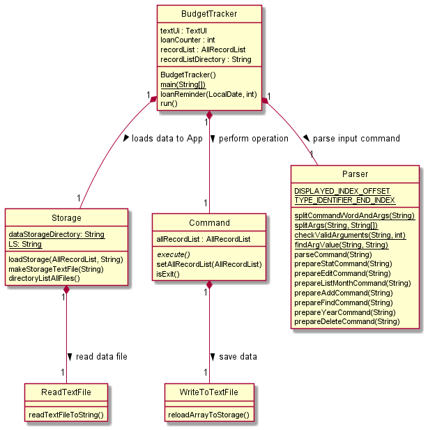
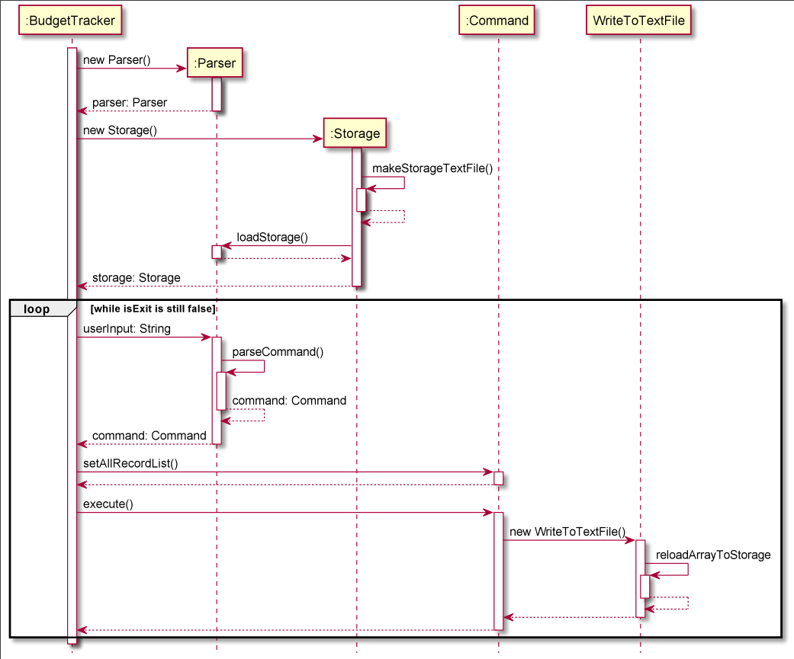
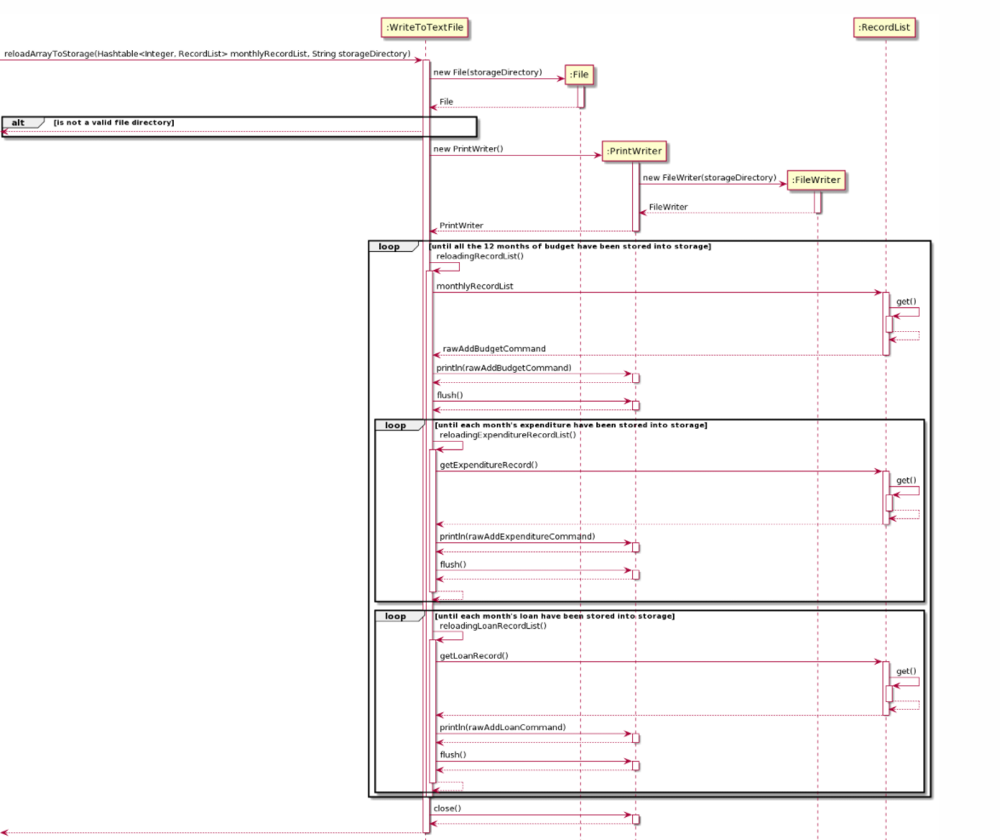

# Yeo Wei Hng - Project Portfolio Page

## Overview

Budget Tracker is a app app for managing expenses, budget and loans, optimized for 
use via a through Command Line Interface (CLI) for tech-savvy students who have 
trouble keeping track of their expenses.

## Summary of Features Implemented

[Repo Sense](https://nus-cs2113-ay2122s1.github.io/tp-dashboard/?search=&sort=groupTitle&sortWithin=title&timeframe=commit&mergegroup=&groupSelect=groupByRepos&breakdown=true&checkedFileTypes=docs~functional-code~test-code~other&since=2021-09-25&tabOpen=true&tabType=zoom&tabAuthor=naijie2108&tabRepo=AY2122S1-CS2113T-F11-1%2Ftp%5Bmaster%5D&authorshipIsMergeGroup=false&authorshipFileTypes=docs~functional-code~test-code~other&authorshipIsBinaryFileTypeChecked=false&zA=YEOWEIHNGWHYELAB&zR=AY2122S1-CS2113T-F11-2%2Ftp%5Bmaster%5D&zACS=167.6350974930362&zS=2021-09-25&zFS=&zU=2021-11-08&zMG=false&zFTF=commit&zFGS=groupByRepos&zFR=false)

Given below are the features I have implemented:

* **Feature 1**: UI Greetings
  * Created a welcome page that will give user details about the yearly budget and the total 
  amount the user have spent.
  * It also displays out the list of yearly budget database that the user current have. For 
  example: 2019.txt, 2020.txt, 2021.txt

* **Feature 2**: List Budget & Expenditure `list`
  * Allows the user to list budget and expenditure of the entire year or list only by month.

* **Feature 3**: Statistics Analysis (by Year)
  * Type 1
      * Allows user to see a breakdown yearly budget and expenditure. 
      * There are 12 bars on the graph which shows the percentage spent on each month. 
  * Type 2
      * Quick summary of the percentage of total expenditure the user have on his budget.
      * A single bar graph to combine all monthly budget and expenditure.
  
* **Feature 4**: Find `find`
  * Allows user to quickly search up a particular keyword. 
  * It can search for matching keyword in budget, expenditure and loan.
  * Any attribute's value such as a particular amount for example "$20.00" can be searched up.

* **Feature 5**: Storage
  * Stores the app's data into ".txt" files.
  * During app launch, it creates a ".txt" database if there isn't any.
  * During each user's command which will change the data such as `add`, `edit` and `delete`,
    the storage will reload the data from the app into the ".txt" file to ensure data is 
    saved at every point of data change.
  
* **Feature 6**: CSV
  * Allows the conversion of a ".txt" year database into a csv format. 
  * This is so that budget data can be used in software like excel to do more advanced 
    statistical analysis. 

* **Feature 7**: Edit Budget Command `edit`
  * Lets user change the amount of budget in a particular month selected.
  * It is also written in a way that it works well with the Storage class.

* **Feature 8**: Delete Budget `delete`
  * Lets user delete the Budget of the selected month. 

* **Feature 8**: Delete Expenditure `delete`
  * Lets user delete a particular Expenditure of the selected month.

* **Feature 9**: Add Budget `add`
  * Lets user add budget amount to a particular month.

* **Feature 10**: Add Expenditure `add`
  * Lets user add expenditure description, date and amount.

## Project management:

1) Tested all the code everytime when someone does a PR into our Repository.
2) Tested the JAR file before submission. 
3) Help to suggest add-on, features and code quality.
4) Help to hunt for bugs and add issues to the repository.

## Developer Guide Contribution

[Developer Guide](https://github.com/AY2122S1-CS2113T-F11-2/tp/blob/master/docs/DeveloperGuide.md)

Given below are my contributions to the team's documentation:

* **Developer Guide**:
  * Created the table of content structure and organized the developer guide content.
  * Wrote the Getting-Started part to let user understand how to fork our repo and edit 
    our code.
  * Wrote the design for our Storage Architecture. 
  * Wrote the implementation of our Storage. 
  * Transferred our user stories from word document to the Developers Guide.
  * Wrote some of the glossory.

* **Design Breakdown**:
  * Use of Class diagram and a sequence diagram to explain how the storage works.
  * A basic architectural diagram is shown to simplify the way the Storage is designed to 
    work with the app. 

* **Implementation Breakdown**:
  * Goes into deeper details about some key methods that help to implement the storage.
  * reloadArrayToStorage() method is the key method that is used to reload app data into 
    the ".txt" file storage.
  * convertToCsvFile() method is similar to reloadArrayToStorage() but it converts app 
    data to ".csv" instead.
  * readTextFileToString() converts the command stored the ".txt" file storage into 
    ArrayList<String>.

## User Guide Contribution

[User Guide](https://github.com/AY2122S1-CS2113T-F11-2/tp/blob/master/docs/UserGuide.md)

* **User Guide**:
  * Created the table of content structure and organized 
  * Make the basic skeleton content for each of the commands on what needs to be included
    for each command's description. 
  * Wrote the Command Summary. 
  * Wrote most of the command description such as `stat`, `add`, `edit`, `delete`, `list`
    `list`, `csv`, `db`. 
